[🏠 Home](../../README.md) | [📊 Market Analysis](../market-analysis/index.md)

<link rel="stylesheet" href="../../assets/css/styles.css">
---

# AI Hive Competitive Positioning Strategy

## Executive Summary

O2.services AI Hive represents a fundamental paradigm shift in software development, positioning itself as the world's first truly autonomous development platform that delivers enterprise-grade software at 47-1,612x lower cost and up to 50x faster than traditional approaches.

Our positioning strategy leverages three core disruption vectors:
1. **Economic Disruption**: Transforming $300K projects into $1.5K investments
2. **Speed Revolution**: Compressing 3-month timelines into 2-3 days
3. **Quality Guarantee**: 80%+ test coverage with enforced best practices

## 1. Unique Value Proposition

### Core Value Statement

> **"Enterprise-grade software development at startup prices, delivered in days not months, with guaranteed quality through autonomous AI agents"**

### Value Proposition Canvas

### Unique Differentiators

| Differentiator | Traditional | AI Tools | AI Hive | Impact |
|----------------|------------|----------|----------|---------|
| **Autonomous Operation** | Human-driven | Human + AI assist | Fully autonomous | No developers needed |
| **End-to-End Coverage** | Partial automation | Code completion only | Requirements → Deployment | Complete solution |
| **Cost Model** | $150-300/hour | $10-39/user + salaries | $100-500/day flat | 99.6% savings |
| **Delivery Speed** | 3-6 months | 2-4 months | 2-3 days | 50x faster |
| **Quality Guarantee** | Variable (20-40% coverage) | 41% more bugs | 80%+ coverage | Superior quality |
| **Scaling Model** | Hire more people | Add more seats | Instant unlimited | Zero friction |

## 2. Market Positioning Framework

### Positioning Statement

**For** innovative startups and forward-thinking enterprises
**Who** need to build software products rapidly and affordably
**AI Hive** is an autonomous development platform
**That** delivers complete software solutions in days instead of months
**Unlike** traditional development teams or AI coding assistants
**Our solution** requires no developers, costs 99% less, and guarantees enterprise-grade quality

### Three-Dimensional Positioning

## 3. Target Customer Segments

### Primary Segments & Winning Strategy

### Segment Prioritization Matrix

| Segment | Market Size | Adoption Speed | Competition | Strategic Fit | Priority |
|---------|------------|----------------|-------------|---------------|----------|
| **Bootstrapped Startups** | $50B | Fast (Days) | None | Perfect | **1** |
| **Funded Startups** | $150B | Fast (Weeks) | Low | Excellent | **2** |
| **Dev Agencies** | $90B | Medium (Months) | Medium | Good | **3** |
| **Tech Consultancies** | $200B | Medium (Months) | Low | Good | **4** |
| **Innovation Labs** | $75B | Fast (Weeks) | Low | Excellent | **5** |
| **Enterprises** | $500B | Slow (Years) | High | Future | **6** |

### Why We Win in Each Segment

#### 🚀 Bootstrapped Startups
- **Traditional Barrier**: Can't afford $300K development
- **Our Solution**: $1.5K gets them to market
- **Competitive Advantage**: Only viable option at this price point

#### 💰 Funded Startups
- **Traditional Barrier**: Burn rate on 10-person teams
- **Our Solution**: Extend runway by 90%
- **Competitive Advantage**: More iterations, faster learning

#### 🏢 Development Agencies
- **Traditional Barrier**: Talent shortage, margin pressure
- **Our Solution**: Handle 10x more projects
- **Competitive Advantage**: Scale without hiring

#### 🔬 Innovation Labs
- **Traditional Barrier**: POC development bottlenecks
- **Our Solution**: Daily prototype iterations
- **Competitive Advantage**: Test 50x more ideas

## 4. Competitive Differentiation Matrix

```mermaid
%%{init: {
  'theme': 'base',
  'themeVariables': {
    'primaryColor': '#A8B8D0',
    'primaryTextColor': '#000000',
    'primaryBorderColor': '#8A9AB2',
    'lineColor': '#8A9AB2',
    'secondaryColor': '#5DBCB6',
    'secondaryTextColor': '#000000',
    'secondaryBorderColor': '#3D9A94',
    'tertiaryColor': '#84D4F5',
    'tertiaryTextColor': '#000000',
    'tertiaryBorderColor': '#5ABCD8',
    'background': '#F5F5F5',
    'mainBkg': '#A8B8D0',
    'secondBkg': '#5DBCB6',
    'tertiaryBkg': '#84D4F5'
  }
}}%%
graph LR
    subgraph "Capability Comparison"
        A[Capability] --> B[Traditional Teams]
        A --> C[GitHub Copilot]
        A --> D[Cursor]
        A --> E[Low-Code]
        A --> F[AI Hive]
    end

    subgraph "Full Autonomy"
        B --> B1[❌ Requires developers]
        C --> C1[❌ Assists only]
        D --> D1[❌ Assists only]
        E --> E1[⚠️ Limited scope]
        F --> F1[✅ Fully autonomous]
    end

    subgraph "End-to-End"
        B --> B2[⚠️ Manual coordination]
        C --> C2[❌ Code only]
        D --> D2[❌ Code only]
        E --> E2[⚠️ Platform limits]
        F --> F2[✅ Requirements to deploy]
    end

    subgraph "Cost Efficiency"
        B --> B3[❌ $300K/project]
        C --> C3[❌ $300K + tools]
        D --> D3[❌ $300K + tools]
        E --> E3[⚠️ $50-100K]
        F --> F3[✅ $1.5K/project]
    end

    subgraph "Speed"
        B --> B4[❌ 3-6 months]
        C --> C4[⚠️ 2-4 months]
        D --> D4[⚠️ 2-4 months]
        E --> E4[⚠️ 1-2 months]
        F --> F4[✅ 2-3 days]
    end

    style F1 fill:#4CAF50,color:#fff
    style F2 fill:#4CAF50,color:#fff
    style F3 fill:#4CAF50,color:#fff
    style F4 fill:#4CAF50,color:#fff
```

### Sustainable Competitive Advantages

| Advantage | Description | Defensibility | Moat Type |
|-----------|-------------|---------------|-----------|
| **Autonomous Architecture** | Multi-agent system with specialized roles | High - Complex orchestration | Technical |
| **Cost Structure** | No human labor costs | Very High - Structural advantage | Economic |
| **Speed of Iteration** | Deploy fixes in minutes | High - Continuous improvement | Operational |
| **Quality Automation** | Built-in testing and best practices | Medium - Can be copied | Process |
| **Market Position** | First mover in autonomous development | Medium - Brand recognition | Market |
| **Data Network Effects** | Learning from every project | Very High - Compounds over time | Network |

## 5. Messaging Framework

### Master Messaging Architecture

### Audience-Specific Messaging

#### 🚀 For Bootstrapped Startups

**Headline**: "Launch Your Startup for Less Than a MacBook Pro"

**Key Messages**:
- Turn your idea into reality for $1,500, not $300,000
- Get to market in 3 days, not 3 months
- No technical co-founder needed
- Iterate daily based on user feedback

**Proof Points**:
- Case studies of bootstrapped success stories
- Side-by-side cost comparisons
- Time-to-market metrics

#### 💼 For Development Agencies

**Headline**: "10x Your Agency's Output Without Hiring"

**Key Messages**:
- Handle more projects with existing team
- Improve margins by 90%
- Deliver in days, bill for value
- White-label option available

**Proof Points**:
- Agency partner testimonials
- Margin improvement calculations
- Portfolio expansion examples

#### 🏢 For Enterprises

**Headline**: "Innovation at the Speed of Thought"

**Key Messages**:
- Prototype ideas in days, not quarters
- Reduce innovation lab costs by 95%
- No vendor lock-in or platform constraints
- Enterprise-grade security and compliance

**Proof Points**:
- Fortune 500 pilot results
- Security certifications
- ROI calculations

#### 💰 For Investors

**Headline**: "The Trillion-Dollar Disruption in Software Development"

**Key Messages**:
- Addressing $737B market with 10-100x better economics
- First mover in autonomous development
- Network effects create defensible moat
- Path to $1B+ revenue in 5 years

**Proof Points**:
- Market size analysis
- Growth trajectory
- Competitive advantages

### Message Testing Framework

| Message Variant | Target | Metric | Success Criteria |
|-----------------|--------|--------|------------------|
| "Build Without Developers" | Startups | Conversion | >5% trial signup |
| "99% Cheaper Development" | Budget-conscious | Click-through | >15% CTR |
| "Ship in Days Not Months" | Time-sensitive | Engagement | >3 min on site |
| "AI That Actually Delivers" | Skeptics | Trust | >30% demo request |

## 6. Visual Positioning Maps

### Market Position Map

### Speed vs Quality Matrix

### Automation Evolution Journey

## 7. Strategic Positioning Pillars

### The Three Pillars of Disruption

### Positioning Evolution Strategy

#### Phase 1: Market Entry (Current)
- **Position**: "Affordable development for startups"
- **Focus**: Bootstrapped founder segment
- **Message**: Cost and speed benefits

#### Phase 2: Market Expansion (6-12 months)
- **Position**: "The development platform for modern businesses"
- **Focus**: Agencies and consultancies
- **Message**: Scale and efficiency

#### Phase 3: Market Leadership (12-24 months)
- **Position**: "The future of software development"
- **Focus**: Enterprise innovation
- **Message**: Transformation and competitive advantage

### Competitive Response Playbook

| Competitor Move | Our Response | Positioning Angle |
|-----------------|--------------|-------------------|
| Price cuts on AI tools | Emphasize total cost (tool + developers) | "Tools still need expensive developers" |
| New autonomous competitors | Highlight first-mover advantages | "Proven track record, not promises" |
| Enterprise FUD campaigns | Showcase security & quality metrics | "Better tested than human code" |
| Platform lock-in attempts | Promote open architecture | "Your code, your control" |

## Implementation Roadmap

### 90-Day Positioning Launch Plan

### Success Metrics

| Metric | Target | Timeline | Measurement |
|--------|--------|----------|-------------|
| Brand Awareness | 25% in target segment | 6 months | Survey data |
| Message Resonance | >40% recall of key benefits | 3 months | A/B testing |
| Positioning Clarity | 80% correct categorization | 6 months | User research |
| Competitive Win Rate | >60% vs alternatives | 12 months | Sales data |
| Market Share | 5% of addressable market | 18 months | Revenue analysis |

## Conclusion

AI Hive's positioning as the world's first truly autonomous development platform creates a new category that transcends traditional boundaries between tools, services, and platforms. By focusing on radical cost reduction, unprecedented speed, and guaranteed quality, we occupy a unique market position that is both defensible and expandable.

Our positioning strategy evolves from initial market entry through startup enablement to eventual market leadership across all segments. The key to success lies in consistent execution of our three-pillar disruption strategy while maintaining laser focus on customer value delivery.

---

[🏠 Home](../../README.md) | [📊 Market Analysis](../market-analysis/index.md)
