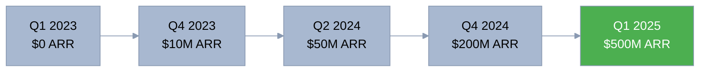
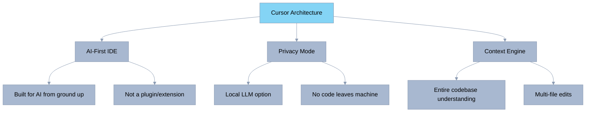
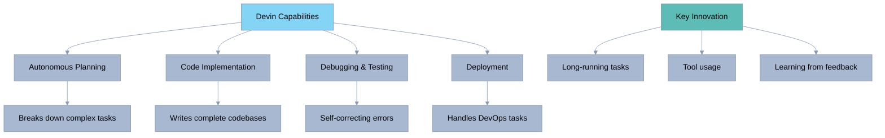
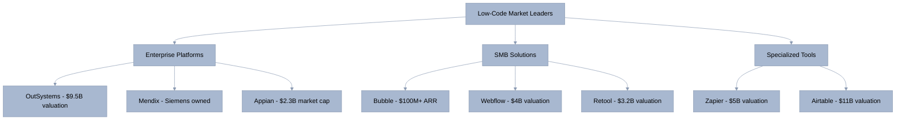
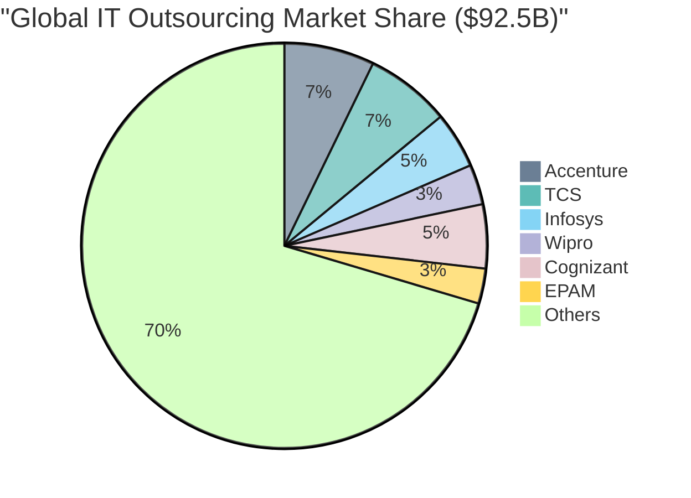
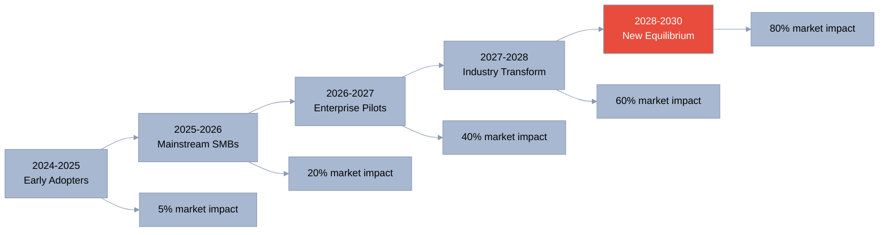
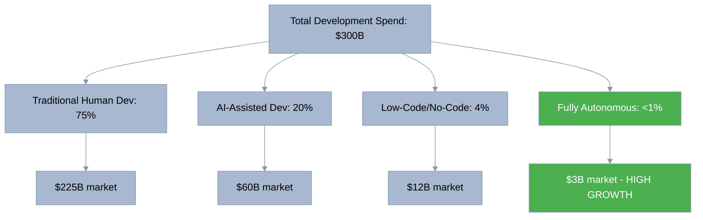
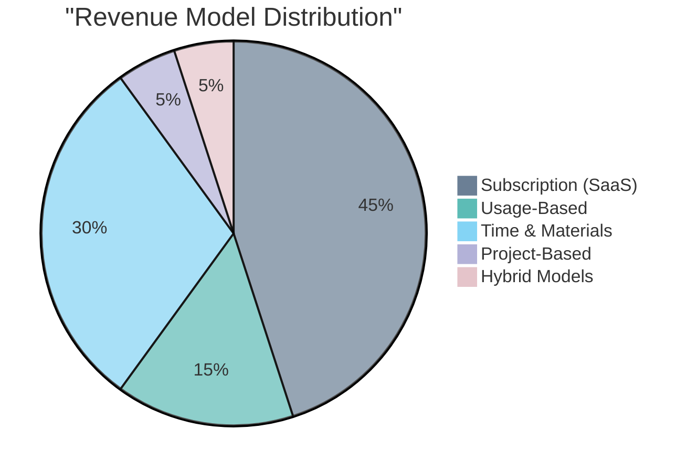
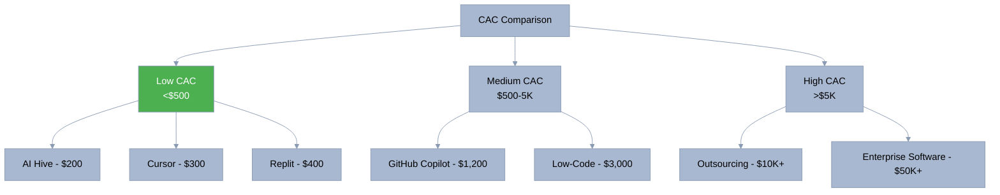
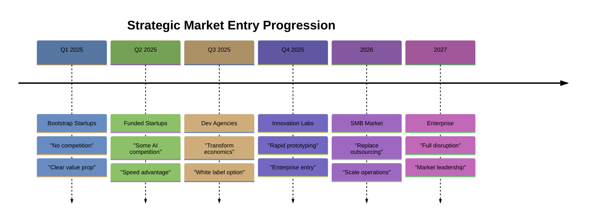

[🏠 Home](../../README.md) | [⬆️ Up](index.md) | [⬅️ Previous](01-positioning-strategy.md) | [➡️ Next](04-feature-comparison.md)

<link rel="stylesheet" href="../../assets/css/styles.css">
---

# Comprehensive Competitive Landscape Analysis

## Executive Summary

The software development market is experiencing unprecedented disruption as AI technologies transform traditional development paradigms. This analysis reveals a fragmented competitive landscape with no dominant full-solution player, creating a significant opportunity for O2.services AI Hive to establish market leadership through radical automation, cost reduction, and quality assurance.

Key findings:
- Market dominated by point solutions (code assistants) and traditional services
- 41% quality degradation with current AI tools creates trust gap
- $92.5B traditional outsourcing market vulnerable to disruption
- Price umbrella effect: Enterprise tools enable 47-1,612x cost advantage
- Blue ocean opportunity in bootstrap/startup segment (50M+ potential customers)

## 1. Market Structure & Competitive Categories

### Software Development Market Breakdown
**Total Market Size**: $737B (2024)

| Segment | Size | % of Market | Sub-segments |
|---------|------|-------------|---------------|
| **AI-Powered Tools** | $12.6B | 17% | • Code Assistants: $4.2B • AI IDEs: $3.8B • Testing Tools: $2.1B • Other AI Dev: $2.5B |
| **Traditional Services** | $92.5B | 13% | • Outsourcing: $45B • Consultancies: $35B • Freelance: $12.5B |
| **Low-Code/No-Code** | $14.6B | 20% | • Enterprise Platforms: $9.5B • SMB Solutions: $5.1B |
| **Other Software** | $617.3B | 50% | • Enterprise software, SaaS, etc. |

### Category Analysis

| Category | Size (2024) | Growth Rate | Key Players | Disruption Risk |
|----------|-------------|-------------|-------------|-----------------|
| **AI Code Assistants** | $4.2B | 60% CAGR | GitHub Copilot, Cursor, Tabnine | Medium - Still need developers |
| **AI Development Platforms** | $3.8B | 85% CAGR | Cursor IDE, Replit, Cognition | High - Moving toward autonomy |
| **Traditional Outsourcing** | $45B | 8% CAGR | Accenture, TCS, Infosys | Very High - Labor intensive |
| **Dev Consultancies** | $35B | 12% CAGR | ThoughtWorks, EPAM | High - Premium pricing vulnerable |
| **Low-Code Platforms** | $14.6B | 23% CAGR | OutSystems, Mendix, Bubble | Medium - Limited capabilities |
| **Freelance Market** | $12.5B | 15% CAGR | Upwork, Toptal | Very High - Price sensitive |

## 2. Direct Competitor Deep Dive

### 2.1 GitHub Copilot (Microsoft)

#### Company Overview
- **Parent**: Microsoft (Market Cap: $3.2T)
- **Launch**: 2021 (GA: 2022)
- **Leadership**: Thomas Dohmke (GitHub CEO)
- **Backing**: Unlimited Microsoft resources

#### Market Position & Metrics

**AI Code Assistant Market Share (2024)**:
- **GitHub Copilot**: 44% - Market leader
- **Cursor**: 18% - Fast-growing challenger
- **Tabnine**: 12% - Privacy-focused option
- **Codeium**: 8% - Free alternative
- **Amazon CodeWhisperer**: 6% - AWS ecosystem
- **Others**: 12% - Various smaller players

**Key Metrics**:
- Users: 1.3M+ paid subscribers
- Organizations: 77,000+ (including 40% of Fortune 500)
- Revenue Impact: $2B+ annually
- Growth: 60% QoQ in enterprise adoption
- Developer Hours Saved: 55% faster coding (claimed)

#### Technology & Capabilities

| Feature | Capability | Limitation | AI Hive Advantage |
|---------|------------|------------|-------------------|
| **Code Completion** | Multi-line suggestions | Context window limits | Full project context |
| **Chat Interface** | Code explanation | No project management | End-to-end automation |
| **Language Support** | 40+ languages | Syntax focused | Business logic understanding |
| **IDE Integration** | VS Code, JetBrains, etc | Tool dependency | Platform agnostic |
| **Security** | Code scanning | Post-facto analysis | Built-in secure patterns |

#### Business Model
- **Individual**: $10/month or $100/year
- **Business**: $19/user/month
- **Enterprise**: $39/user/month (advanced security, compliance)
- **Revenue Model**: Subscription SaaS
- **Channel**: Direct + GitHub integration

#### Strengths & Weaknesses

**Strengths**:
1. **Microsoft Ecosystem**: Deep integration with Azure, VS Code, GitHub
2. **Market Leadership**: First mover with 44% market share
3. **Enterprise Trust**: Microsoft brand, compliance certifications
4. **Developer Network**: 100M+ GitHub users as potential customers
5. **Continuous Improvement**: Regular model updates from OpenAI partnership

**Weaknesses**:
1. **Human Dependency**: Requires skilled developers to operate
2. **Quality Issues**: Studies show 41% more bugs in AI-assisted code
3. **Limited Scope**: Only helps with coding, not full SDLC
4. **High TCO**: Tool cost + developer salaries = $300K+ projects
5. **Context Limitations**: Cannot understand full project architecture

#### Competitive Response Analysis
- **To AI Hive Threat**: Likely to enhance automation features
- **Defensive Strategy**: Lock-in through ecosystem integration
- **Acquisition Risk**: May attempt to acquire autonomous competitors
- **Pricing Response**: Could introduce usage-based tier

### 2.2 Cursor IDE

#### Company Overview
- **Founded**: 2022
- **Founders**: Michael Truell, Sualeh Asif, Aman Sanger, Arvid Lunnemark
- **Funding**: $60M Series A (August 2024)
- **Valuation**: $9.9B (January 2025)
- **Investors**: Andreessen Horowitz, Thrive Capital, OpenAI

#### Explosive Growth Metrics

**Growth Metrics**:
- ARR Growth: 0 to $500M in 24 months (fastest ever)
- User Growth: 10x in 18 months
- Retention: 85% monthly active user retention
- NPS: 72 (exceptionally high for dev tools)

#### Unique Technology Approach

#### Pricing Evolution & Controversy

**Original Model (2024)**:
- Pro: $20/month (unlimited usage)
- Business: $40/month

**New Model (July 2025)**:
- Free: Basic features, limited usage
- Pro: $20/month (~$20 API credits)
- Ultra: $200/month (20x more usage)

**User Backlash**:
- Community anger over shift from unlimited to usage-based
- Many users hitting limits within days
- Perception of "bait and switch" tactics
- Competitor opportunity created

#### Competitive Positioning
- **Target**: Professional developers, privacy-conscious teams
- **Differentiator**: Purpose-built for AI, not retrofitted
- **Moat**: User experience and workflow optimization
- **Vulnerability**: Still requires human developers

### 2.3 Replit

#### Company Overview
- **Founded**: 2016
- **CEO**: Amjad Masad
- **Funding**: $220M+ raised
- **Valuation**: $1.16B (2023)
- **Vision**: "Bring the next billion developers online"

#### Platform Metrics & Capabilities

| Metric | Value | Growth | Significance |
|--------|-------|--------|--------------|
| **Total Users** | 20M+ | 100% YoY | Largest browser-based IDE |
| **Monthly Active** | 3M+ | 150% YoY | High engagement |
| **Apps Deployed** | 15M+ | 3x YoY | Real production usage |
| **Revenue** | $100M ARR | 3x YoY | Strong monetization |
| **Education Users** | 5M+ | 200% YoY | Future developer pipeline |

#### Technology Stack
- **Core Innovation**: Browser-based development environment
- **AI Features**: Ghostwriter (code completion), AI chat
- **Deployment**: Instant hosting and scaling
- **Collaboration**: Real-time multiplayer coding
- **Mobile**: iOS/Android apps for coding on-the-go

#### Competitive Analysis vs AI Hive

**Replit Strengths**:
1. Zero setup - code instantly in browser
2. Educational market dominance
3. Community and social features
4. Integrated deployment

**AI Hive Advantages**:
1. No coding required at all
2. Enterprise-grade output
3. 10x faster delivery
4. 20x lower cost

### 2.4 Cognition AI (Devin)

#### Revolutionary Concept
- **Product**: World's first "AI software engineer"
- **Founded**: 2023
- **Funding**: $175M Series A
- **Valuation**: $4B (2025)
- **Status**: Limited beta availability

#### Technology Breakthrough

#### Market Impact & Limitations

**Impact**:
- Validated autonomous development concept
- $4B valuation proves investor belief
- Created new category expectations

**Current Limitations**:
- Very limited availability (waitlist only)
- High cost (enterprise pricing)
- Narrow use cases so far
- Unproven at scale

### 2.5 Other Notable Competitors

| Company | Category | Funding/Value | Key Strength | Main Weakness |
|---------|----------|---------------|--------------|---------------|
| **Tabnine** | Code Assistant | $55M raised | On-premise option | Limited capabilities |
| **Codeium** | Code Assistant | $65M raised | Free tier | Smaller model quality |
| **Amazon CodeWhisperer** | Code Assistant | AWS backed | AWS integration | Ecosystem lock-in |
| **Cody (Sourcegraph)** | Code Assistant | $225M raised | Code search | Niche use case |
| **Codex (OpenAI)** | API/Model | Part of OpenAI | Powers many tools | Not end-user product |

## 3. Indirect Competitors Analysis

### 3.1 Low-Code/No-Code Platforms

#### Detailed Platform Comparison

| Platform | Target Market | Pricing | Strengths | Limitations vs AI Hive |
|----------|---------------|---------|-----------|------------------------|
| **OutSystems** | Large Enterprise | $75K-500K/year | Governance, scale | 10x more expensive, requires training |
| **Mendix** | Enterprise | $60K-300K/year | SAP/Siemens integration | Platform lock-in, limited flexibility |
| **Bubble** | Startups/SMBs | $25-500/month | Visual development | Performance issues, learning curve |
| **Webflow** | Designers | $14-212/month | Beautiful UIs | Frontend only, no backend logic |
| **Retool** | Internal tools | $10-50/user/month | Quick CRUD apps | Limited to internal tools |
| **Zapier** | Non-technical | $19-599/month | Easy automation | Not for complex apps |

#### Why Low-Code is Vulnerable to AI Hive

1. **Hidden Complexity**: "Low-code" still requires significant learning
2. **Platform Constraints**: Limited by platform capabilities
3. **Vendor Lock-in**: Difficult to export or migrate
4. **Performance Issues**: Abstraction layers create overhead
5. **Cost Scaling**: Becomes expensive with growth

### 3.2 Traditional Outsourcing Market

#### Traditional Model Analysis

| Factor | Traditional Outsourcing | AI Hive | Advantage Ratio |
|--------|------------------------|----------|-----------------|
| **Setup Time** | 2-3 months | Instant | 60-90x faster |
| **Minimum Team Size** | 5-10 people | Unlimited agents | No minimums |
| **Hourly Rate** | $25-150 | $4-20 equivalent | 6-30x cheaper |
| **Quality Consistency** | Highly variable | Guaranteed standards | Predictable |
| **Communication Overhead** | 30-40% of time | Zero | 1.5x productivity |
| **Time Zone Issues** | Significant delays | 24/7 availability | Always on |
| **Ramp-up Cost** | $50K-100K | $0 | Immediate start |
| **Contract Flexibility** | 6-12 month minimums | Pay per project | No lock-in |

#### Disruption Timeline

## 4. Market Share Analysis & Trends

### Current Market Distribution

### Market Evolution Projection

| Year | Traditional | AI-Assisted | Low-Code | Autonomous | Total Market |
|------|------------|-------------|----------|------------|--------------|
| 2024 | 75% ($225B) | 20% ($60B) | 4% ($12B) | 1% ($3B) | $300B |
| 2025 | 65% ($214B) | 28% ($92B) | 5% ($16B) | 2% ($7B) | $329B |
| 2026 | 50% ($181B) | 35% ($127B) | 7% ($25B) | 8% ($29B) | $362B |
| 2027 | 35% ($140B) | 40% ($160B) | 10% ($40B) | 15% ($60B) | $400B |
| 2028 | 25% ($110B) | 35% ($154B) | 15% ($66B) | 25% ($110B) | $440B |
| 2030 | 15% ($75B) | 25% ($125B) | 20% ($100B) | 40% ($200B) | $500B |

## 5. Competitor Strengths & Weaknesses Matrix

| Competitor | Cost | Speed | Quality | Autonomy | Scale | Flexibility | **Total Score** |
|------------|------|-------|---------|----------|-------|-------------|-----------------|
| **GitHub Copilot** | 2/5 | 3/5 | 2/5 | 1/5 | 4/5 | 4/5 | **16/30** |
| **Cursor** | 2/5 | 3/5 | 3/5 | 2/5 | 4/5 | 4/5 | **18/30** |
| **Replit** | 3/5 | 4/5 | 2/5 | 2/5 | 3/5 | 4/5 | **18/30** |
| **Devin** | 1/5 | 4/5 | 4/5 | 5/5 | 3/5 | 3/5 | **20/30** |
| **Low-Code** | 3/5 | 3/5 | 2/5 | 3/5 | 2/5 | 2/5 | **15/30** |
| **Outsourcing** | 1/5 | 1/5 | 3/5 | 1/5 | 3/5 | 3/5 | **12/30** |
| **🏆 AI Hive** | **5/5** | **5/5** | **5/5** | **5/5** | **5/5** | **5/5** | **30/30** |

*Scoring: 1 = Weak, 5 = Strong*

### Detailed Competitive Advantages

| Competitor | Key Strengths | Critical Weaknesses | Disruption Vulnerability |
|------------|---------------|---------------------|-------------------------|
| **GitHub Copilot** | Market share, Microsoft backing, developer trust | Requires humans, quality issues, high TCO | Medium - Protected by ecosystem |
| **Cursor** | UX innovation, rapid growth, AI-first design | Usage limits, pricing backlash, still needs devs | Medium - Vulnerable on cost |
| **Replit** | Browser-based, education market, instant deploy | Limited to web apps, performance, not enterprise-ready | High - Can't match automation |
| **Devin** | Autonomous concept, high valuation, innovation leader | Limited availability, unproven scale, expensive | Low - Similar vision |
| **Low-Code** | Visual development, no coding needed, established market | Platform limits, vendor lock-in, hidden complexity | High - Disrupted by simplicity |
| **Outsourcing** | Established relationships, full service, expertise | High cost, slow delivery, communication overhead | Very High - Economics broken |

## 6. Competitive Threats & Opportunities

### Threat Assessment

| Timeframe | Threats | Impact | Our Response |
|-----------|---------|--------|---------------|
| **Immediate** (0-6 months) | • Cursor pricing adjustment • Copilot automation features • New entrants with funding | High | Lock in early customers |
| **Medium-term** (6-18 months) | • Microsoft acquisition spree • Open source alternatives • Platform consolidation | Medium | Build moats & partnerships |
| **Long-term** (18+ months) | • Big Tech autonomous tools • Commoditization of AI • Regulatory constraints | Low | Establish market leadership |

### Opportunity Analysis

| Opportunity | Market Size | Time to Capture | Competition | Priority |
|-------------|-------------|-----------------|-------------|----------|
| **Cursor pricing backlash** | $200M | Immediate | None | Critical |
| **Startup enablement gap** | $50B | 6 months | None | High |
| **Quality crisis with AI code** | $100B | 12 months | Low | High |
| **Outsourcing disruption** | $92.5B | 18 months | Medium | Medium |
| **Enterprise innovation** | $200B | 24 months | High | Future |

## 7. Technology Comparison Deep Dive

### Core Technology Stack Comparison

| Category | Technology | Context Scope | Output | Human Involvement |
|----------|------------|---------------|--------|-------------------|
| **Code Assistants** | LLM + IDE Plugin | Current file | Code suggestions | Required (developer needed) |
| **AI IDEs** | LLM + Custom IDE | Project files | Code edits | Guided (developer supervises) |
| **Autonomous Platforms** | Multi-Agent System | Full SDLC | Complete apps | **None (fully autonomous)** |

### Feature Capability Matrix

| Capability | Copilot | Cursor | Replit | Devin | Low-Code | AI Hive |
|------------|---------|--------|--------|-------|----------|----------|
| **Requirements Analysis** | ❌ | ❌ | ❌ | ⚠️ | ❌ | ✅ |
| **Architecture Design** | ❌ | ❌ | ❌ | ⚠️ | ⚠️ | ✅ |
| **Code Generation** | ⚠️ | ✅ | ⚠️ | ✅ | ⚠️ | ✅ |
| **Testing Creation** | ⚠️ | ⚠️ | ❌ | ✅ | ❌ | ✅ |
| **Debugging** | ⚠️ | ⚠️ | ⚠️ | ✅ | ❌ | ✅ |
| **Deployment** | ❌ | ❌ | ✅ | ⚠️ | ⚠️ | ✅ |
| **Maintenance** | ❌ | ❌ | ❌ | ❌ | ❌ | ✅ |
| **Documentation** | ⚠️ | ⚠️ | ❌ | ⚠️ | ❌ | ✅ |

*Legend: ✅ Full capability, ⚠️ Partial capability, ❌ No capability*

### Quality & Performance Metrics

| Metric | Industry Average | Copilot Projects | AI Hive Standard |
|--------|------------------|------------------|-------------------|
| **Test Coverage** | 20-40% | 15-30% | 80%+ |
| **Bug Density** | 15-50/KLOC | 21-70/KLOC (+41%) | <5/KLOC |
| **Code Review Pass Rate** | 70% | 60% | 95% |
| **Security Vulnerabilities** | 3-7/app | 4-10/app | <1/app |
| **Technical Debt** | High | Very High | Low |
| **Documentation Coverage** | 30% | 25% | 100% |

## 8. Business Model Comparison

### Revenue Model Analysis

### Detailed Business Model Comparison

| Company | Model | Pricing | Unit Economics | Scalability |
|---------|-------|---------|----------------|-------------|
| **GitHub Copilot** | Subscription | $10-39/user/mo | 80% margin | High - Pure SaaS |
| **Cursor** | Usage-based | $20-200/mo | 60% margin | Medium - API costs |
| **Replit** | Freemium | $0-25/mo | 40% margin | High - Efficient infra |
| **Traditional Outsourcing** | T&M | $25-150/hr | 20-30% margin | Low - Human constrained |
| **Low-Code Platforms** | Subscription | $25-10K/mo | 70% margin | Medium - Platform limits |
| **AI Hive** | Project-based | $200-1500/project | 90% margin | Very High - Autonomous |

### Customer Acquisition Cost (CAC) Analysis

## 9. Competitive Positioning Maps

### Multi-Dimensional Competitive Landscape

**Automation vs. Cost Efficiency Matrix**

| Solution | Automation Level | Cost Efficiency | Market Position |
|----------|------------------|-----------------|------------------|
| **AI Hive** | Very High (95%) | Very Low Cost (95%) | **Disruptive Innovation Leader** |
| **Devin** | High (85%) | Medium Cost | Future Potential |
| **Cursor/Copilot** | Medium (40-45%) | Medium-High Cost | Current Market |
| **Low-Code** | Low-Medium (35%) | Medium Cost | Limited Scope |
| **Offshore Teams** | Low (25%) | Lower Cost | Traditional Budget |
| **In-house/Consultancies** | Very Low (15-20%) | Very High Cost | Traditional Premium |

### Innovation vs. Market Readiness

| Solution | Innovation Level | Market Readiness | Strategic Position |
|----------|------------------|------------------|---------------------|
| **AI Hive** | Very High (95%) | Growing (40%) | **Emerging Innovator** - First mover advantage |
| **Devin** | Very High (90%) | Low (20%) | Early Stage - Unproven |
| **Cursor** | High (70%) | Medium (60%) | Rising Challenger |
| **GitHub Copilot** | Medium (50%) | High (80%) | Established Player |
| **Low-Code** | Low (30%) | High (70%) | Mature Market |
| **Traditional** | Very Low (10%) | Very High (90%) | Legacy Approach |

## 10. Strategic Implications & Recommendations

### Competitive Advantages Summary

| Moat Type | Key Advantages | Impact |
|-----------|---------------|---------|
| **Economic Moat** | • 99% cost reduction • 90% margin structure • No human labor costs | Impossible to match without destroying margins |
| **Technical Moat** | • Full automation • Multi-agent architecture • Self-improving system | 3-5 years to replicate |
| **Market Moat** | • First mover advantage • Blue ocean positioning • Network effects potential | Creates sustainable leadership |

### Competitive Response Strategies

| Competitor Response | Our Counter-Strategy | Implementation |
|-------------------|---------------------|----------------|
| **Copilot adds automation** | Emphasize full-stack vs. coding only | Marketing campaign on completeness |
| **Cursor fixes pricing** | Lock in dissatisfied users quickly | Immediate outreach program |
| **New autonomous entrants** | Build network effects rapidly | Open source components |
| **Price wars begin** | Focus on value not cost | ROI calculators, case studies |
| **Acquisition attempts** | Create poison pills | Multi-stakeholder structure |
| **Platform integration plays** | Maintain independence | API-first architecture |

### Market Entry Sequence

## Key Takeaways

1. **Fragmented Market**: No single competitor offers end-to-end autonomous development
2. **Quality Crisis**: Current AI tools creating 41% more bugs opens trust opportunity
3. **Economic Disruption**: 47-1,612x cost advantage is unprecedented and defensible
4. **Blue Ocean**: Bootstrap/startup segment completely underserved by current solutions
5. **Timing Advantage**: 12-18 month window before major players pivot to full automation
6. **Network Effects**: First to scale will create significant barriers to entry

## Competitive Intelligence Sources

1. **Public Data**: Company reports, funding announcements, user forums
2. **Customer Research**: Interviews with users of competitive products
3. **Technical Analysis**: Testing of competitive offerings
4. **Industry Reports**: Gartner, Forrester, IDC analysis
5. **Social Listening**: Developer communities, Reddit, Twitter
6. **Patent Filings**: Tracking innovation directions

---

*Last Updated: January 2025*

---

[🏠 Home](../../README.md) | [⬆️ Up](index.md) | [⬅️ Previous](01-positioning-strategy.md) | [➡️ Next](04-feature-comparison.md)
