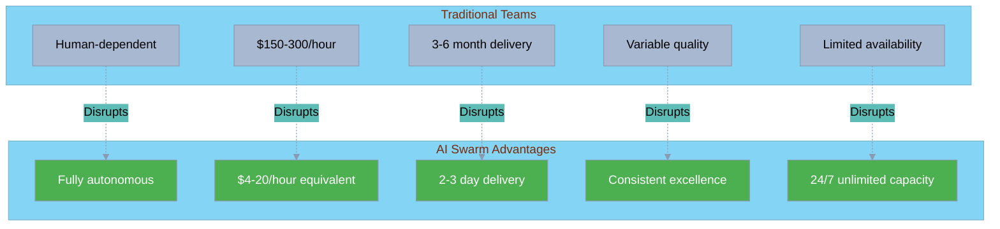
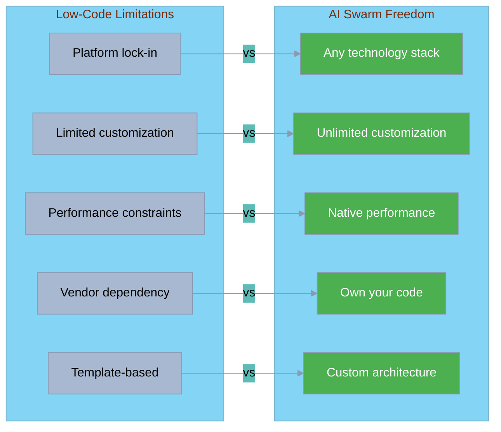
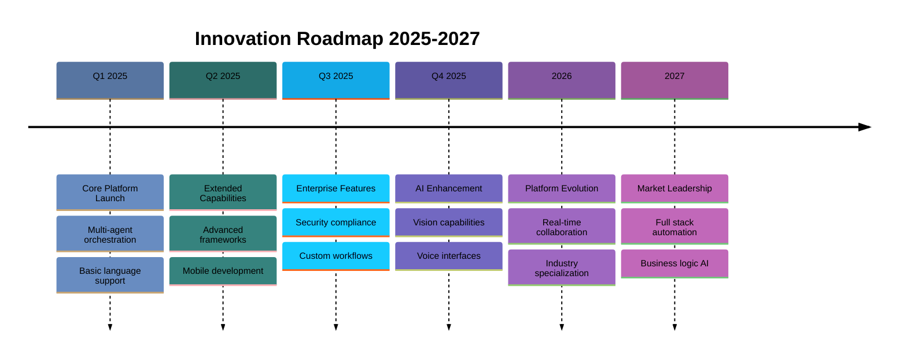
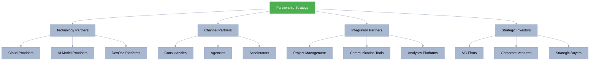
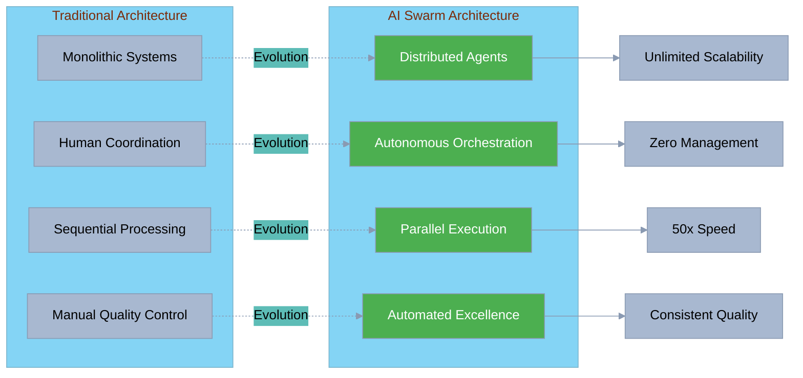
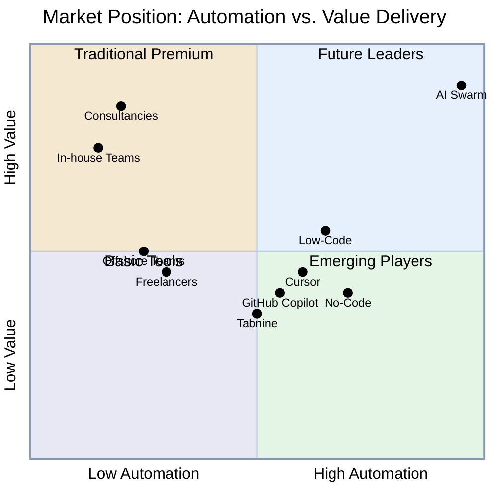
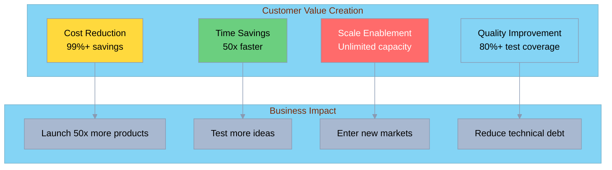

[🏠 Home](../../README.md) | [📊 Market Analysis](../market-analysis/index.md) | [🎯 Competitive Positioning](./index.md)

<link rel="stylesheet" href="../../assets/css/styles.css">
---

# AI Swarm Differentiation Strategy

## Executive Summary

O2.services AI Swarm has established a defensible market position through radical innovation in autonomous software development. Our differentiation strategy leverages technological superiority, economic disruption, and strategic partnerships to create sustainable competitive advantages that are difficult to replicate.

**Key Differentiators:**
- **99.6% cost reduction** through full automation
- **50x faster delivery** via parallel AI agent execution
- **Zero human dependency** with autonomous operation
- **Guaranteed quality** through enforced best practices
- **Unlimited scalability** without resource constraints

## 1. Core Differentiators by Competitor Type

### vs. Traditional Development Teams

**Key Differentiators:**
- **Economic**: 47-75x cost reduction eliminates budget barriers
- **Speed**: Parallel processing compresses months into days
- **Quality**: Automated testing exceeds human consistency
- **Scale**: No hiring, training, or management overhead

### vs. AI-Assisted Development (GitHub Copilot, Cursor)

| Capability | AI-Assisted Tools | AI Swarm | Our Advantage |
|------------|------------------|----------|---------------|
| **Human Requirement** | Still need developers | Zero humans needed | Complete automation |
| **Coverage** | Code completion only | Requirements → Deploy | End-to-end solution |
| **Cost Structure** | Tool + Developer salary | Flat project rate | 99%+ savings |
| **Quality Control** | Human dependent | Automated enforcement | Consistent excellence |
| **Project Management** | Manual coordination | Autonomous orchestration | No overhead |
| **Architecture** | Human decisions | AI-optimized design | Best practices guaranteed |

**Unique Advantages:**
- Eliminates the need for developers entirely
- Handles complete software lifecycle, not just coding
- No learning curve or integration required
- Works autonomously without human oversight

### vs. Low-Code/No-Code Platforms

**Strategic Advantages:**
- No platform constraints or limitations
- Full code ownership and portability
- Enterprise-grade architecture and scalability
- Technology agnostic implementation

### vs. Offshore Development Teams

| Factor | Offshore Teams | AI Swarm | Differentiation |
|--------|---------------|----------|-----------------|
| **Cost** | $25-50/hour | $4-20/hour equivalent | 5-10x cheaper |
| **Communication** | Time zone delays | Instant response | No delays |
| **Quality** | Variable, often lower | Guaranteed high | Consistent excellence |
| **Management** | High overhead | Zero management | No coordination needed |
| **IP Security** | Potential risks | Complete control | Enhanced security |
| **Cultural Barriers** | Common challenges | None | Perfect understanding |

## 2. Sustainable Competitive Advantages

### Technical Moats

```mermaid
%%{init: {
  'theme': 'base',
  'themeVariables': {
    'primaryColor': '#A8B8D0',
    'primaryTextColor': '#000000',
    'primaryBorderColor': '#8A9AB2',
    'lineColor': '#8A9AB2',
    'secondaryColor': '#5DBCB6',
    'tertiaryColor': '#84D4F5',
    'background': '#F5F5F5'
  }
}}%%
graph TD
    A[Technical Moats] --> B[Multi-Agent Orchestration]
    A --> C[Context Preservation]
    A --> D[Quality Automation]
    A --> E[Continuous Learning]

    B --> B1[Complex coordination logic]
    B --> B2[Agent specialization]
    B --> B3[Parallel execution engine]

    C --> C1[Full project understanding]
    C --> C2[Decision history tracking]
    C --> C3[Knowledge persistence]

    D --> D1[Automated testing framework]
    D --> D2[Best practice enforcement]
    D --> D3[Code quality metrics]

    E --> E1[Pattern recognition]
    E --> E2[Performance optimization]
    E --> E3[Error prevention]

    style A fill:#4CAF50,color:#fff
    style B fill:#5DBCB6,color:#fff
    style C fill:#5DBCB6,color:#fff
    style D fill:#5DBCB6,color:#fff
    style E fill:#5DBCB6,color:#fff
```

### Economic Moats

**1. Cost Structure Advantage**
- Zero marginal cost per project
- No human labor expenses
- Economies of scale in AI infrastructure
- Value-based pricing captures more surplus

**2. Network Effects**
- Each project improves the system
- Pattern library grows exponentially
- Bug fixes benefit all customers
- Community contributions compound

**3. Switching Costs**
- Integration with customer workflows
- Historical project knowledge
- Team familiarity with outputs
- Proven track record

### Operational Moats

| Moat Type | Description | Defensibility | Time to Replicate |
|-----------|-------------|---------------|-------------------|
| **First Mover** | Market education and brand | Medium | 6-12 months |
| **Data Advantage** | Learning from thousands of projects | High | 2-3 years |
| **Integration Ecosystem** | API connections and partnerships | Medium-High | 1-2 years |
| **Customer Success** | Proven results and case studies | High | 2-3 years |
| **Technology Stack** | Proprietary agent architecture | Very High | 3-5 years |

## 3. Innovation Roadmap for Leadership

### Phase 1: Foundation (Current - Q2 2025)

### Innovation Priorities

**1. Immediate (Q1-Q2 2025)**
- Expand language and framework support
- Enhance mobile app development capabilities
- Implement advanced debugging and optimization
- Add real-time collaboration features

**2. Near-term (Q3-Q4 2025)**
- Computer vision for UI/UX development
- Voice-driven development interfaces
- Advanced security and compliance tools
- Industry-specific templates and patterns

**3. Long-term (2026-2027)**
- Business logic understanding and implementation
- Automated architecture optimization
- Cross-platform unified development
- AI-driven product strategy recommendations

### Competitive Innovation Matrix

| Innovation Area | Current State | 6-Month Target | Competitive Impact |
|-----------------|---------------|----------------|-------------------|
| **Language Support** | 10 languages | 25+ languages | Expand TAM 3x |
| **Mobile Development** | Basic | Full native/hybrid | New market segment |
| **AI Capabilities** | Text-based | Multimodal | Unique differentiator |
| **Enterprise Tools** | Standard | Compliance suite | Enterprise penetration |
| **Performance** | 2-3 days | Same-day delivery | Unmatched speed |

## 4. Partnership Strategies

### Strategic Partnership Framework

### Key Partnership Opportunities

**1. Technology Partnerships**
- **Cloud Providers**: AWS, Google Cloud, Azure for infrastructure
- **AI Providers**: OpenAI, Anthropic for model access
- **DevOps**: GitHub, GitLab for repository integration

**2. Channel Partnerships**
- **Consultancies**: White-label opportunities
- **Development Agencies**: Productivity multiplication
- **Startup Accelerators**: Portfolio company benefits

**3. Integration Partnerships**
- **Atlassian**: Jira/Confluence integration
- **Slack/Teams**: Communication workflow
- **Salesforce**: CRM integration for agencies

### Partnership Value Propositions

| Partner Type | Their Benefit | Our Benefit | Joint Value |
|--------------|---------------|-------------|-------------|
| **Consultancies** | 10x project capacity | Market access | Serve more clients |
| **Accelerators** | Portfolio differentiation | Customer pipeline | Startup success |
| **Cloud Providers** | Increased usage | Infrastructure deals | Market growth |
| **Agencies** | Higher margins | Distribution | Industry transformation |

## 5. Technology Differentiators

### Architecture Advantages

### Technical Capabilities Matrix

| Capability | Traditional | AI-Assisted | AI Swarm | Unique Advantage |
|------------|------------|-------------|----------|------------------|
| **Requirements Analysis** | Manual interpretation | Manual + suggestions | AI comprehension | Full automation |
| **Architecture Design** | Human expertise | Human + patterns | AI optimization | Best practices guaranteed |
| **Code Generation** | Manual coding | Assisted coding | Autonomous coding | No human needed |
| **Testing** | Manual/Semi-auto | Assisted creation | Full automation | 80%+ coverage |
| **Documentation** | Often skipped | Assisted writing | Auto-maintained | Always current |
| **Deployment** | Manual DevOps | Assisted setup | Full automation | Zero-touch deploy |

### Proprietary Technology Stack

**1. Multi-Agent Orchestration Engine**
- Proprietary coordination algorithms
- Optimized task distribution
- Real-time performance monitoring
- Self-healing error recovery

**2. Context Preservation System**
- Full project state management
- Decision tree tracking
- Knowledge graph construction
- Cross-project learning

**3. Quality Assurance Framework**
- Automated test generation
- Code quality scoring
- Security vulnerability scanning
- Performance optimization

**4. Continuous Learning Pipeline**
- Pattern extraction from projects
- Error prediction and prevention
- Performance optimization
- Best practice evolution

## 6. Visual Market Position

### Competitive Landscape Map

### Value Creation Matrix

### Differentiation Radar

```mermaid
%%{init: {
  'theme': 'base',
  'themeVariables': {
    'primaryColor': '#A8B8D0',
    'primaryTextColor': '#000000',
    'primaryBorderColor': '#8A9AB2',
    'lineColor': '#8A9AB2',
    'secondaryColor': '#5DBCB6',
    'tertiaryColor': '#84D4F5',
    'background': '#F5F5F5'
  }
}}%%
graph LR
    subgraph "Differentiation Dimensions"
        direction TB
        D1[Cost Efficiency: 10/10]
        D2[Speed to Market: 10/10]
        D3[Quality Guarantee: 9/10]
        D4[Automation Level: 10/10]
        D5[Scalability: 10/10]
        D6[Flexibility: 9/10]
        D7[Innovation: 9/10]
        D8[Market Position: 8/10]
    end

    style D1 fill:#4CAF50,color:#fff
    style D2 fill:#4CAF50,color:#fff
    style D3 fill:#4CAF50,color:#fff
    style D4 fill:#4CAF50,color:#fff
    style D5 fill:#4CAF50,color:#fff
    style D6 fill:#4CAF50,color:#fff
    style D7 fill:#4CAF50,color:#fff
    style D8 fill:#5DBCB6,color:#fff
```

## 7. Barriers to Entry

### Structural Barriers

| Barrier Type | Description | Height | Time to Overcome |
|--------------|-------------|--------|------------------|
| **Technical Complexity** | Multi-agent orchestration | Very High | 3-5 years |
| **Data Advantage** | Learning from thousands of projects | High | 2-3 years |
| **Brand Recognition** | First mover advantage | Medium | 1-2 years |
| **Customer Trust** | Proven track record | High | 2-3 years |
| **Partnership Network** | Established relationships | Medium | 1-2 years |
| **Cost Structure** | Zero marginal cost model | Very High | Structural |

### Competitive Response Barriers

**1. Incumbent Constraints**
- Traditional firms can't match pricing without destroying margins
- AI tool companies lack full automation capabilities
- Low-code platforms constrained by their architectures

**2. New Entrant Challenges**
- High technical complexity requires specialized expertise
- Customer acquisition costs in established market
- Need for significant upfront investment

**3. Substitution Difficulties**
- No direct substitute offers same value proposition
- Switching costs increase as customers integrate
- Network effects strengthen our position

## 8. Strategic Recommendations

### Immediate Actions (Q1 2025)

1. **Strengthen Technical Moat**
   - File patents on key innovations
   - Accelerate development of proprietary features
   - Build deeper integration capabilities

2. **Expand Market Position**
   - Launch aggressive customer acquisition campaign
   - Establish key strategic partnerships
   - Build thought leadership through content

3. **Enhance Differentiation**
   - Add unique features competitors can't match
   - Develop industry-specific solutions
   - Create exclusive partnership benefits

### Medium-term Strategy (2025-2026)

1. **Market Domination**
   - Achieve 25% market share in target segments
   - Establish as category leader
   - Build insurmountable data advantage

2. **Platform Evolution**
   - Expand into adjacent markets
   - Add business logic capabilities
   - Create ecosystem of complementary services

3. **Global Expansion**
   - Localize for key markets
   - Build regional partnerships
   - Adapt to local regulations

### Long-term Vision (2027+)

1. **Industry Transformation**
   - Redefine software development paradigm
   - Enable new business models
   - Democratize technology creation

2. **Technology Leadership**
   - Push boundaries of AI capabilities
   - Create new categories of automation
   - Set industry standards

## Conclusion

AI Swarm's differentiation strategy positions us as the inevitable future of software development. By combining radical cost reduction, unprecedented speed, and guaranteed quality, we've created a value proposition that's not just better than alternatives—it's fundamentally different.

Our sustainable competitive advantages, built on technical innovation, economic disruption, and strategic partnerships, create multiple reinforcing moats that will be difficult for competitors to overcome. As we execute on our innovation roadmap and strengthen our market position, we'll transform from a disruptive startup to the dominant platform for autonomous software development.

The key to maintaining our differentiation lies in continuous innovation, aggressive market expansion, and relentless focus on customer value delivery. By staying ahead of the technology curve and building deep customer relationships, we'll ensure that AI Swarm remains not just differentiated, but indispensable.

---

[🏠 Home](../../README.md) | [📊 Market Analysis](../market-analysis/index.md) | [🎯 Competitive Positioning](./index.md)
