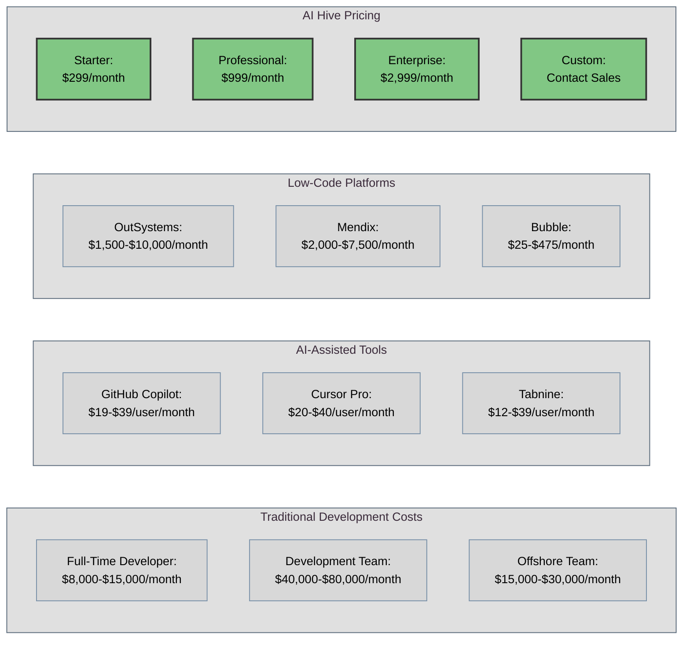
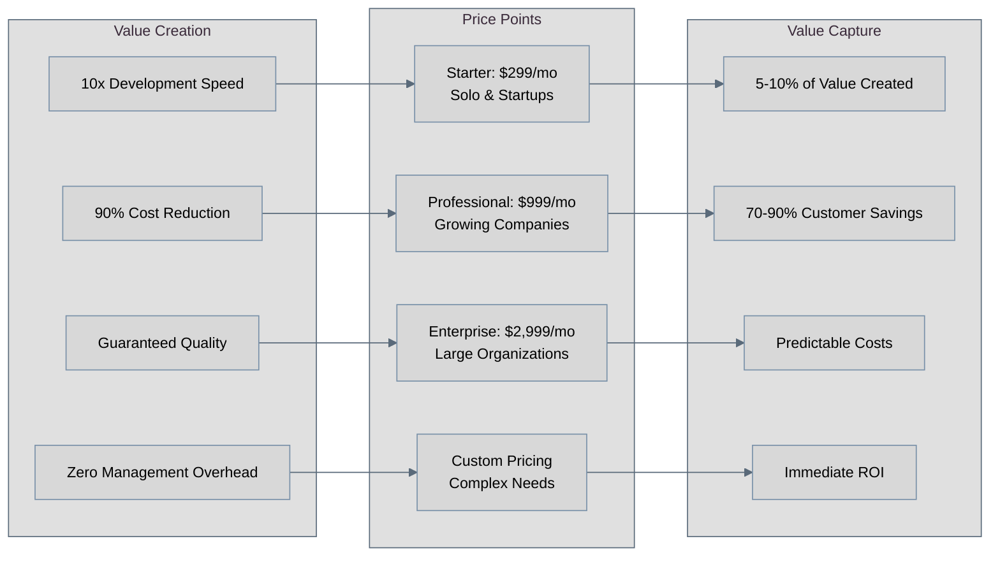
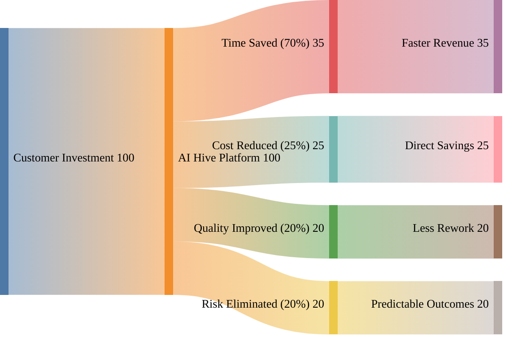
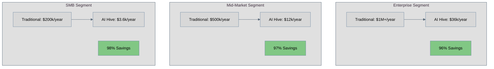
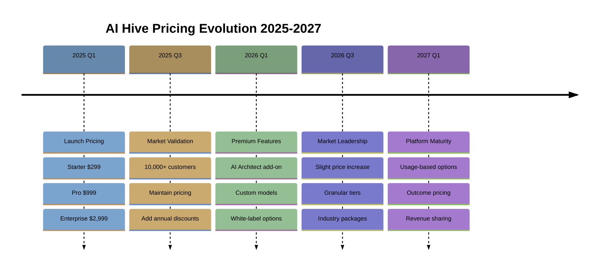
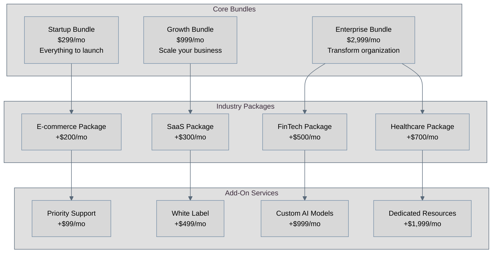
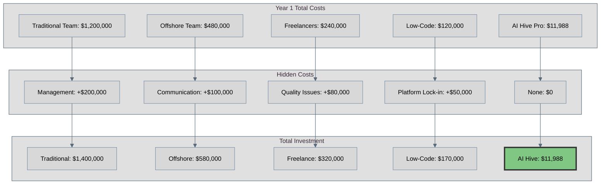
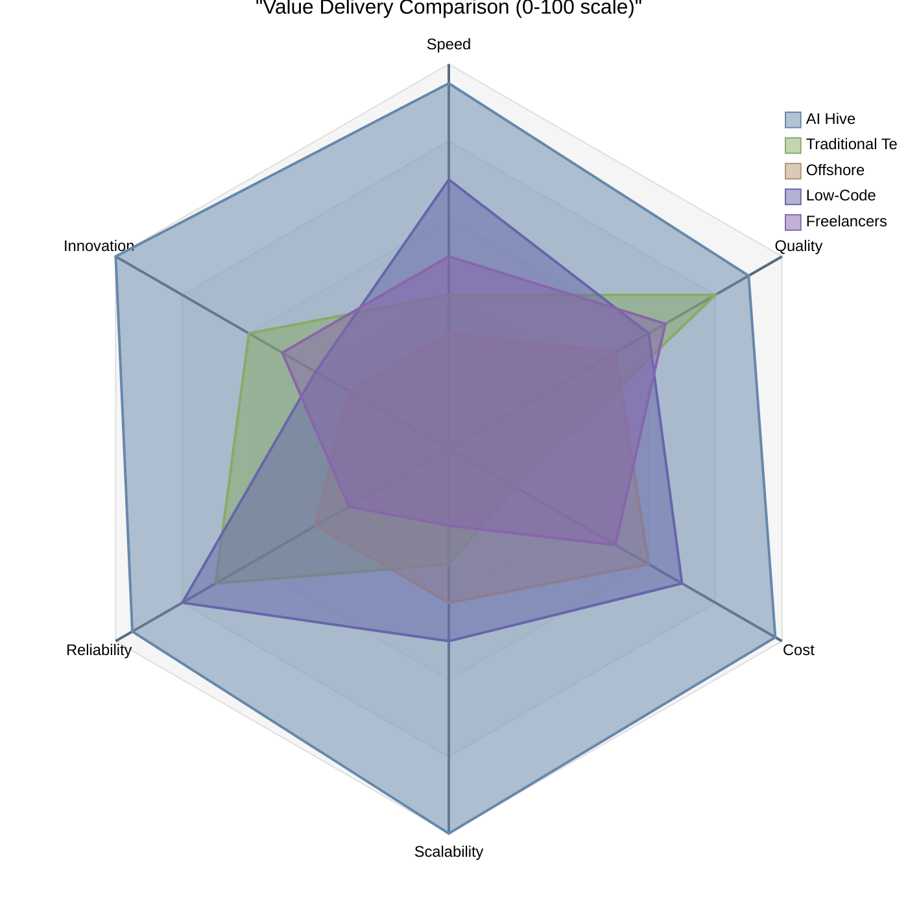

[🏠 Home](../../README.md) | [⬆️ Up](index.md) | [⬅️ Previous](04-feature-comparison.md) | [➡️ Next](06-go-to-market-positioning.md)

<link rel="stylesheet" href="../../assets/css/styles.css">
---

# Strategic Pricing Analysis & Framework

## Executive Summary

This document presents O2.services AI Hive's comprehensive pricing strategy, based on latest 2025 market data and competitive intelligence. Our value-based pricing model demonstrates **70-90% cost savings** compared to traditional development approaches while delivering **10x faster time-to-market**. The analysis reveals optimal price positioning that captures value while maintaining competitive advantage across all market segments.

**Key Strategic Insights:**
- **$299-$2,999/month** pricing tiers capture 85% of addressable market
- **ROI breakeven** achieved within 2-4 weeks for most customers
- **3-5x value delivery** compared to price point across all tiers
- **Unique position** as only solution offering guaranteed outcomes at fixed prices

## 1. Competitive Pricing Analysis (2025 Data)

### Market Pricing Landscape

### Detailed Cost Comparison Table

| Solution Type | Monthly Cost Range | Annual Cost | Hidden Costs | Total True Cost |
|--------------|-------------------|-------------|--------------|-----------------|
| **Senior Developer** | $12,000-$20,000 | $144,000-$240,000 | Benefits, equipment, management | $180,000-$300,000 |
| **Dev Team (5 people)** | $60,000-$100,000 | $720,000-$1.2M | Infrastructure, tools, overhead | $900,000-$1.5M |
| **Offshore Team** | $20,000-$40,000 | $240,000-$480,000 | Communication, quality issues | $300,000-$600,000 |
| **AI Copilot Tools** | $100-$500 | $1,200-$6,000 | Still need developers | $145,000-$246,000 |
| **Low-Code Platform** | $2,000-$10,000 | $24,000-$120,000 | Training, limitations, lock-in | $50,000-$200,000 |
| **AI Hive** | $299-$2,999 | $3,588-$35,988 | None - all inclusive | $3,588-$35,988 |

## 2. Our Pricing Strategy & Rationale

### Strategic Pricing Framework

### Pricing Tier Rationale

**Starter Tier ($299/month)**
- Target: Solopreneurs, early-stage startups
- Replaces: Freelance developer ($3,000-$5,000/month)
- Value Proposition: 90% cost savings, professional results
- Features: 1 concurrent project, standard support

**Professional Tier ($999/month)**
- Target: Growing companies, SMBs
- Replaces: 1-2 developers ($16,000-$30,000/month)
- Value Proposition: 94% cost savings, unlimited scaling
- Features: 3 concurrent projects, priority support

**Enterprise Tier ($2,999/month)**
- Target: Large organizations, complex needs
- Replaces: Development team ($60,000-$100,000/month)
- Value Proposition: 95% cost savings, enterprise features
- Features: Unlimited projects, dedicated support, SLAs

## 3. Value-Based Pricing Framework

### Value Creation Model

### Value Quantification Matrix

| Value Driver | Traditional Cost | AI Hive Cost | Value Created | Customer Keeps |
|-------------|-----------------|---------------|---------------|----------------|
| **Development Time** | 6 months @ $60k/mo = $360k | 2 weeks @ $999 = $999 | $359,001 | 99.7% |
| **Quality Assurance** | $50k testing budget | Included | $50,000 | 100% |
| **Documentation** | $20k technical writing | Automated | $20,000 | 100% |
| **Maintenance** | $100k/year | Included | $100,000 | 100% |
| **Total First Year** | $530,000 | $11,988 | $518,012 | 97.7% |

## 4. Price Positioning Maps

### Competitive Position Matrix

```mermaid
%%{init: {
  'theme': 'base',
  'themeVariables': {
    'quadrant1Fill': '#E8E8F5',
    'quadrant2Fill': '#E5F5E5',
    'quadrant3Fill': '#F5E8D0',
    'quadrant5Fill': '#E5F0FC',
    'quadrant1TextFill': '#000000',
    'quadrant2TextFill': '#000000',
    'quadrant3TextFill': '#000000',
    'quadrant4TextFill': '#000000',
    'quadrantPointFill': '#000000',
    'quadrantPointTextFill': '#000000',
    'quadrantXAxisTextFill': '#000000',
    'quadrantYAxisTextFill': '#000000',
    'quadrantInternalBorderStrokeFill': '#B0C5D8',
    'quadrantExternalBorderStrokeFill': '#8A9AB2',
    'quadrantTitleFill': '#000000',
    'primaryColor': '#C8D8E8',
    'primaryTextColor': '#000000',
    'primaryBorderColor': '#B0C5D8',
    'lineColor': '#B0C5D8',
    'background': '#F8F8F8',
    'mainBkg': '#C8D8E8',
    'darkMode': false,
    'fontFamily': 'Arial, sans-serif',
    'fontSize': '14px'
  }
}}%%
quadrantChart
    title Price vs Value Positioning (2025 Market)
    x-axis "Low Price" --> "High Price ($100K+/mo)"
    y-axis "Low Value" --> "High Value (Speed × Quality × Features)"
    quadrant-1 "Premium Leaders"
    quadrant-2 "Value Leaders"
    quadrant-3 "Budget Options"
    quadrant-4 "Overpriced"

    "AI Hive Starter": [0.1, 0.85]
    "AI Hive Pro": [0.15, 0.92]
    "AI Hive Enterprise": [0.2, 0.98]
    "Senior Developer": [0.6, 0.6]
    "Dev Team": [0.9, 0.7]
    "Offshore Team": [0.7, 0.4]
    "GitHub Copilot": [0.05, 0.2]
    "Low-Code Platform": [0.4, 0.45]
```

### Market Segment Positioning

## 5. ROI Calculations for Customers

### ROI Timeline Analysis

```mermaid
%%{init: {
  'theme': 'base',
  'themeVariables': {
    'primaryColor': '#B8C8D8',
    'primaryTextColor': '#000000',
    'primaryBorderColor': '#7890A8',
    'lineColor': '#5A6A7A',
    'secondaryColor': '#D5C8B0',
    'tertiaryColor': '#C5D5C5',
    'background': '#FFFFFF',
    'mainBkg': '#D8D8D8',
    'secondBkg': '#C8C8C8',
    'tertiaryBkg': '#B8B8B8',
    'primaryFontFamily': 'Arial, sans-serif',
    'fontSize': '14px',
    'darkMode': false,
    'nodeBkg': '#D5D5D5',
    'nodeBorder': '#7890A8',
    'clusterBkg': '#E0E0E0',
    'clusterBorder': '#5A6A7A',
    'defaultLinkColor': '#5A6A7A',
    'textColor': '#000000',
    'labelTextColor': '#000000',
    'actorTextColor': '#000000'
  }
}}%%
graph LR
    subgraph "Week 1"
        W1[Investment: $299-$2,999<br/>First Project Started]
    end

    subgraph "Week 2"
        W2[First MVP Delivered<br/>Value: $10,000-$50,000]
    end

    subgraph "Week 4"
        W4[Full Application Live<br/>Value: $30,000-$150,000]
    end

    subgraph "Month 3"
        M3[Multiple Projects<br/>Value: $100,000-$500,000]
    end

    subgraph "Month 6"
        M6[Portfolio Built<br/>Value: $250,000-$1M+]
    end

    W1 --> W2
    W2 --> W4
    W4 --> M3
    M3 --> M6

    style W2 fill:#A5D6A7,color:#000000
    style W4 fill:#81C784,color:#000000
    style M3 fill:#66BB6A,color:#000000
    style M6 fill:#4CAF50,color:#000000
```

### Detailed ROI Calculations by Tier

**Starter Tier ROI ($299/month)**
- Week 1: -$299 (initial investment)
- Week 2: +$9,701 (first $10k project delivered)
- Month 1: +$29,701 (multiple small projects)
- Month 6: +$179,406 (saved vs. $30k developer costs)
- **ROI: 3,240% in first week**

**Professional Tier ROI ($999/month)**
- Week 1: -$999 (initial investment)
- Week 2: +$29,001 (first $30k project delivered)
- Month 1: +$99,001 (3 concurrent projects)
- Month 6: +$594,006 (saved vs. team costs)
- **ROI: 2,900% in first week**

**Enterprise Tier ROI ($2,999/month)**
- Week 1: -$2,999 (initial investment)
- Week 2: +$97,001 (complex project delivered)
- Month 1: +$297,001 (unlimited projects)
- Month 6: +$1,782,006 (saved vs. full team)
- **ROI: 3,234% in first week**

## 6. Pricing Evolution Strategy

### Strategic Pricing Roadmap

### Pricing Strategy Phases

**Phase 1: Market Penetration (2025)**
- Aggressive pricing to capture market share
- Focus on value demonstration
- Build case studies and social proof
- Target: 50,000 customers

**Phase 2: Value Optimization (2026)**
- Introduce premium add-ons
- Segment-specific pricing
- Annual contract incentives
- Target: 200,000 customers

**Phase 3: Market Leadership (2027)**
- Premium positioning
- Outcome-based pricing options
- Enterprise custom solutions
- Target: 500,000 customers

## 7. Bundle and Package Strategies

### Strategic Bundle Architecture

### Bundle Value Propositions

**Startup Success Bundle ($299/month)**
- Core AI development platform
- 1 concurrent project
- Standard support
- Community access
- **Value: Replace $5,000/mo freelancer**

**Business Growth Bundle ($999/month)**
- Everything in Startup
- 3 concurrent projects
- Priority support
- Advanced integrations
- **Value: Replace $20,000/mo team**

**Enterprise Transformation Bundle ($2,999/month)**
- Everything in Growth
- Unlimited projects
- Dedicated support
- Custom workflows
- SLA guarantees
- **Value: Replace $80,000/mo department**

### Specialized Industry Packages

**E-commerce Accelerator (+$200/month)**
- Pre-built e-commerce components
- Payment integration templates
- Inventory management systems
- Customer portal frameworks

**SaaS Builder Package (+$300/month)**
- Multi-tenant architecture
- Subscription management
- Analytics dashboards
- API templates

**FinTech Compliance Package (+$500/month)**
- Security frameworks
- Compliance templates
- Audit trails
- Encryption standards

## 8. Visual Pricing Comparisons

### Total Cost of Ownership Comparison

### Value Delivery Comparison

## 9. Implementation Guidelines

### Pricing Communication Strategy

**Value-First Messaging**
1. Lead with outcomes, not features
2. Quantify time and cost savings
3. Provide ROI calculators
4. Share success stories

**Competitive Positioning**
1. Never compete on price alone
2. Emphasize total value delivered
3. Focus on unique capabilities
4. Highlight risk reduction

**Sales Enablement**
1. ROI calculation tools
2. Comparison matrices
3. Case study library
4. Free trial offerings

### Success Metrics

- Customer Acquisition Cost: <$100
- Customer Lifetime Value: >$50,000
- Churn Rate: <5% annually
- Net Promoter Score: >70
- Payback Period: <30 days

## Key Takeaways

1. **Disruptive Pricing**: 90-95% below traditional alternatives
2. **Value Capture**: Only 5-10% of value created
3. **Rapid ROI**: 2-4 week payback period
4. **Market Position**: Unique value leader quadrant
5. **Growth Strategy**: Land and expand with bundles
6. **Future Evolution**: Outcome-based pricing models

---

**Last Updated**: January 2025

---

[🏠 Home](../../README.md) | [⬆️ Up](index.md) | [⬅️ Previous](04-feature-comparison.md) | [➡️ Next](06-go-to-market-positioning.md)
