[🏠 Home](../../README.md) | [⬆️ Up](index.md) | [⬅️ Previous](05-pricing-strategy.md) | [➡️ Next](07-competitive-response.md)

<link rel="stylesheet" href="../../assets/css/styles.css">
---

# AI Hive Go-to-Market Positioning

## Executive Summary

This document outlines AI Hive's comprehensive go-to-market positioning strategy, defining how we will enter and dominate each market segment, position our revolutionary autonomous development platform, and execute multi-channel strategies to achieve rapid market penetration and sustainable competitive advantage.

Our GTM strategy is built on three core principles:
1. **Segment-Specific Entry**: Tailored approaches for each customer type
2. **Value-Based Positioning**: Focus on transformational outcomes, not features
3. **Rapid Market Capture**: Aggressive channel strategies to establish leadership

## 1. Market Entry Strategy by Segment

### Segment Prioritization & Entry Sequence

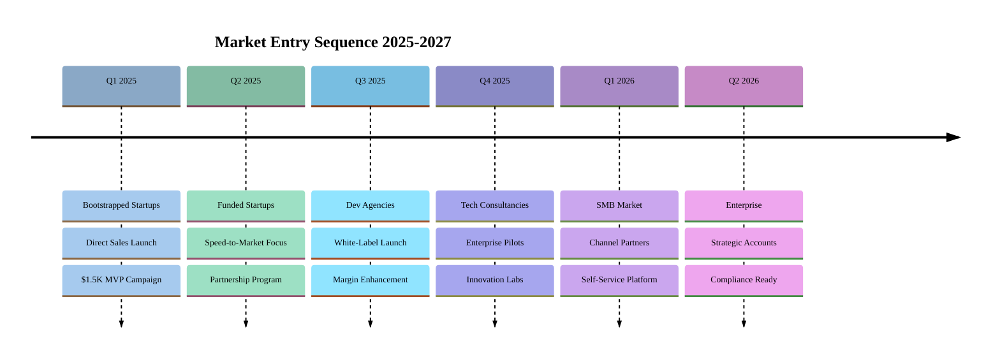

### Phase 1: Bootstrapped Startups (Q1 2025)

#### Entry Strategy
- **Beachhead**: Non-technical founders with validated ideas
- **Hook**: "$1,500 MVP Challenge" campaign
- **Proof**: 10 successful launches in 30 days

#### Tactical Execution

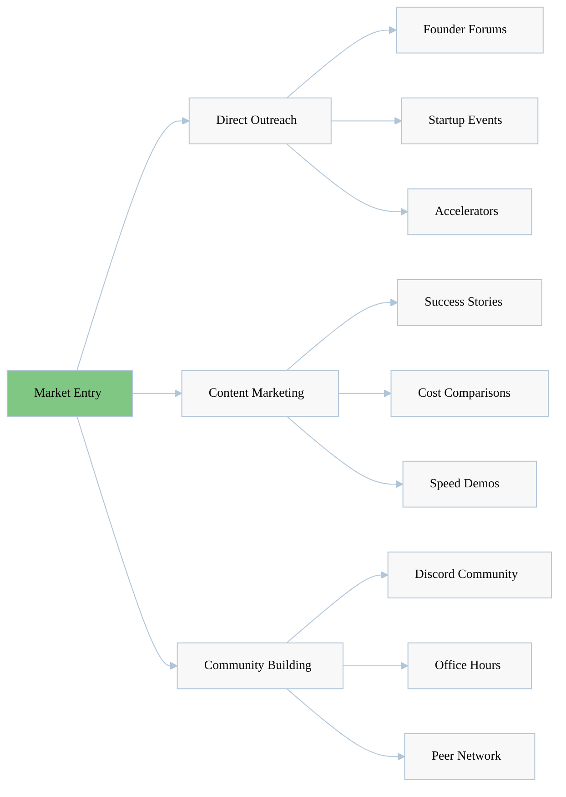

#### Success Metrics
- 100 paying customers in 90 days
- 80% customer success rate
- 5 case studies published
- NPS > 70

### Phase 2: Funded Startups (Q2 2025)

#### Entry Strategy
- **Positioning**: "Extend Your Runway by 10x"
- **Target**: Series A/B companies burning on development
- **Value Prop**: More experiments, faster iterations

#### Channel Strategy

| Channel | Approach | Expected Yield |
|---------|----------|----------------|
| **VC Partners** | Portfolio company programs | 50 leads/month |
| **YC Network** | Alumni referral program | 30 leads/month |
| **Direct Sales** | CTO/VP Eng outreach | 40 leads/month |
| **Webinars** | "10x Your Dev Velocity" | 25 leads/month |
| **Conferences** | Startup event sponsorships | 20 leads/month |

### Phase 3: Development Agencies (Q3 2025)

#### Entry Strategy
- **Positioning**: "Your Secret Weapon for 90% Margins"
- **Model**: White-label partnership program
- **Support**: Full training and certification

#### Partnership Framework

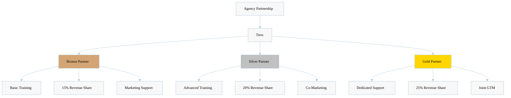

### Phase 4: Enterprise Innovation Labs (Q4 2025)

#### Entry Strategy
- **Positioning**: "Innovation at Enterprise Scale"
- **Approach**: Pilot programs with Fortune 500
- **Focus**: Rapid prototyping use cases

#### Enterprise GTM Model

| Stage | Activities | Duration | Success Criteria |
|-------|------------|----------|------------------|
| **Pilot** | 3 POC projects | 30 days | Technical validation |
| **Expansion** | Department rollout | 90 days | 10x usage growth |
| **Enterprise** | Company-wide adoption | 180 days | Strategic partnership |
| **Champion** | Reference customer | Ongoing | Public case study |

## 2. Positioning for Each Customer Type

### Customer-Specific Value Propositions

```mermaid
%%{init: {
  'theme': 'base',
  'themeVariables': {
    'primaryColor': '#E0E8F0',
    'primaryTextColor': '#000000',
    'primaryBorderColor': '#B0C5D8',
    'lineColor': '#B0C5D8',
    'secondaryColor': '#D5E8E0',
    'tertiaryColor': '#E0F0F8',
    'background': '#FFFFFF',
    'mainBkg': '#F8F8F8',
    'secondBkg': '#F0F0F0',
    'darkMode': false,
    'fontFamily': 'Arial, sans-serif',
    'fontSize': '14px',
    'textColor': '#000000'
  }
}}%%
graph TD
    subgraph "Bootstrapped Startups"
        A1[Pain: No budget for dev]
        A2[Position: Affordable MVP]
        A3[Message: $1.5K to launch]
    end

    subgraph "Funded Startups"
        B1[Pain: Burning cash on devs]
        B2[Position: Runway extension]
        B3[Message: 10x more with less]
    end

    subgraph "Dev Agencies"
        C1[Pain: Talent shortage]
        C2[Position: Scale enabler]
        C3[Message: 10x capacity]
    end

    subgraph "Enterprises"
        D1[Pain: Innovation speed]
        D2[Position: Transformation]
        D3[Message: Days not quarters]
    end

    A1 --> A2 --> A3
    B1 --> B2 --> B3
    C1 --> C2 --> C3
    D1 --> D2 --> D3

    style A3 fill:#81C784,color:#000000
    style B3 fill:#81C784,color:#000000
    style C3 fill:#81C784,color:#000000
    style D3 fill:#81C784,color:#000000
```

### Positioning Matrix by Segment

| Segment | Core Position | Key Differentiator | Proof Points | Competition |
|---------|---------------|-------------------|--------------|-------------|
| **Bootstrapped** | "Only viable option" | $1.5K total cost | Cost calculator | None at this price |
| **Funded** | "Velocity multiplier" | 50x faster delivery | Iteration metrics | Dev teams |
| **Agencies** | "Margin maximizer" | 90% gross margins | P&L impact | Offshore teams |
| **Consultancies** | "Innovation accelerator" | Daily deployments | Time studies | Traditional SDLC |
| **Enterprises** | "Digital transformer" | Risk-free pilots | Security audits | Big consultancies |

### Message Architecture by Persona

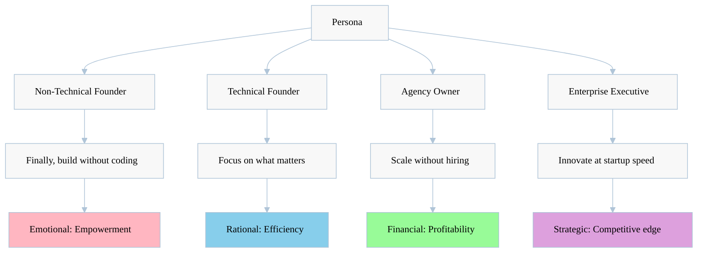

## 3. Channel Strategy and Partnerships

### Multi-Channel GTM Architecture

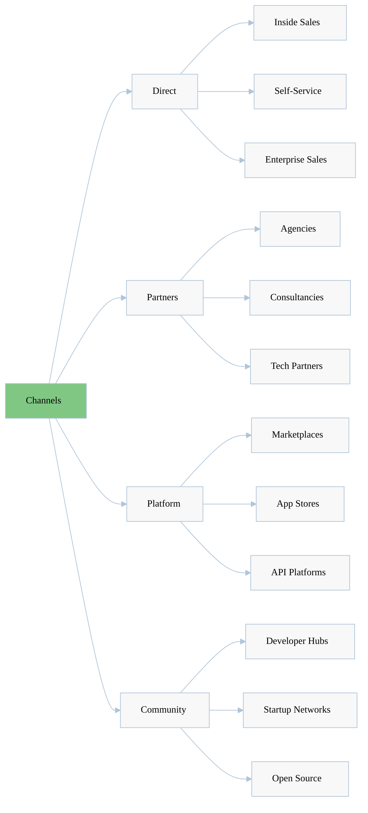

### Channel Performance Projections

| Channel | Y1 Revenue | Y2 Revenue | CAC | LTV:CAC | Priority |
|---------|------------|------------|-----|---------|----------|
| **Direct Sales** | $2M | $10M | $500 | 10:1 | High |
| **Self-Service** | $1M | $8M | $50 | 30:1 | High |
| **Agency Partners** | $500K | $5M | $200 | 15:1 | Medium |
| **Tech Partners** | $300K | $3M | $1000 | 5:1 | Low |
| **Marketplaces** | $200K | $2M | $100 | 10:1 | Medium |

### Strategic Partnership Framework

#### Technology Partners

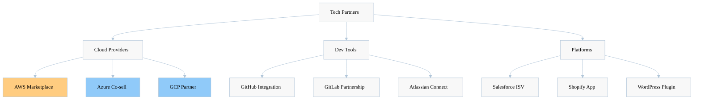

#### Channel Partner Enablement

| Partner Type | Enablement Package | Revenue Model | Support Level |
|--------------|-------------------|---------------|---------------|
| **Referral Partners** | Basic training, materials | 10% commission | Email support |
| **Reseller Partners** | Certification program | 20% margin | Dedicated rep |
| **Strategic Partners** | Co-development | 30% revenue share | Executive sponsor |
| **OEM Partners** | White-label platform | Custom pricing | Full integration |

## 4. Marketing Messages and Campaigns

### Campaign Architecture

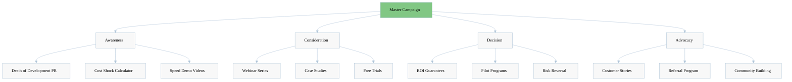

### Campaign Calendar 2025

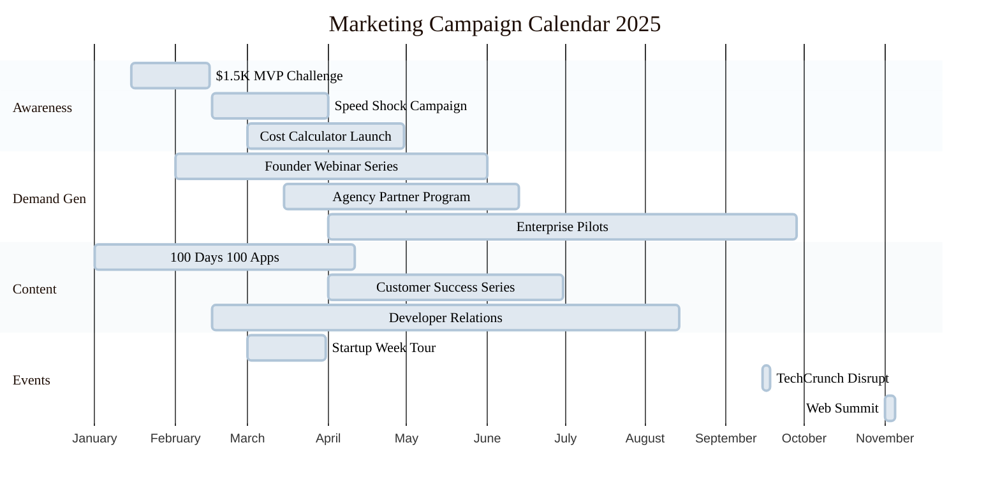

### Message Testing Framework

| Message Variant | Target Audience | Channel | Success Metric | Test Duration |
|-----------------|-----------------|---------|----------------|---------------|
| "Build Without Developers" | Non-technical | Social | CTR > 5% | 14 days |
| "$300K → $1.5K Reality" | Budget-conscious | Email | Open > 40% | 7 days |
| "Launch in 72 Hours" | Time-pressed | Landing Page | Conv > 3% | 21 days |
| "90% Margin Improvement" | Agencies | LinkedIn | Engagement > 10% | 14 days |
| "Innovation at Scale" | Enterprise | Webinar | Attendance > 200 | 30 days |

### Content Marketing Strategy

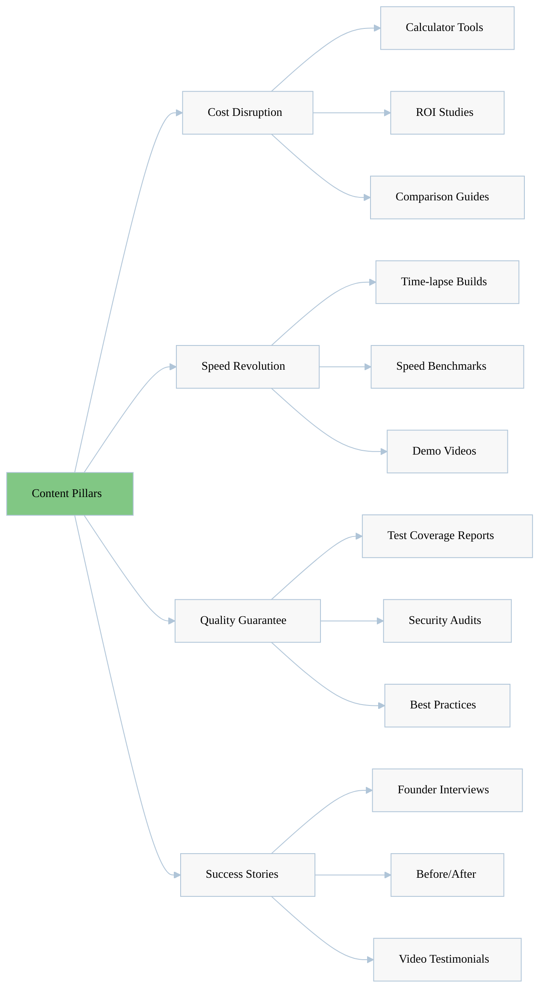

## 5. Sales Enablement Positioning

### Sales Playbook Framework

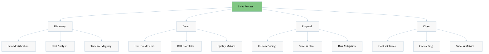

### Objection Handling Matrix

| Objection | Response | Proof Point | Success Rate |
|-----------|----------|-------------|--------------|
| "Too good to be true" | Live demonstration | Build app in meeting | 85% |
| "Quality concerns" | Test coverage data | 80%+ automated tests | 75% |
| "Security risks" | Audit reports | SOC2 compliance | 90% |
| "Vendor lock-in" | Open architecture | Export anytime | 80% |
| "Support worries" | SLA guarantees | 24/7 response | 70% |

### Sales Tools and Collateral

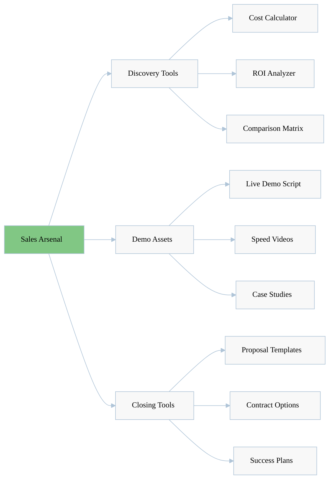

### Future Organizational Structure

| Function | Focus Area | Key Metrics | Priority |
|----------|------------|-------------|----------|
| **Business Development** | Partnership & Channel | Partner pipeline | High |
| **Customer Success** | Retention & Growth | 95% retention | Critical |
| **Product Marketing** | Positioning & Content | Market awareness | High |
| **Technical Support** | Implementation Success | Response time | Medium |

## 6. Competitive Displacement Strategies

### Displacement Playbook by Competitor

```mermaid
%%{init: {
  'theme': 'base',
  'themeVariables': {
    'primaryColor': '#E0E8F0',
    'primaryTextColor': '#000000',
    'primaryBorderColor': '#B0C5D8',
    'lineColor': '#B0C5D8',
    'secondaryColor': '#D5E8E0',
    'tertiaryColor': '#E0F0F8',
    'background': '#FFFFFF',
    'mainBkg': '#F8F8F8',
    'secondBkg': '#F0F0F0',
    'darkMode': false,
    'fontFamily': 'Arial, sans-serif',
    'fontSize': '14px',
    'textColor': '#000000'
  }
}}%%
graph TD
    A[Competitor] --> B[Traditional Dev]
    A --> C[AI Tools]
    A --> D[Low-Code]
    A --> E[Offshore]

    B --> B1[Attack: Cost]
    B --> B2[Message: 99% cheaper]
    B --> B3[Proof: Calculator]

    C --> C1[Attack: Completeness]
    C --> C2[Message: End-to-end]
    C --> C3[Proof: Full builds]

    D --> D1[Attack: Flexibility]
    D --> D2[Message: No limits]
    D --> D3[Proof: Complex apps]

    E --> E1[Attack: Speed/Quality]
    E --> E2[Message: 50x faster]
    E --> E3[Proof: Test coverage]

    style B1 fill:#FFAB91,color:#000000
    style C1 fill:#FFAB91,color:#000000
    style D1 fill:#FFAB91,color:#000000
    style E1 fill:#FFAB91,color:#000000
```

### Competitive Win Strategies

| Competitor Type | Their Strength | Our Attack Vector | Win Rate |
|-----------------|----------------|-------------------|----------|
| **Dev Teams** | Customization | Total cost comparison | 75% |
| **GitHub Copilot** | Developer productivity | No developers needed | 80% |
| **Cursor** | AI assistance | Full automation | 85% |
| **Low-Code** | Visual development | Real code, no limits | 70% |
| **Offshore** | Low hourly rates | Total project cost | 90% |

### Switching Cost Analysis

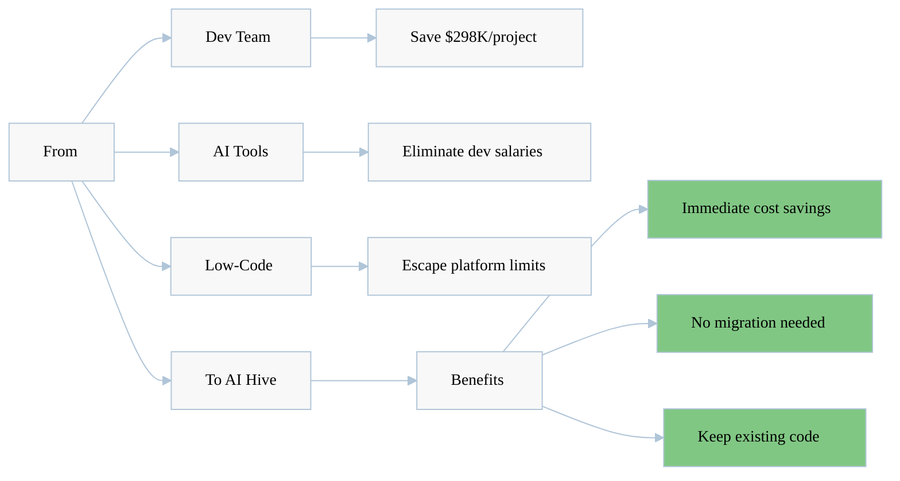

## 7. Visual GTM Roadmaps and Funnels

### Master GTM Funnel

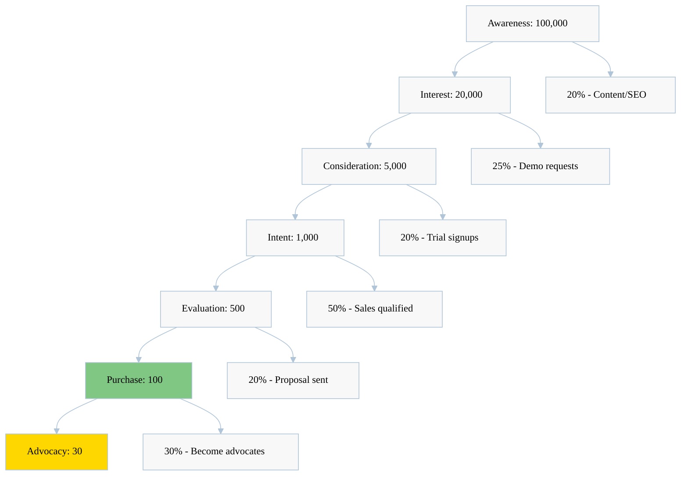

### Segment-Specific Funnels

```mermaid
%%{init: {
  'theme': 'base',
  'themeVariables': {
    'primaryColor': '#E0E8F0',
    'primaryTextColor': '#000000',
    'primaryBorderColor': '#B0C5D8',
    'lineColor': '#B0C5D8',
    'secondaryColor': '#D5E8E0',
    'tertiaryColor': '#E0F0F8',
    'background': '#FFFFFF',
    'mainBkg': '#F8F8F8',
    'secondBkg': '#F0F0F0',
    'darkMode': false,
    'fontFamily': 'Arial, sans-serif',
    'fontSize': '14px',
    'textColor': '#000000'
  }
}}%%
graph TD
    subgraph "Startup Funnel"
        A1[Calculator: 10K] --> A2[Demo: 2K]
        A2 --> A3[Trial: 500]
        A3 --> A4[Pay: 100]
    end

    subgraph "Agency Funnel"
        B1[Partner Inquiry: 1K] --> B2[Qualification: 300]
        B2 --> B3[Training: 100]
        B3 --> B4[Active: 50]
    end

    subgraph "Enterprise Funnel"
        C1[Contact: 500] --> C2[Discovery: 100]
        C2 --> C3[Pilot: 25]
        C3 --> C4[Contract: 10]
    end

    style A4 fill:#81C784,color:#000000
    style B4 fill:#81C784,color:#000000
    style C4 fill:#81C784,color:#000000
```

### GTM Execution Roadmap

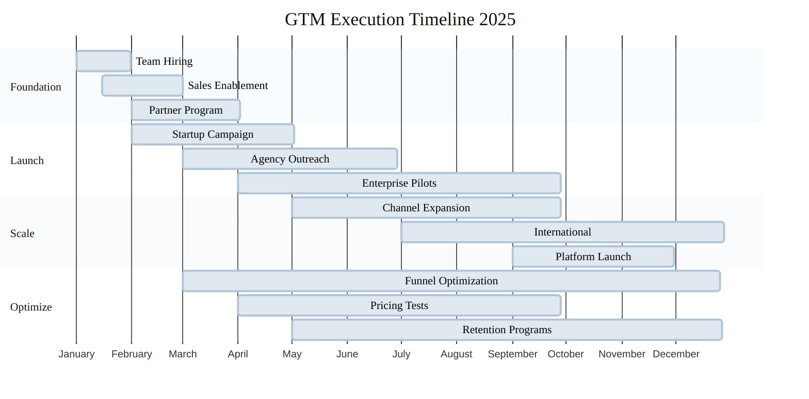

### Revenue Ramp Projection

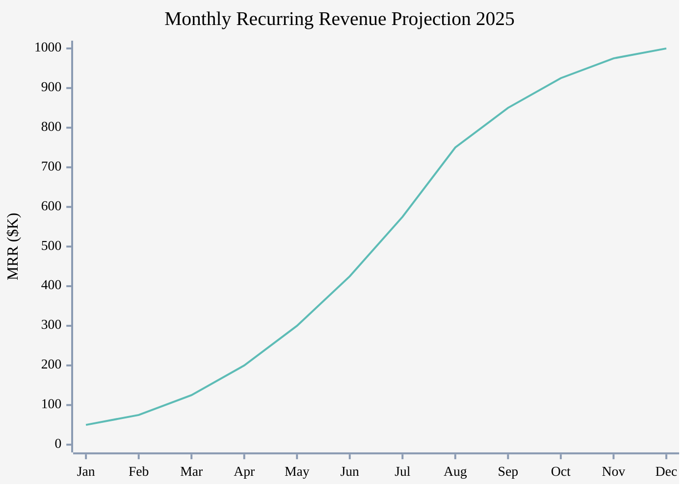

## 8. Navigation & Related Resources

### Quick Links
- [← Back to Competitive Positioning](index.md)
- [→ Market Analysis](../market-analysis/index.md)
- [→ Differentiation Strategy](03-differentiation-strategy.md)
- [→ Feature Comparison](04-feature-comparison.md)

### Implementation Resources
- Sales Playbook Template
- Partner Agreement Templates
- Campaign Asset Library
- ROI Calculator Tool
- Competitive Battle Cards

## Key Takeaways

### Strategic Imperatives
1. **Sequential Market Entry**: Start with bootstrapped startups, expand systematically
2. **Value-Based Messaging**: Focus on outcomes (cost, speed, quality) not features
3. **Multi-Channel Approach**: Direct, partners, platform, and community in parallel
4. **Competitive Displacement**: Targeted strategies for each competitor type
5. **Rapid Iteration**: Test, measure, and optimize continuously

### Success Metrics
- **Year 1**: $6M ARR, 500 customers, 3 channel partners
- **Year 2**: $30M ARR, 2,500 customers, 25 partners
- **Year 3**: $100M ARR, 10,000 customers, 100 partners

### Next Steps
1. Finalize Q1 2025 campaign assets
2. Develop partnership strategy
3. Launch partner program
4. Begin startup outreach
5. Establish success metrics tracking

---

**Last Updated**: January 2025

---

[🏠 Home](../../README.md) | [⬆️ Up](index.md) | [⬅️ Previous](05-pricing-strategy.md) | [➡️ Next](07-competitive-response.md)
