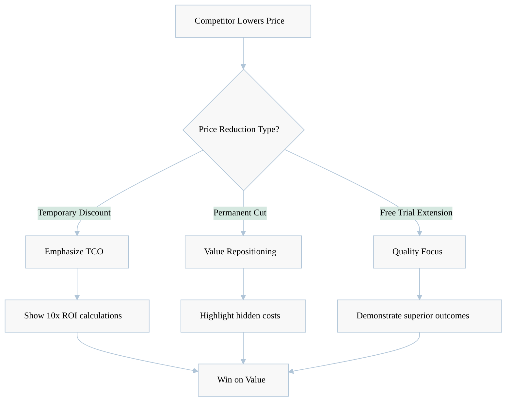
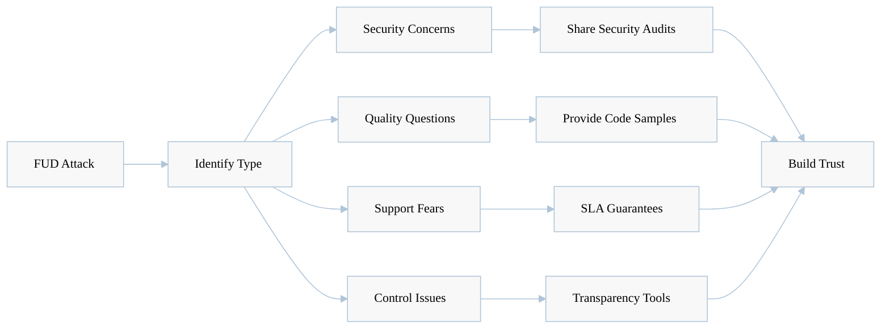
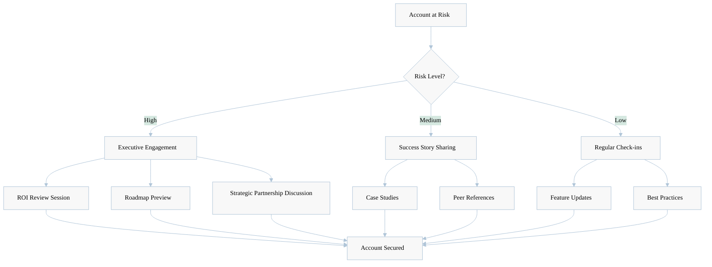
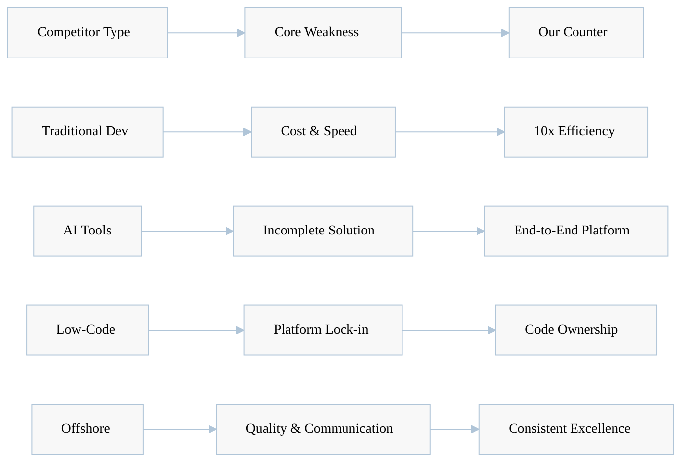
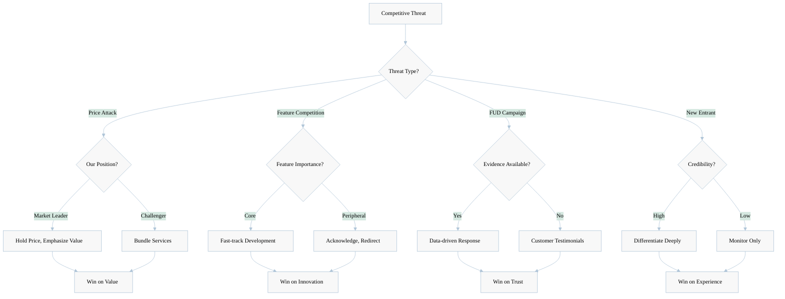
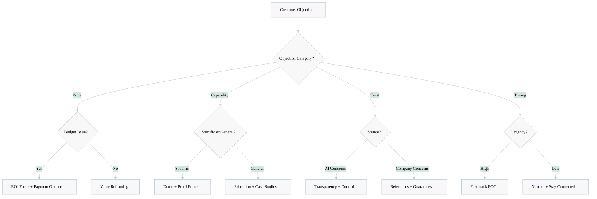

[🏠 Home](../../README.md) | [⬆️ Up](index.md) | [⬅️ Previous](06-go-to-market-positioning.md) | [➡️ Next](08-win-loss-analysis.md)

<link rel="stylesheet" href="../../assets/css/styles.css">
---

# Competitive Response Playbook

## Executive Summary

This playbook provides comprehensive strategies for anticipating and responding to competitive threats in the AI development market. It equips sales teams with battle-tested frameworks, objection handling techniques, and counter-positioning tactics to maintain O2.services AI Hive's market leadership position.

**Key Components:**
- **8 competitor reaction scenarios** with tailored response strategies
- **15 objection handling frameworks** for competitive situations
- **Battle cards** for top 5 competitors
- **Decision trees** for strategic responses
- **Win/loss analysis framework** with actionable insights

## 1. Anticipated Competitor Reactions

### 1.1 Price Warfare Response

<div class="mermaid-diagram-wrapper">



</div>

**Response Strategy:**
- **Never match price cuts** - Focus on total value delivered
- **Quantify ROI** - Show 10-100x cost advantage over project lifecycle
- **Expose hidden costs** - Highlight competitor's management overhead, quality issues
- **Case study ammunition** - Use success stories showing superior outcomes

### 1.2 Feature Parity Claims

**Anticipated Claims:**
- "We now offer AI-powered development"
- "Our solution is also autonomous"
- "We match their speed"

**Counter-Strategy:**
1. **Depth vs Surface** - Expose superficial implementations
2. **Proven vs Promised** - Show track record vs beta features
3. **Integration completeness** - Highlight end-to-end capabilities
4. **Quality metrics** - Compare actual output quality

### 1.3 FUD Campaigns (Fear, Uncertainty, Doubt)

<div class="mermaid-diagram-wrapper">



</div>

## 2. Response Strategies by Scenario

### Scenario 1: "Traditional Dev Teams Are More Reliable"

**Response Framework:**
1. **Acknowledge concern** - "Reliability is crucial for any project"
2. **Reframe reliability** - Define as consistent quality + predictable delivery
3. **Present evidence**:
   - 99.9% uptime SLA vs human sick days/turnover
   - Consistent code quality metrics
   - Predictable sprint velocity
4. **Risk mitigation** - Show backup systems and failsafes

### Scenario 2: "AI Can't Handle Complex Projects"

**Three-Step Counter:**
1. **Define complexity** - Break down what makes projects complex
2. **Show capability mapping**:
   ```
   Complex Project Elements → AI Hive Capabilities
   - Multi-service architecture → Microservices expertise
   - Integration requirements → API orchestration
   - Scalability needs → Cloud-native design
   - Security compliance → Built-in best practices
   ```
3. **Provide proof points** - Complex projects successfully delivered

### Scenario 3: "We Need Human Creativity"

**Strategic Response:**
1. **Agree and amplify** - "Creativity is essential"
2. **Reposition AI role** - AI handles implementation, humans drive vision
3. **Show creative outputs**:
   - Innovative architecture patterns
   - Novel problem solutions
   - Adaptive user experiences
4. **Hybrid advantage** - Best of both worlds approach

## 3. Win/Loss Analysis Framework

### 3.1 Win Analysis Template

<div class="mermaid-diagram-wrapper">

| Factor | Weight | Our Score | Competitor Score | Win Driver |
|--------|--------|-----------|------------------|------------|
| **Price/Value** | 25% | 9/10 | 5/10 | 10x cost efficiency |
| **Speed to Market** | 20% | 10/10 | 3/10 | 50x faster delivery |
| **Quality Metrics** | 20% | 8/10 | 6/10 | Automated testing |
| **Scalability** | 15% | 10/10 | 4/10 | Instant scaling |
| **Innovation** | 10% | 9/10 | 7/10 | AI capabilities |
| **Support** | 10% | 8/10 | 8/10 | 24/7 availability |

</div>

### 3.2 Loss Analysis Framework

**Post-Loss Review Questions:**
1. **Decision Criteria** - What factors mattered most?
2. **Competitive Advantages** - What did competitor offer?
3. **Our Gaps** - Where did we fall short?
4. **Messaging Effectiveness** - What didn't resonate?
5. **Relationship Factors** - Any pre-existing biases?

**Action Items Template:**
- Capability gaps to address
- Messaging refinements needed
- Proof points to develop
- Relationship building opportunities

## 4. Objection Handling for Competitive Situations

### 4.1 Price Objections

**"Competitor X is 50% cheaper"**

<div class="response-framework">

**Response Path:**
1. **Acknowledge** - "Price is an important consideration"
2. **Expand view** - "Let's look at total project cost"
3. **Calculate TCO**:
   - Development cost
   - Management overhead
   - Quality assurance
   - Maintenance burden
   - Opportunity cost of delays
4. **Show math** - AI Hive delivers 10x lower TCO

</div>

### 4.2 Capability Objections

**"Competitor Y has been around longer"**

**Counter-framework:**
1. **Reframe age as baggage** - Legacy approaches vs modern AI
2. **Show innovation velocity** - Our rapid advancement
3. **Customer success rate** - Quality over quantity
4. **Future-proofing** - Built for tomorrow, not yesterday

### 4.3 Control Objections

**"We lose control with AI development"**

**Four-Part Response:**
1. **Define control** - What specific concerns?
2. **Show transparency**:
   - Real-time code access
   - Architecture decisions explained
   - Change tracking
   - Override capabilities
3. **Compare to alternatives** - More control than offshore
4. **Governance framework** - How we ensure alignment

## 5. Battle Cards for Sales Teams

### 5.1 vs Traditional Development Teams

<div class="battle-card">

**Their Strengths:**
- Human relationships
- Custom approaches
- Perceived control

**Their Weaknesses:**
- High cost ($150-300/hour)
- Slow delivery (months)
- Inconsistent quality
- Scaling challenges

**Our Attack Points:**
- 10x cost advantage
- 50x speed advantage
- Consistent quality
- Instant scaling

**Proof Points:**
- Case study: 6-month project in 3 days
- ROI calculator showing 1000% return
- Quality metrics comparison

</div>

### 5.2 vs GitHub Copilot/AI Assistants

<div class="battle-card">

**Their Strengths:**
- Low entry cost
- Developer familiarity
- Easy integration

**Their Weaknesses:**
- Still requires developers
- Only assists, doesn't complete
- No project management
- No quality assurance

**Our Attack Points:**
- End-to-end solution
- No developer needed
- Built-in QA
- Project completion guarantee

**Winning Messages:**
- "Copilot helps developers code. We eliminate the need for developers."
- "They provide suggestions. We deliver solutions."

</div>

### 5.3 vs Low-Code Platforms

<div class="battle-card">

**Their Strengths:**
- Visual development
- Quick prototypes
- Business user friendly

**Their Weaknesses:**
- Platform lock-in
- Limited customization
- Performance constraints
- Scaling costs

**Our Attack Points:**
- No platform constraints
- Unlimited customization
- Production-grade code
- Own your codebase

**Differentiation Points:**
- "Low-code locks you in. We set you free."
- "Template-based vs truly custom solutions"

</div>

## 6. Defensive Strategies

### 6.1 Protecting Current Accounts

<div class="mermaid-diagram-wrapper">



</div>

### 6.2 Competitive Intelligence Gathering

**Information Sources:**
- Win/loss interviews
- Customer feedback
- Market analysis
- Competitor websites
- Industry forums
- Sales team insights

**Intelligence Framework:**
- Weekly competitor updates
- Monthly strategy reviews
- Quarterly battle card updates
- Annual positioning refresh

## 7. Counter-Positioning Tactics

### 7.1 Category Creation

**Position:** "We're not competing with developers or tools. We're the world's first Autonomous Development Platform."

**Supporting Messages:**
- Different evaluation criteria
- New budget category
- Unique value proposition
- No direct comparison

### 7.2 Weakness Exploitation

<div class="mermaid-diagram-wrapper">



</div>

### 7.3 Reframing the Conversation

**From:** "Which development option?"
**To:** "Build or buy autonomous capability?"

**From:** "Cost per developer hour"
**To:** "Cost per business outcome"

**From:** "Features comparison"
**To:** "Business transformation potential"

## 8. Visual Decision Trees

### 8.1 Competitive Response Decision Tree

<div class="mermaid-diagram-wrapper">



</div>

### 8.2 Objection Handling Decision Tree

<div class="mermaid-diagram-wrapper">



</div>

## 9. Implementation Checklist

### Sales Team Enablement

- [ ] Distribute battle cards to all sales reps
- [ ] Conduct competitive response training
- [ ] Practice objection handling scenarios
- [ ] Set up competitive intelligence sharing
- [ ] Create quick reference guides

### Ongoing Optimization

- [ ] Weekly win/loss reviews
- [ ] Monthly battle card updates
- [ ] Quarterly competitive analysis
- [ ] Continuous message testing
- [ ] Regular team feedback sessions

### Success Metrics

- Win rate vs each competitor
- Objection conversion rate
- Sales cycle length
- Average deal size
- Customer retention rate

---

## Next Steps

1. **Immediate Actions**
   - Train sales team on playbook
   - Implement intelligence gathering
   - Deploy battle cards

2. **30-Day Goals**
   - Refine messaging based on results
   - Develop competitor-specific demos
   - Build reference library

3. **90-Day Objectives**
   - Measure win rate improvement
   - Expand playbook based on learnings
   - Develop advanced counters

---

**Last Updated**: January 2025

---

[🏠 Home](../../README.md) | [⬆️ Up](index.md) | [⬅️ Previous](06-go-to-market-positioning.md) | [➡️ Next](08-win-loss-analysis.md)
