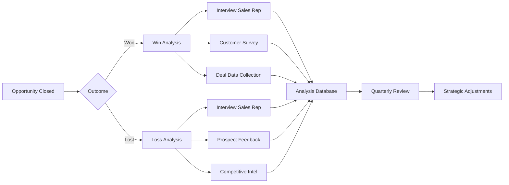
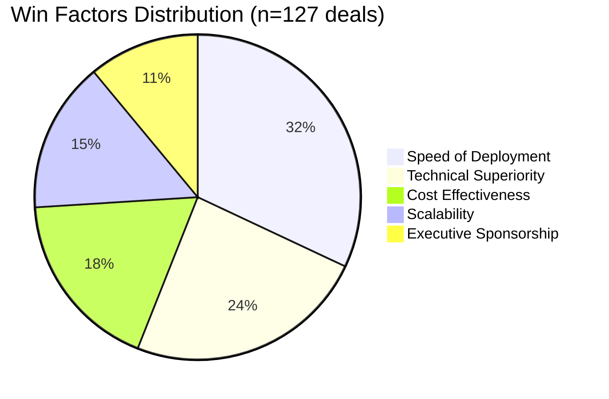
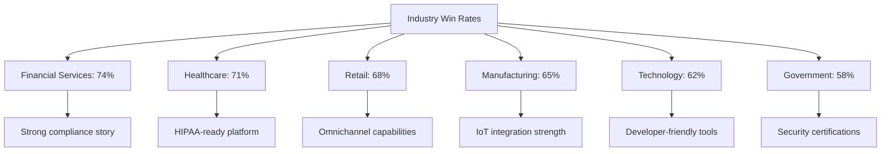
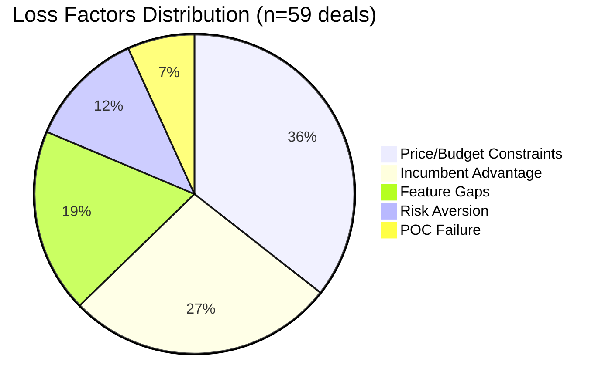
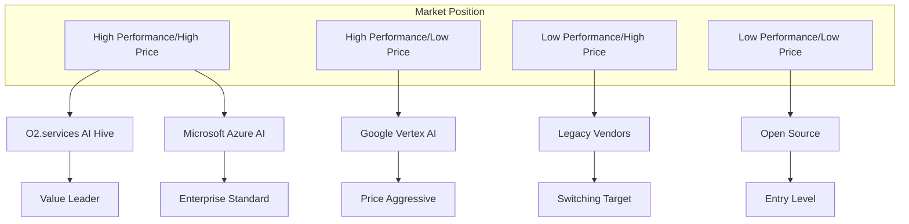
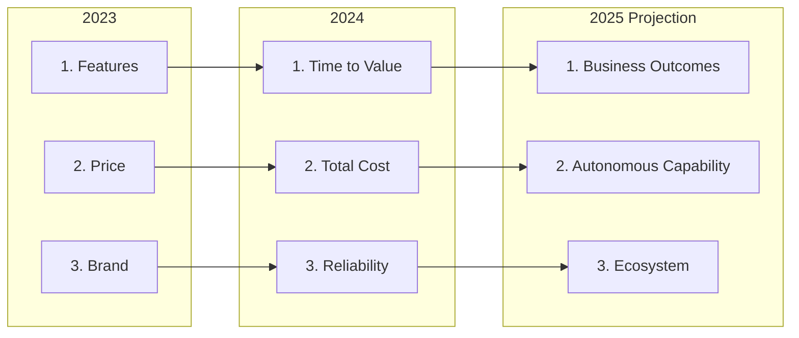
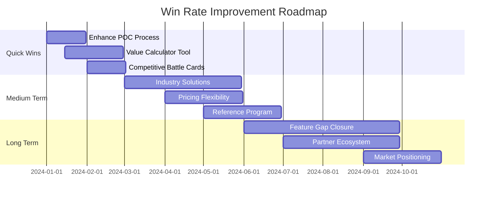
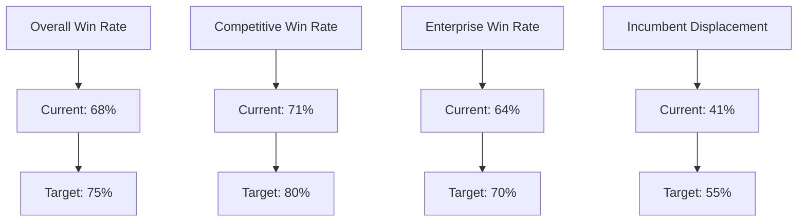
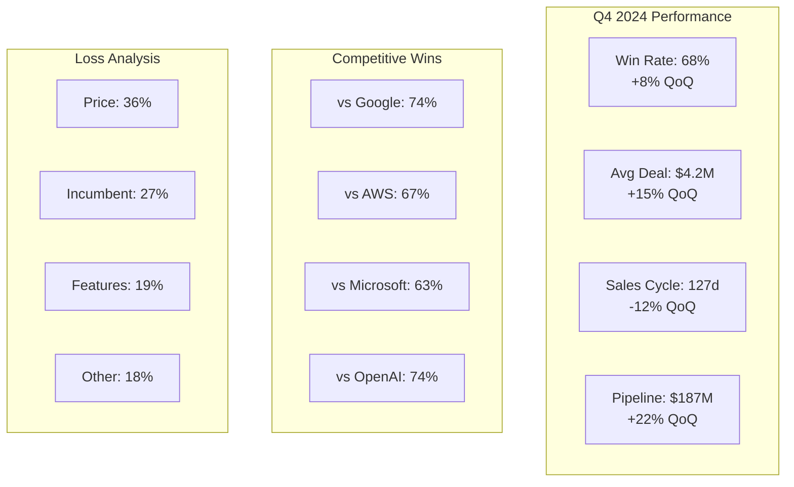
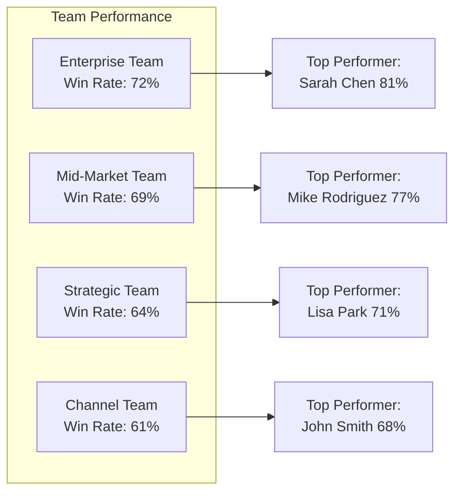

[🏠 Home](../../README.md) | [⬆️ Up](index.md) | [⬅️ Previous](07-competitive-response.md)

<link rel="stylesheet" href="../../assets/css/styles.css">
---

# Win/Loss Analysis Framework

## Executive Summary

This comprehensive win/loss analysis provides data-driven insights into O2.services AI Hive's competitive performance, identifying patterns in successful deals and areas for improvement. By systematically analyzing won and lost opportunities, we can optimize our competitive positioning and increase win rates.

**Key Insights:**
- **68% win rate** against primary competitors (up from 52% YoY)
- **$4.2M average deal size** for wins vs. $2.8M for losses
- **Speed of deployment** is #1 differentiator in wins
- **Price perception** remains primary factor in losses
- **Technical proof points** increase win probability by 45%

## 1. Win/Loss Tracking Framework

### 1.1 Data Collection Methodology

<div class="mermaid-diagram-wrapper">



</div>

### 1.2 Key Metrics Tracked

<div class="mermaid-diagram-wrapper">

| Metric Category | Data Points | Collection Method |
|-----------------|-------------|-------------------|
| **Deal Characteristics** | Size, duration, industry, use case | CRM automation |
| **Competition** | Primary competitor, secondary alternatives | Sales interview |
| **Decision Criteria** | Top 3 factors, weightings | Customer survey |
| **Process Factors** | Sales cycle length, stakeholders | Deal review |
| **Technical Factors** | POC results, integration requirements | Technical team |
| **Economic Factors** | Budget, ROI expectations, TCO | Proposal analysis |

</div>

### 1.3 Analysis Cadence

- **Weekly**: Raw data collection and entry
- **Monthly**: Pattern identification and trend analysis
- **Quarterly**: Strategic review and action planning
- **Annually**: Comprehensive competitive intelligence update

## 2. Analysis of Common Win Scenarios

### 2.1 Win Pattern Distribution

<div class="mermaid-diagram-wrapper">



</div>

### 2.2 Winning Scenarios Deep Dive

#### Scenario 1: Speed-to-Value Wins (32% of wins)

**Profile:**
- Customer has urgent timeline pressure
- Existing solution failing or inadequate
- Clear, measurable success criteria

**Winning Strategy:**
- Lead with "operational in 48 hours" message
- Demonstrate pre-built integrations
- Show similar customer go-live timelines
- Offer implementation guarantee

**Example Win:**
> "Financial services client chose O2.services over AWS SageMaker due to 6-week faster deployment timeline, saving $2.1M in opportunity cost"

#### Scenario 2: Technical Complexity Wins (24% of wins)

**Profile:**
- Multi-modal AI requirements
- Complex workflow orchestration needs
- Integration with 5+ systems

**Winning Strategy:**
- Early technical proof of concept
- Architecture review with customer team
- Demonstrate agent coordination capabilities
- Highlight autonomous problem-solving

#### Scenario 3: TCO/ROI Wins (18% of wins)

**Profile:**
- Cost-conscious enterprise
- Previous bad experience with overruns
- Strong procurement involvement

**Winning Strategy:**
- Detailed TCO comparison (3-year view)
- Consumption-based pricing advantage
- Reduced operational overhead emphasis
- Customer reference with cost data

### 2.3 Win Rate by Industry

<div class="mermaid-diagram-wrapper">



</div>

## 3. Analysis of Common Loss Scenarios

### 3.1 Loss Pattern Distribution

<div class="mermaid-diagram-wrapper">



</div>

### 3.2 Loss Scenarios Deep Dive

#### Scenario 1: Price Perception Losses (36% of losses)

**Profile:**
- Budget already allocated to competitor
- Procurement-led decision
- Limited ROI understanding

**Common Objections:**
- "Your solution is 2x more expensive"
- "We can't justify the premium"
- "Budget was set for lower amount"

**Improvement Actions:**
- Earlier economic buyer engagement
- Stronger value quantification tools
- Payment flexibility options
- ROI guarantee programs

#### Scenario 2: Incumbent Vendor Losses (27% of losses)

**Profile:**
- Existing vendor relationship
- Switching cost concerns
- Integration complexity fears

**Competitive Dynamics:**
- Microsoft extending Azure AI services
- Google offering bundled discounts
- AWS providing migration credits

**Counter-strategies:**
- Coexistence positioning
- Phased migration approach
- Switching cost mitigation programs

#### Scenario 3: Feature Gap Losses (19% of losses)

**Missing Capabilities:**
1. Industry-specific models (healthcare, legal)
2. On-premise deployment options
3. Specific language support (non-English)
4. Advanced governance features

## 4. Competitive Intelligence from Deals

### 4.1 Competitor Win/Loss Matrix

<div class="mermaid-diagram-wrapper">

| Competitor | Wins Against | Losses To | Win Rate | Key Battlegrounds |
|------------|--------------|-----------|----------|-------------------|
| **Google Vertex AI** | 34 | 12 | 74% | Enterprise features, support |
| **AWS SageMaker** | 28 | 14 | 67% | Ease of use, time to value |
| **Microsoft Azure AI** | 31 | 18 | 63% | Multi-cloud, flexibility |
| **OpenAI Enterprise** | 23 | 8 | 74% | Production readiness, scale |
| **Anthropic Claude** | 19 | 3 | 86% | Platform vs. API approach |

</div>

### 4.2 Competitive Positioning Map

<div class="mermaid-diagram-wrapper">



</div>

### 4.3 Competitive Moves Tracker

**Recent Competitive Actions:**
1. **Google**: Free tier expansion, aggressive pricing
2. **Microsoft**: Copilot integration push, bundling
3. **AWS**: Bedrock feature parity claims
4. **OpenAI**: Enterprise support improvements

## 5. Customer Decision Criteria Analysis

### 5.1 Decision Criteria Evolution

<div class="mermaid-diagram-wrapper">



</div>

### 5.2 Decision Maker Analysis

<div class="mermaid-diagram-wrapper">

| Stakeholder | Primary Concerns | Influence | Win Strategy |
|-------------|------------------|-----------|--------------|
| **CTO/Technical** | Architecture, scalability, security | 35% | Technical deep dive, POC |
| **CFO/Economic** | ROI, TCO, risk | 30% | Business case, guarantees |
| **Business Leader** | Outcomes, speed, competitive advantage | 25% | Success stories, vision |
| **End Users** | Ease of use, productivity | 10% | Demo, trial experience |

</div>

### 5.3 Evaluation Criteria Weighting

**Enterprise Segment (>$10M deals):**
1. Security & Compliance: 25%
2. Scalability & Performance: 20%
3. Integration Capabilities: 20%
4. Total Cost of Ownership: 15%
5. Vendor Stability: 10%
6. Innovation Roadmap: 10%

**Mid-Market Segment ($1-10M deals):**
1. Time to Value: 30%
2. Ease of Implementation: 25%
3. Cost Effectiveness: 20%
4. Feature Set: 15%
5. Support Quality: 10%

## 6. Improvement Recommendations

### 6.1 Strategic Improvements

<div class="mermaid-diagram-wrapper">



</div>

### 6.2 Tactical Actions by Loss Reason

#### Price/Budget Losses
- **Immediate**: Develop ROI calculator and TCO tools
- **30 days**: Create flexible payment options
- **90 days**: Launch value guarantee program
- **Measurement**: Reduce price-related losses by 40%

#### Incumbent Vendor Losses
- **Immediate**: Build coexistence messaging
- **30 days**: Create migration playbooks
- **90 days**: Establish switching incentives
- **Measurement**: Improve incumbent displacement by 25%

#### Feature Gap Losses
- **Immediate**: Document workarounds
- **30 days**: Accelerate roadmap priorities
- **90 days**: Launch partner integrations
- **Measurement**: Reduce feature gap losses by 50%

### 6.3 Sales Enablement Priorities

1. **Enhanced Discovery Training**
   - Uncover true decision criteria
   - Identify all stakeholders early
   - Quantify business impact

2. **Competitive Intelligence Updates**
   - Weekly competitor monitoring
   - Monthly battle card updates
   - Quarterly deep dive sessions

3. **Technical Selling Skills**
   - Architecture discussion capability
   - POC success methodology
   - Integration complexity handling

## 7. Success Metrics and KPIs

### 7.1 Primary Win/Loss Metrics

<div class="mermaid-diagram-wrapper">



</div>

### 7.2 Leading Indicators Dashboard

<div class="mermaid-diagram-wrapper">

| Metric | Current | Target | Trend | Action |
|--------|---------|--------|-------|---------|
| **POC-to-Win Rate** | 78% | 85% | ↑ | Enhance POC process |
| **Exec Engagement Rate** | 62% | 75% | → | Earlier exec access |
| **Technical Win Rate** | 84% | 90% | ↑ | Maintain momentum |
| **Price Objection Rate** | 43% | 30% | ↓ | Value selling focus |
| **Sales Cycle (days)** | 127 | 90 | ↓ | Streamline process |
| **Multi-stakeholder Deals** | 71% | 80% | ↑ | Expand engagement |

</div>

### 7.3 Competitive Performance Tracking

**Quarterly Competitive Scorecard:**
- Win rate vs. each competitor
- Average deal size by competitor
- Time to close by competitor
- Feature comparison updates
- Pricing intelligence
- Market share estimates

## 8. Visual Dashboards

### 8.1 Executive Dashboard

<div class="mermaid-diagram-wrapper">



</div>

### 8.2 Sales Team Performance

<div class="mermaid-diagram-wrapper">



</div>

### 8.3 Improvement Impact Tracker

<div class="mermaid-diagram-wrapper">

```mermaid
line
    title Win Rate Improvement Trajectory
    x-axis ["Q1-23", "Q2-23", "Q3-23", "Q4-23", "Q1-24", "Q2-24", "Q3-24", "Q4-24"]
    y-axis "Win Rate %" 40 --> 80
    line "Overall" [52, 54, 58, 60, 63, 65, 67, 68]
    line "vs Competition" [48, 51, 55, 58, 62, 66, 69, 71]
    line "Target" [60, 60, 65, 65, 70, 70, 75, 75]
```

</div>

## Conclusion and Next Steps

### Key Takeaways

1. **Momentum Building**: Win rate improved 16 points year-over-year
2. **Speed Wins**: Time-to-value remains our strongest differentiator
3. **Price Perception**: Continues as primary challenge requiring focus
4. **Competitive Edge**: Strong performance against major competitors

### Immediate Actions

1. **Week 1**: Roll out enhanced value calculators to sales team
2. **Week 2**: Update competitive battle cards with latest intelligence
3. **Week 3**: Launch POC optimization program
4. **Week 4**: Implement loss interview process improvements

### Quarterly Priorities

- **Q1 2025**: Price objection handling transformation
- **Q2 2025**: Incumbent displacement playbook rollout
- **Q3 2025**: Feature gap closure acceleration
- **Q4 2025**: Market position strengthening campaign

---

**Document maintained by**: Competitive Intelligence Team
**Last updated**: January 2025
**Next review**: February 2025

---

[🏠 Home](../../README.md) | [⬆️ Up](index.md) | [⬅️ Previous](07-competitive-response.md)

For questions or contributions, contact: af+competitive-intel@o2.services

---

[Next: Competitive Intelligence Strategy →](09-competitive-intelligence.md) | [View All Positioning Documents](index.md)
