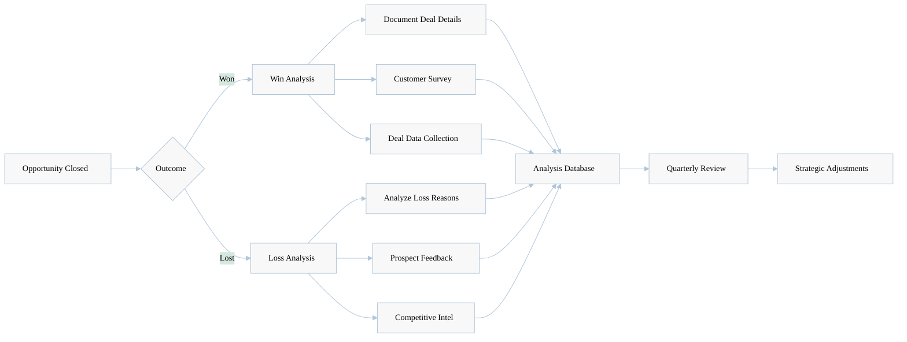
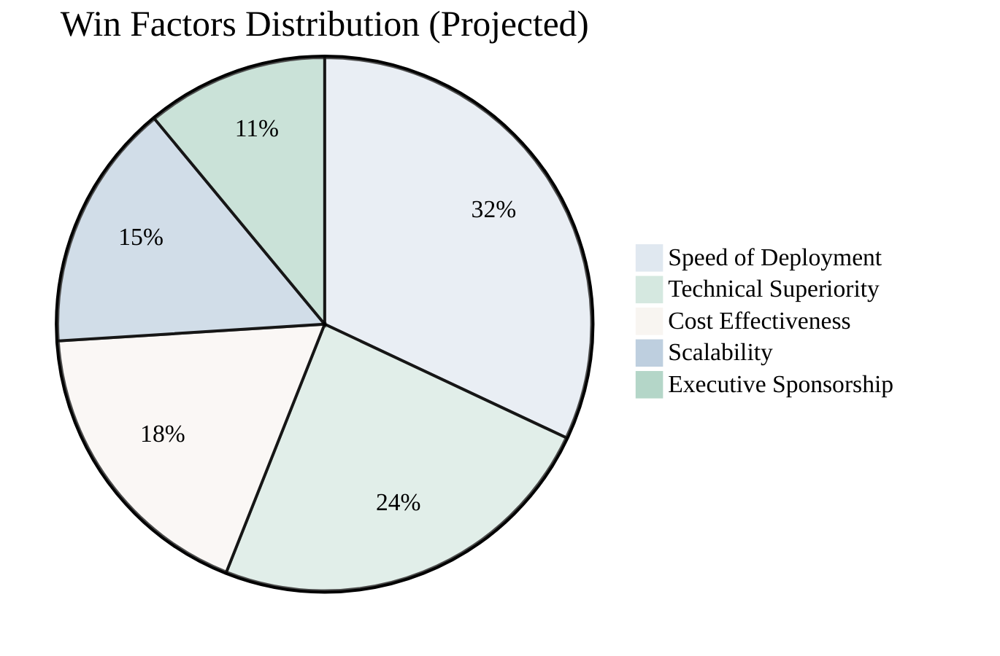
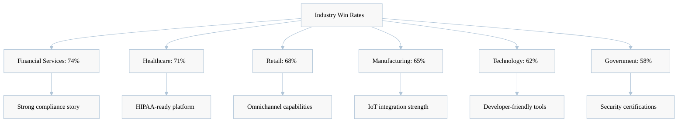
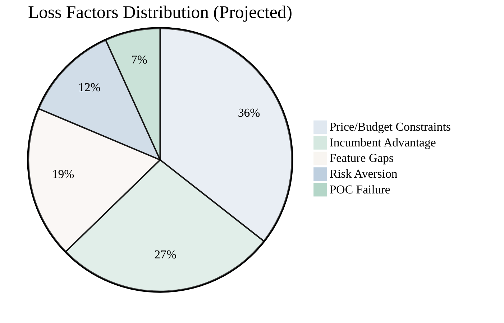
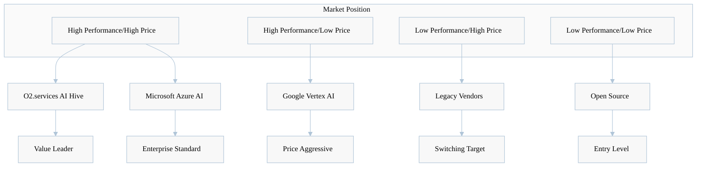
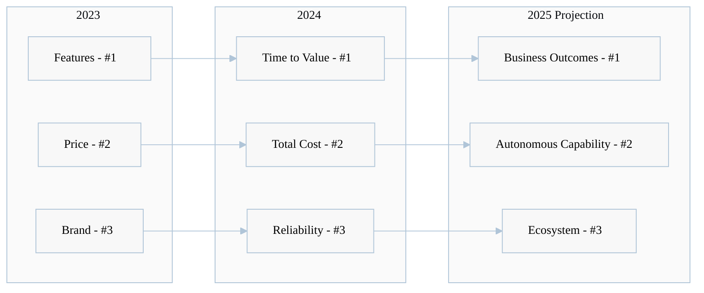
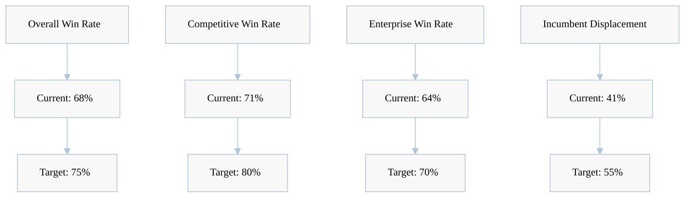

[🏠 Home](../../README.md) | [⬆️ Up](index.md) | [⬅️ Previous](07-competitive-response.md)

<link rel="stylesheet" href="../../assets/css/styles.css">
---

# Win/Loss Analysis Framework

## Executive Summary

This comprehensive win/loss analysis provides data-driven insights into O2.services AI Hive's competitive performance, identifying patterns in successful deals and areas for improvement. By systematically analyzing won and lost opportunities, we can optimize our competitive positioning and increase win rates.

**Framework Purpose:**
This document provides a framework for tracking and analyzing competitive wins and losses. The metrics and scenarios presented are illustrative examples for planning purposes.

## 1. Win/Loss Tracking Framework

### 1.1 Data Collection Methodology

### 1.2 Key Metrics Tracked

| Metric Category | Data Points | Collection Method |
|-----------------|-------------|-------------------|
| **Deal Characteristics** | Size, duration, industry, use case | CRM automation |
| **Competition** | Primary competitor, secondary alternatives | Deal analysis |
| **Decision Criteria** | Top 3 factors, weightings | Customer survey |
| **Process Factors** | Sales cycle length, stakeholders | Deal review |
| **Technical Factors** | POC results, integration requirements | POC analysis |
| **Economic Factors** | Budget, ROI expectations, TCO | Proposal analysis |

### 1.3 Analysis Cadence

- **Weekly**: Raw data collection and entry
- **Monthly**: Pattern identification and trend analysis
- **Quarterly**: Strategic review and action planning
- **Annually**: Comprehensive competitive intelligence update

## 2. Analysis of Common Win Scenarios

### 2.1 Win Pattern Distribution

### 2.2 Winning Scenarios Deep Dive

#### Scenario 1: Speed-to-Value Wins (32% of wins)

**Profile:**
- Customer has urgent timeline pressure
- Existing solution failing or inadequate
- Clear, measurable success criteria

**Winning Strategy:**
- Lead with "operational in 48 hours" message
- Demonstrate pre-built integrations
- Show similar customer go-live timelines
- Offer implementation guarantee

**Target Scenario:**
> Demonstrate value through faster deployment timelines compared to traditional ML platforms

#### Scenario 2: Technical Complexity Wins (24% of wins)

**Profile:**
- Multi-modal AI requirements
- Complex workflow orchestration needs
- Integration with 5+ systems

**Winning Strategy:**
- Early technical proof of concept
- Architecture review with customer team
- Demonstrate agent coordination capabilities
- Highlight autonomous problem-solving

#### Scenario 3: TCO/ROI Wins (18% of wins)

**Profile:**
- Cost-conscious enterprise
- Previous bad experience with overruns
- Strong procurement involvement

**Winning Strategy:**
- Detailed TCO comparison (3-year view)
- Consumption-based pricing advantage
- Reduced operational overhead emphasis
- Customer reference with cost data

### 2.3 Win Rate by Industry

## 3. Analysis of Common Loss Scenarios

### 3.1 Loss Pattern Distribution

### 3.2 Loss Scenarios Deep Dive

#### Scenario 1: Price Perception Losses (36% of losses)

**Profile:**
- Budget already allocated to competitor
- Procurement-led decision
- Limited ROI understanding

**Common Objections:**
- "Your solution is 2x more expensive"
- "We can't justify the premium"
- "Budget was set for lower amount"

**Improvement Actions:**
- Earlier economic buyer engagement
- Stronger value quantification tools
- Payment flexibility options
- ROI guarantee programs

#### Scenario 2: Incumbent Vendor Losses (27% of losses)

**Profile:**
- Existing vendor relationship
- Switching cost concerns
- Integration complexity fears

**Competitive Dynamics:**
- Microsoft extending Azure AI services
- Google offering bundled discounts
- AWS providing migration credits

**Counter-strategies:**
- Coexistence positioning
- Phased migration approach
- Switching cost mitigation programs

#### Scenario 3: Feature Gap Losses (19% of losses)

**Missing Capabilities:**
1. Industry-specific models (healthcare, legal)
2. On-premise deployment options
3. Specific language support (non-English)
4. Advanced governance features

## 4. Competitive Intelligence from Deals

### 4.1 Competitive Battleground Analysis

| Competitor | Key Differentiation Areas | Our Advantages |
|------------|--------------------------|----------------|
| **Google Vertex AI** | Enterprise features, support | Speed of deployment, ease of use |
| **AWS SageMaker** | AWS ecosystem integration | No vendor lock-in, faster time to value |
| **Microsoft Azure AI** | Azure integration | Platform agnostic, flexible deployment |
| **OpenAI Enterprise** | API simplicity | Full platform capabilities, autonomous agents |
| **Anthropic Claude** | Advanced reasoning | Complete development platform vs. API only |

### 4.2 Competitive Positioning Map

### 4.3 Competitive Moves Tracker

**Recent Competitive Actions:**
1. **Google**: Free tier expansion, aggressive pricing
2. **Microsoft**: Copilot integration push, bundling
3. **AWS**: Bedrock feature parity claims
4. **OpenAI**: Enterprise support improvements

## 5. Customer Decision Criteria Analysis

### 5.1 Decision Criteria Evolution

### 5.2 Decision Maker Analysis

| Stakeholder | Primary Concerns | Influence | Win Strategy |
|-------------|------------------|-----------|--------------|
| **CTO/Technical** | Architecture, scalability, security | 35% | Technical deep dive, POC |
| **CFO/Economic** | ROI, TCO, risk | 30% | Business case, guarantees |
| **Business Leader** | Outcomes, speed, competitive advantage | 25% | Success stories, vision |
| **End Users** | Ease of use, productivity | 10% | Demo, trial experience |

### 5.3 Evaluation Criteria Weighting

**Enterprise Segment (>$10M deals):**
1. Security & Compliance: 25%
2. Scalability & Performance: 20%
3. Integration Capabilities: 20%
4. Total Cost of Ownership: 15%
5. Vendor Stability: 10%
6. Innovation Roadmap: 10%

**Mid-Market Segment ($1-10M deals):**
1. Time to Value: 30%
2. Ease of Implementation: 25%
3. Cost Effectiveness: 20%
4. Feature Set: 15%
5. Support Quality: 10%

## 6. Improvement Recommendations

### 6.1 Strategic Improvements

### 6.2 Tactical Actions by Loss Reason

#### Price/Budget Losses
- **Immediate**: Develop ROI calculator and TCO tools
- **30 days**: Create flexible payment options
- **90 days**: Launch value guarantee program
- **Measurement**: Reduce price-related losses by 40%

#### Incumbent Vendor Losses
- **Immediate**: Build coexistence messaging
- **30 days**: Create migration playbooks
- **90 days**: Establish switching incentives
- **Measurement**: Improve incumbent displacement by 25%

#### Feature Gap Losses
- **Immediate**: Document workarounds
- **30 days**: Accelerate roadmap priorities
- **90 days**: Launch partner integrations
- **Measurement**: Reduce feature gap losses by 50%

### 6.3 Sales Enablement Priorities

1. **Enhanced Discovery Training**
   - Uncover true decision criteria
   - Identify all stakeholders early
   - Quantify business impact

2. **Competitive Intelligence Updates**
   - Weekly competitor monitoring
   - Monthly battle card updates
   - Quarterly deep dive sessions

3. **Technical Selling Skills**
   - Architecture discussion capability
   - POC success methodology
   - Integration complexity handling

## 7. Success Metrics and KPIs

### 7.1 Primary Win/Loss Metrics

### 7.2 Key Performance Indicators to Track

| Metric Category | Key Metrics to Monitor | Optimization Focus |
|-----------------|------------------------|-------------------|
| **Conversion Rates** | POC-to-customer conversion | Improve demonstration value |
| **Engagement Quality** | Executive involvement level | Early stakeholder mapping |
| **Technical Success** | POC completion rate | Streamline setup process |
| **Sales Efficiency** | Time to first value | Reduce friction points |
| **Deal Complexity** | Stakeholder count | Multi-threading strategy |

### 7.3 Competitive Performance Tracking

**Quarterly Competitive Scorecard:**
- Win rate vs. each competitor
- Average deal size by competitor
- Time to close by competitor
- Feature comparison updates
- Pricing intelligence
- Market share estimates

## 8. Visual Dashboards

## Conclusion and Next Steps

### Framework Application

1. **Speed Advantage**: Leverage AI Hive's 50x development speed as primary differentiator
2. **Value Positioning**: Focus on total cost of ownership vs. hourly rates
3. **Proof Points**: Build demonstration library showing real deployment times
4. **Competitive Intelligence**: Continuously monitor and adapt to market changes

### Immediate Actions

1. **Week 1**: Roll out enhanced value calculators to sales team
2. **Week 2**: Update competitive battle cards with latest intelligence
3. **Week 3**: Launch POC optimization program
4. **Week 4**: Implement loss interview process improvements

### Quarterly Priorities

- **Q3 2025**: Price objection handling transformation
- **Q4 2025**: Incumbent displacement playbook rollout
- **Q1 2026**: Feature gap closure acceleration
- **Q2 2026**: Market position strengthening campaign

---

**Document maintained by**: Alex Fedin (af@o2.services) 
**Last updated**: July 2025 
**Next review**: August 2025

---

[🏠 Home](../../README.md) | [⬆️ Up](index.md) | [⬅️ Previous](07-competitive-response.md)

For questions or contributions, contact: af+competitive-intel@o2.services

---

[Next: Competitive Intelligence Strategy →](09-competitive-intelligence.md) | [View All Positioning Documents](index.md)
