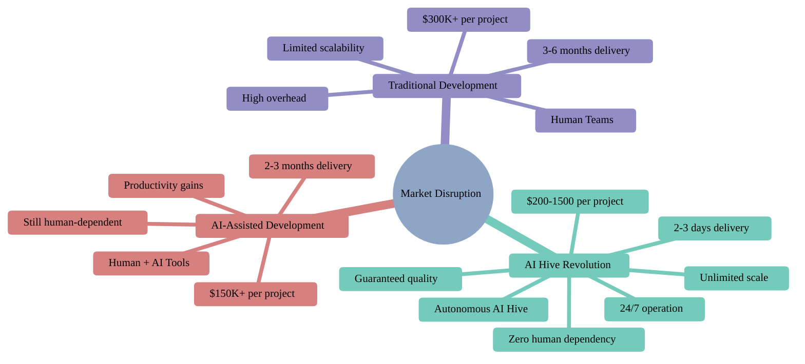

[🏠 Home](../../README.md)

<link rel="stylesheet" href="../../assets/css/styles.css">
---

# Competitive Positioning & Strategic Analysis

## Table of Contents

### 🎯 Core Positioning Documents

1. **[Positioning Strategy](01-positioning-strategy.md)**
   - Market positioning summary
   - Key competitive advantages
   - Strategic differentiation framework
   - Value proposition matrix

2. **[Competitive Landscape](02-competitive-landscape.md)**
   - Direct competitors deep dive
   - Indirect competitors assessment
   - Market positioning matrix
   - Competitive intelligence insights

3. **[Differentiation Strategy](03-differentiation-strategy.md)**
   - Unique value propositions
   - Technology advantages
   - Business model innovation
   - Defensibility analysis

4. **[Feature Comparison](04-feature-comparison.md)**
   - Comprehensive feature analysis
   - Capability benchmarking
   - Technology stack comparison
   - Performance metrics

5. **[Pricing Strategy](05-pricing-strategy.md)**
   - Competitive pricing analysis with 2025 data
   - Value-based pricing framework
   - ROI calculations and breakeven analysis
   - Bundle and package strategies
   - Visual pricing comparisons

6. **[Competitive Response Playbook](07-competitive-response.md)**
   - Anticipated competitor reactions
   - Response strategies for each scenario
   - Win/loss analysis framework
   - Objection handling for competitive situations
   - Battle cards for sales teams
   - Defensive strategies
   - Counter-positioning tactics
   - Visual decision trees

---

## 🚀 Executive Overview

### Our Competitive Position

O2.services AI Hive represents a paradigm shift in software development, positioned as the first truly autonomous development platform that delivers enterprise-quality results at unprecedented speed and cost efficiency.

### Market Disruption Vectors

---

## 💪 Key Competitive Advantages

### 1. **Cost Revolution**
- **47-1,612x** cheaper than traditional development
- **$100-500/day** enables bootstrap startups
- **No minimum team size** or long-term contracts
- **Value-based pricing** aligned with customer success

### 2. **Speed Transformation**
- **Up to 50x faster** delivery (days vs. months)
- **Instant team deployment** with no ramp-up
- **24/7 autonomous operation** across all time zones
- **Parallel processing** of multiple features

### 3. **Quality Guarantee**
- **80%+ test coverage** on all projects
- **SOLID principles** enforced automatically
- **Best practices** built into every line of code
- **Living documentation** maintained in real-time

### 4. **Scale & Flexibility**
- **Unlimited capacity** on demand
- **No hiring or training** delays
- **Instant expertise** in any technology
- **Consistent quality** at any scale

---

## 📊 Competitive Positioning Matrix

| Competitor Type | Cost | Speed | Quality | Autonomy | Our Advantage |
|----------------|------|-------|---------|----------|---------------|
| **Traditional Teams** | $$$$ | Months | Variable | None | 100-1000x cheaper |
| **Offshore Teams** | $$$ | Months | Variable | Low | 50-500x cheaper |
| **Freelancers** | $$ | Weeks | Variable | Low | 10-100x cheaper |
| **AI Tools (Copilot)** | $ | Days | Variable | Partial | Full automation |
| **Low-Code Platforms** | $$ | Weeks | Limited | Partial | No limitations |
| **AI Hive** | $ | Days | Guaranteed | Full | All advantages |

---

## 🎯 Strategic Differentiation

### Technology Moat
1. **Multi-Agent Architecture**: Specialized AI agents for each development phase
2. **Quality Enforcement**: Automated testing and best practices
3. **Context Preservation**: Full project understanding maintained
4. **Continuous Learning**: Improves with every project

### Business Model Innovation
1. **Pay-per-Project**: No seats, no subscriptions
2. **Success-Based Pricing**: Aligned incentives
3. **Instant Deployment**: No setup or integration
4. **White-Label Ready**: Partner enablement

### Market Positioning
1. **Bootstrap Enabler**: Making development accessible
2. **Agency Accelerator**: 10x productivity gains
3. **Enterprise Efficiency**: Dramatic cost reduction
4. **Innovation Partner**: Rapid prototyping capability

---

## 📈 Competitive Intelligence Summary

### Market Gaps We Address

1. **Accessibility Gap**
   - Others: Require $10K+ monthly minimums
   - AI Hive: Start at $100/day

2. **Automation Gap**
   - Others: Require human oversight
   - AI Hive: Fully autonomous operation

3. **Quality Gap**
   - Others: 41% more bugs with AI tools
   - AI Hive: 80%+ test coverage guarantee

4. **Speed Gap**
   - Others: Weeks to months delivery
   - AI Hive: 2-3 days for most projects

---

## 🔄 Living Document

This competitive positioning analysis is maintained as a living document and updated monthly with:
- New competitor analysis
- Market dynamics changes
- Customer feedback insights
- Technology advancements
- Strategic adjustments

**Last Updated**: January 2025 
**Next Update**: February 2025

---

## 📞 Contact

For questions about competitive positioning:

**O2.services Strategy Team** 
Email: af+strategy@o2.services 
Phone: +1 (425) 351-1652

---

[🏠 Home](../../README.md)
