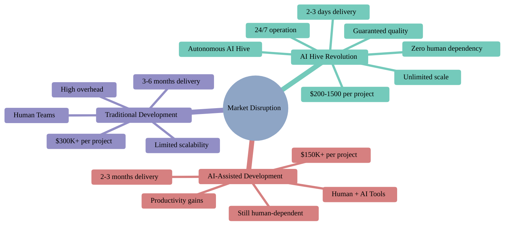

[🏠 Home](../../README.md) | [➡️ Next](00-executive-summary.md)

<link rel="stylesheet" href="../../assets/css/styles.css">
---

# Competitive Positioning & Strategic Analysis

## Quick Navigation

### 🎯 Start Here
- **[Executive Summary](00-executive-summary.md)** - Complete strategic overview and key insights

### 📁 Reference Data (Single Source of Truth)
- **[Pricing Reference](data/pricing-reference.md)** - Official pricing tiers and ROI calculations
- **[Core Advantages](data/core-advantages.md)** - Key competitive advantages and metrics
- **[Market Data](data/market-data-reference.md)** - Market sizing and growth projections
- **[Innovation Roadmap](data/innovation-roadmap.md)** - Product development timeline

### 📄 Strategic Documents

1. **[Positioning Strategy](01-positioning-strategy.md)** - Strategic positioning and differentiation
2. **[Competitive Landscape](02-competitive-landscape.md)** - Detailed competitor analysis
3. **[Feature Comparison](04-feature-comparison.md)** - Capability comparison matrix
4. **[Pricing Strategy](05-pricing-strategy.md)** - Pricing framework and positioning
5. **[Go-to-Market](06-go-to-market-positioning.md)** - Market entry and channel strategy
6. **[Competitive Response](07-competitive-response.md)** - Sales playbook and objection handling
7. **[Win/Loss Analysis](08-win-loss-analysis.md)** - Performance insights and patterns

---

## Executive Summary

O2.services AI Hive is the world's first truly autonomous development platform, delivering enterprise-quality software at revolutionary speed and cost.

### Our Position
We don't compete with existing solutions – we make them obsolete. By removing the human bottleneck from software development, we've created a new category that delivers superior results at a fraction of the cost and time.

### Market Disruption

### Key Advantages Summary

For detailed metrics and competitive advantages, see our **[Core Advantages Reference](data/core-advantages.md)**.

- **Cost**: 47-1,612x cheaper per project
- **Speed**: Up to 50x faster delivery
- **Quality**: 80%+ test coverage guaranteed
- **Scale**: Unlimited capacity on demand

### Quick Links to Key Insights

- [Pricing Tiers & ROI →](data/pricing-reference.md)
- [Competitor Analysis →](02-competitive-landscape.md#competitor-profiles)
- [Battle Cards →](07-competitive-response.md#battle-cards)
- [Win/Loss Insights →](08-win-loss-analysis.md#key-insights)

---

## 📞 Contact

**O2.services Strategy Team**
Email: af+strategy@o2.services
Phone: +1 (425) 351-1652

---

**Last Updated**: January 2025
**Next Review**: February 2025

---

[🏠 Home](../../README.md) | [➡️ Next](00-executive-summary.md)
