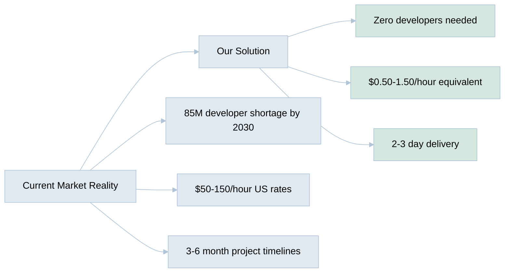

# AI Hive: Autonomous Software Development Platform

## The Opportunity

The global AI software market is experiencing explosive growth, projected to reach **$390B by 2025** with a **30%+ CAGR** ([Grand View Research](https://www.grandviewresearch.com/industry-analysis/artificial-intelligence-ai-market)). Meanwhile, US software development costs average **$50-150/hour** ([Fullstack Labs](https://www.fullstack.com/labs/resources/blog/2024-price-guide)), creating a massive inefficiency in a **$737B global software market**.

## The Solution

AI Hive is the world's first truly autonomous software development platform that eliminates the need for human developers entirely. Unlike AI-assisted coding tools that still require developers, AI Hive autonomously handles the complete software lifecycle from requirements to deployment.

### Core Capabilities
- **50x faster delivery**: 2-3 days vs 3-6 months
- **99% cost reduction**: $1,500 per project vs $150,000+
- **Language agnostic**: Works with ANY programming language or framework
- **Enterprise-grade quality**: 80%+ test coverage, SOLID principles enforced

## Market Validation

## Business Model

**Consumption-based pricing** aligned with value delivered:
- Bootstrapped Startups: $100/day or $1,500/month
- Funded Startups: $3,000-10,000/month
- Agencies (white-label): Revenue share model
- Enterprise: Custom pricing based on usage

## Competitive Advantage

| Aspect | GitHub Copilot | Cursor | Traditional Dev | **AI Hive** |
|--------|----------------|--------|-----------------|--------------|
| Human developers needed | Yes | Yes | Yes | **No** |
| End-to-end delivery | No | No | Yes | **Yes** |
| Cost per project | $20 + dev cost | $40 + dev cost | $150,000+ | **$1,500** |
| Time to market | Months | Months | Months | **Days** |

## Traction & Milestones

- **Technology**: Production-ready platform supporting all major languages
- **Market Entry**: Q1 2025 launch targeting bootstrapped startups
- **Scalability**: Architecture supports unlimited concurrent projects
- **IP**: Proprietary autonomous agent orchestration technology

## Investment Opportunity

**Seeking**: Series A funding to accelerate market penetration

**Use of Funds**:
- 40% Sales & Marketing - capture first-mover advantage
- 30% Product Development - enterprise features
- 20% Operations - scale infrastructure
- 10% Working Capital

**Why Now**:
- AI capabilities have reached inflection point for autonomous development
- Developer shortage crisis accelerating (40M gap today → 85M by 2030)
- Enterprises spending $2.5T on digital transformation

## Leadership

**Alex Fedin** - Founder & CEO 
Email: af@o2.services 
Phone: +1 (425) 351-1652

*Building the future where software creates itself.*

---

**Key Metrics**:
- TAM: $737B global software market
- Cost advantage: 99% reduction
- Speed advantage: 50x faster
- Quality: 80%+ test coverage guaranteed

Learn more: [o2.services](https://o2.services)
