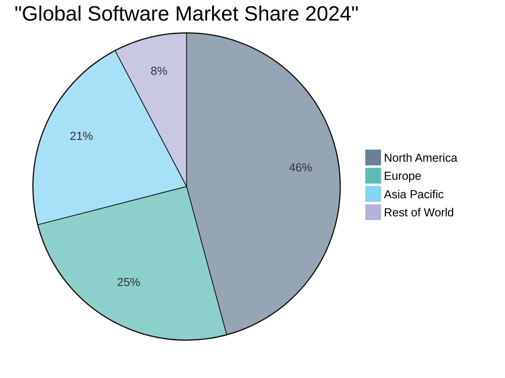

[🏠 Home](../../README.md) | [⬅️ Previous](01-executive-summary.md) | [➡️ Next](03-market-size-growth.md)

<link rel="stylesheet" href="styles.css">
---

# Market Overview

## The Software Development Revolution

The software development industry stands at an unprecedented inflection point. Three powerful forces are converging to create a perfect storm of opportunity:

1. **Explosive Market Growth**: The global software market has reached $737 billion in 2024, growing at 11.8% annually
2. **AI Transformation**: 78% of organizations now use AI, fundamentally changing how software is built
3. **Developer Shortage Crisis**: 85 million developer shortage projected by 2030, creating massive supply-demand imbalance

## Market Dynamics

### 🌍 Geographic Distribution

### 📈 Growth Trajectories

| Region | 2024 Market Size | CAGR (2025-2030) | Key Driver |
|--------|------------------|-------------------|------------|
| North America | $337B | 11.2% | Enterprise AI adoption |
| Europe | $185B | 12.5% | Digital transformation |
| Asia Pacific | $157B | 19.4% | Rapid digitalization |
| Rest of World | $58B | 15.8% | Infrastructure development |

## Key Market Segments

### 1. Traditional Software Development
- **Size**: $500B+ (2024)
- **Growth**: 8-10% CAGR
- **Characteristics**: Human-intensive, project-based, quality variations

### 2. AI-Augmented Development
- **Size**: $122B (2024) → $467B (2030)
- **Growth**: 25-32% CAGR
- **Adoption**: 82% of developers use AI tools

### 3. Software Development Outsourcing
- **Size**: $92.5B (2024) → $131.8B (2033)
- **Growth**: 56.9% CAGR
- **Driver**: Cost optimization and talent access

### 4. Low-Code/No-Code Platforms
- **Size**: $14.6B (2024) → $35.2B (2030)
- **Growth**: 22.5-37.9% CAGR
- **Target**: Business users and citizen developers

## Market Drivers

### 🚀 Primary Growth Factors

1. **Digital Transformation Imperative**
   - 89% of companies have adopted digital-first strategies
   - COVID-19 accelerated digital adoption by 7 years

2. **AI Integration**
   - 30% of enterprise code now AI-generated
   - 55% productivity gains with AI tools

3. **Cloud Migration**
   - 24% CAGR for cloud solutions
   - 94% of enterprises use cloud services

4. **Developer Shortage**
   - Current deficit: 40 million developers
   - 2030 projection: 85 million shortage
   - Driving automation and efficiency tools

### 🚧 Market Barriers

1. **Quality Concerns**
   - 41% increase in bugs with AI-generated code
   - Trust issues: Only 43% trust AI accuracy

2. **Enterprise Adoption Challenges**
   - 69% lack qualified AI professionals
   - Only 26% generate tangible AI value

3. **Security & Compliance**
   - 78% cite security as primary concern
   - Regulatory uncertainty in AI usage

## Competitive Landscape

### Market Leaders by Category

| Category | Leader | Market Share | Key Differentiator |
|----------|--------|--------------|-------------------|
| AI Coding Assistant | GitHub Copilot | 40%+ | Microsoft ecosystem |
| Development Platform | Cursor | $500M ARR | AI-first IDE |
| Low-Code Platform | OutSystems | 25%+ | Enterprise grade |
| Cloud Development | AWS | 32% | Infrastructure scale |

### Emerging Disruptors

1. **Cognition AI (Devin)**: $4B valuation, autonomous AI developer
2. **Replit**: $100M ARR, browser-based development
3. **Magic AI**: $1.5B valuation, generative code models

## Market Opportunities

### 🎯 Underserved Segments

1. **Bootstrapped Startups**
   - Need: Affordable development without VC funding
   - Current solutions: $10K-30K/month minimum
   - Opportunity: $100-500/day solutions

2. **Solo Entrepreneurs**
   - 1.57 billion freelancers globally
   - Average savings with AI: 8 hours/week
   - Need: Enterprise capabilities at individual prices

3. **Regional SMBs**
   - 79% of SMBs use AI tools
   - Limited budgets for development
   - High growth potential in Asia Pacific

### 💡 Emerging Trends

1. **"Vibe Coding"**: Intent-based development
2. **Multi-Agent Systems**: AI teams working together
3. **Autonomous Development**: Beyond copilots to contractors
4. **Edge AI Development**: Local, privacy-focused solutions

## Strategic Implications

The market presents a unique window of opportunity for disruptive solutions that can:

1. **Bridge the Cost Gap**: Current enterprise solutions ($114K-234K/year) vs. startup needs ($3K-15K/month)
2. **Accelerate Time-to-Market**: Traditional 3-month cycles vs. market demand for days
3. **Democratize Development**: Enable non-technical founders and small teams
4. **Ensure Quality**: Address the 41% bug increase problem with AI code

The convergence of market growth, AI capabilities, and unmet demand creates ideal conditions for innovative solutions that can deliver enterprise-grade development at revolutionary price points.

---

[🏠 Home](../../README.md) | [⬅️ Previous](01-executive-summary.md) | [➡️ Next](03-market-size-growth.md)
