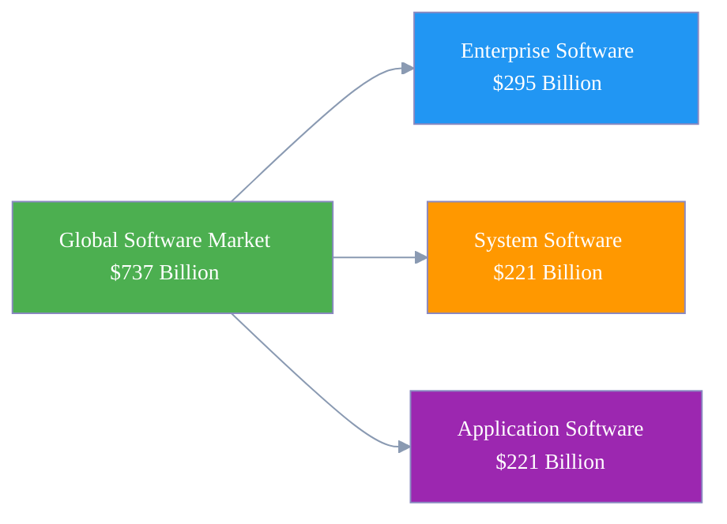
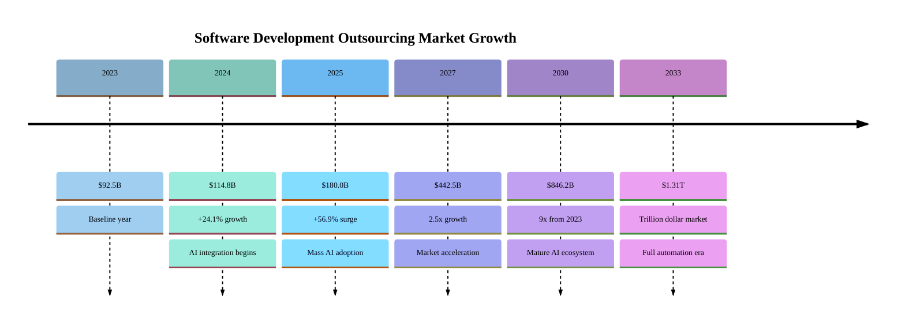
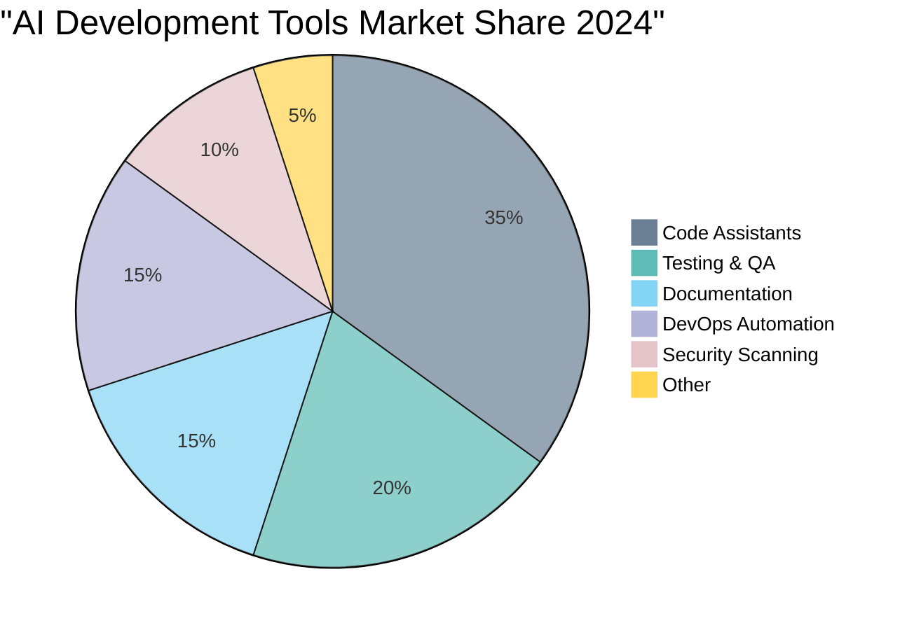
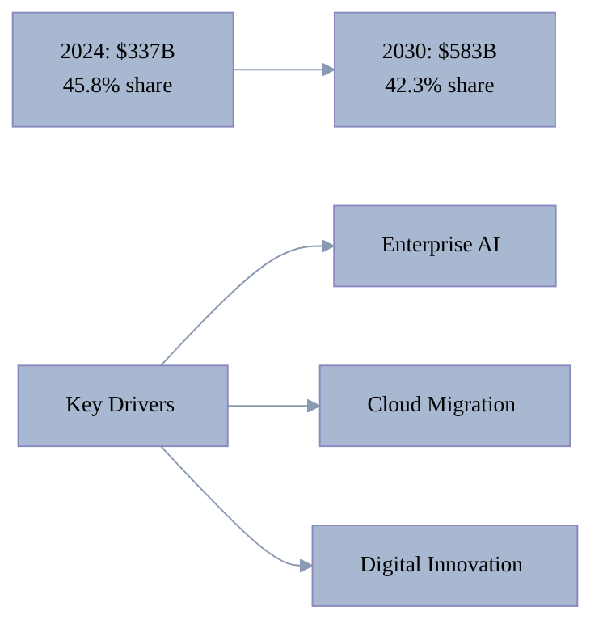
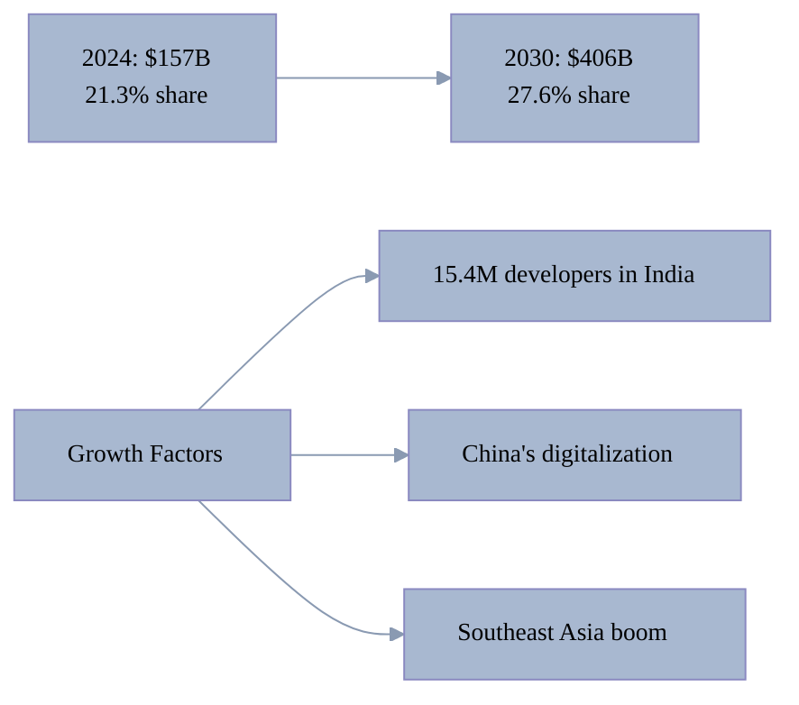
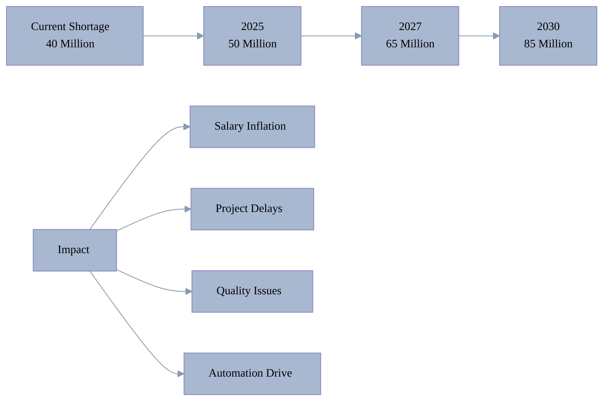

[🏠 Home](../../README.md) | [⬅️ Previous](02-market-overview.md) | [➡️ Next](04-customer-segments.md)

<link rel="stylesheet" href="../../assets/css/styles.css">
---

# Market Size & Growth Analysis

## Global Software Development Market

### Current Market Size (2024)

### Growth Projections

| Year | Market Size | YoY Growth | Key Milestone |
|------|-------------|------------|---------------|
| 2024 | $737B | 11.8% | Current baseline |
| 2025 | $824B | 11.8% | $1T trajectory begins |
| 2026 | $925B | 12.3% | AI integration mainstream |
| 2027 | $1.04T | 12.4% | First trillion dollar year |
| 2028 | $1.17T | 12.5% | Cloud-native dominant |
| 2029 | $1.31T | 12.0% | Autonomous dev emerges |
| 2030 | $1.47T | 12.2% | Market maturation |

### Long-term Outlook (2030-2034)

Some projections show even more aggressive growth:
- **Conservative**: $1.47 trillion by 2030
- **Moderate**: $1.8 trillion by 2032
- **Aggressive**: $2.25 trillion by 2034

## Software Development Outsourcing Market

### Explosive Growth Trajectory

### Key Growth Drivers

1. **Cost Arbitrage**: 70-90% cost savings offshore
2. **Talent Access**: Global developer pool
3. **24/7 Operations**: Follow-the-sun development
4. **Specialization**: Access to niche expertise

## AI in Software Development Market

### Market Evolution

| Metric | 2023 | 2024 | 2030 | CAGR |
|--------|------|------|------|------|
| Market Size | $162B | $122B* | $467B | 25.0% |
| Enterprise Adoption | 55% | 78% | 95%+ | - |
| Developer Usage | 70% | 82% | 98%+ | - |
| Code Generated by AI | 15% | 30% | 80%+ | - |

*Note: Different methodologies account for variance

### AI Tool Categories Growth

## Low-Code/No-Code Market

### Democratizing Development

| Year | Market Size | Growth Rate | Key Driver |
|------|-------------|-------------|------------|
| 2023 | $6.8B | - | Base year |
| 2024 | $14.6B | 114.7% | AI integration |
| 2025 | $18.9B | 29.5% | Enterprise adoption |
| 2027 | $31.7B | 29.5% | Citizen developers |
| 2030 | $35.2B-$388.6B | 22.5-37.9% | Mass adoption |

### Adoption by Company Size

- **Enterprise (1000+ employees)**: 45% adoption
- **Mid-market (100-999)**: 38% adoption
- **Small business (<100)**: 72% adoption

## Regional Market Analysis

### North America - Market Leader

**Characteristics:**
- Highest developer salaries ($107K average)
- 93% cloud adoption rate
- Home to major tech giants
- $213.6B IT outsourcing market

### Asia Pacific - Fastest Growing

**Key Statistics:**
- **CAGR**: 19.4% (highest globally)
- **Developer Growth**: 35% annually
- **Cost Advantage**: 80-90% lower than US
- **Key Markets**: India, China, Vietnam, Philippines

### Europe - Steady Growth

**Market Position:**
- 2024 Size: $185B (25.2% share)
- 2030 Projection: $295B
- CAGR: 12.5%
- Focus: GDPR compliance, sustainability

## Market Acceleration Factors

### 1. Developer Shortage Crisis

### 2. Digital Transformation Spending

- **2024**: $2.5 trillion globally
- **2027**: $3.9 trillion projected
- **Software %**: 35-40% of digital spending

### 3. AI Productivity Gains

| Tool Type | Productivity Gain | Adoption Rate |
|-----------|------------------|---------------|
| Code Assistants | 55% faster | 82% |
| Testing Automation | 70% reduction | 45% |
| Documentation | 80% faster | 38% |
| Code Review | 40% faster | 52% |

## Market Opportunities by Size

### Total Addressable Market (TAM)

```mermaid
%%{init: {
  'theme': 'base',
  'themeVariables': {
    'primaryColor': '#A8B8D0',
    'primaryTextColor': '#000000',
    'primaryBorderColor': '#8A9AB2',
    'lineColor': '#8A9AB2',
    'secondaryColor': '#5DBCB6',
    'secondaryTextColor': '#000000',
    'secondaryBorderColor': '#3D9A94',
    'tertiaryColor': '#84D4F5',
    'tertiaryTextColor': '#000000',
    'tertiaryBorderColor': '#5ABCD8',
    'background': '#F5F5F5',
    'mainBkg': '#A8B8D0',
    'secondBkg': '#5DBCB6',
    'tertiaryBkg': '#84D4F5',
    'mainContrastColor': '#000000',
    'darkMode': false,
    'fontFamily': 'Arial, sans-serif',
    'fontSize': '14px',
    'labelBackground': '#E8E8E8',
    'textColor': '#000000',
    'nodeBkg': '#B3B2D8',
    'nodeTextColor': '#000000',
    'nodeBorder': '#8A89C0',
    'clusterBkg': '#E5C4CA',
    'clusterBorder': '#CDA2AB',
    'defaultLinkColor': '#8A9AB2',
    'titleColor': '#000000',
    'edgeLabelBackground': '#F5F5F5',
    'actorBorder': '#8A9AB2',
    'actorBkg': '#B3B2D8',
    'actorTextColor': '#000000',
    'actorLineColor': '#8A9AB2',
    'signalColor': '#000000',
    'signalTextColor': '#000000',
    'activationBorderColor': '#8A9AB2',
    'activationBkgColor': '#E5C4CA',
    'sequenceNumberColor': '#000000',
    'sectionBkgColor': '#FFD54F',
    'altSectionBkgColor': '#FFB74D',
    'sectionBkgColor2': '#E1B3C4',
    'taskBorderColor': '#8A9AB2',
    'taskBkgColor': '#B3B2D8',
    'taskTextColor': '#000000',
    'taskTextLightColor': '#000000',
    'taskTextOutsideColor': '#000000',
    'taskTextClickableColor': '#000000',
    'activeTaskBorderColor': '#A8B8D0',
    'activeTaskBkgColor': '#84D4F5',
    'gridColor': '#C0C0C0',
    'doneTaskBkgColor': '#5DBCB6',
    'doneTaskBorderColor': '#3D9A94',
    'critBorderColor': '#E27D00',
    'critBkgColor': '#FFB74D',
    'todayLineColor': '#E27D00',
    'labelColor': '#000000',
    'errorBkgColor': '#E1B3C4',
    'errorTextColor': '#000000'
  }
}}%%
graph LR
    A[Global TAM 2024<br/>$737B] --> B[Serviceable Available Market<br/>$250B]
    B --> C[AI-Augmented Segment<br/>$122B]
    C --> D[Our Target Market<br/>$50B]


    style D fill:#4CAF50,color:#fff
```

### Market Capture Scenarios

| Scenario | Market Share | 2025 Revenue | 2030 Revenue |
|----------|--------------|--------------|--------------|
| Conservative | 0.001% | $2-5M | $15-20M |
| Realistic | 0.01% | $20-50M | $150-200M |
| Optimistic | 0.1% | $200-500M | $1.5-2B |

## Key Takeaways

1. **Massive Growth**: Software market doubling by 2030
2. **AI Disruption**: 25-57% CAGR in AI segments
3. **Regional Shift**: Asia Pacific becoming dominant
4. **Talent Crisis**: Creating automation imperative
5. **Price Pressure**: Driving efficiency solutions

The convergence of these factors creates an unprecedented opportunity for solutions that can deliver high-quality software development at revolutionary price points and speeds.

---

[🏠 Home](../../README.md) | [⬅️ Previous](02-market-overview.md) | [➡️ Next](04-customer-segments.md)
