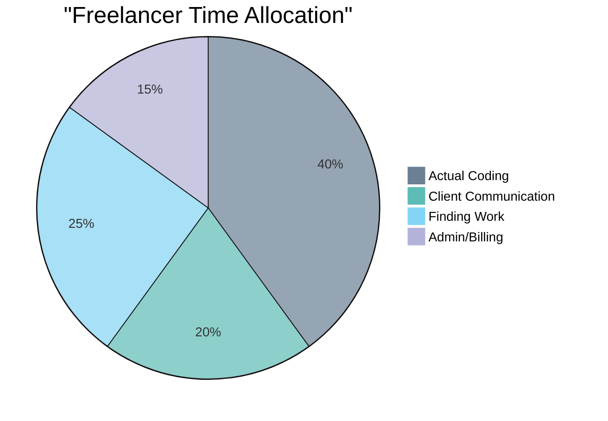
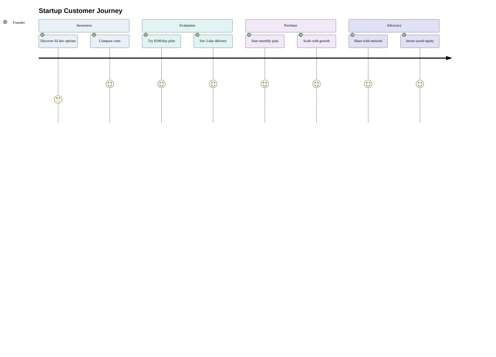
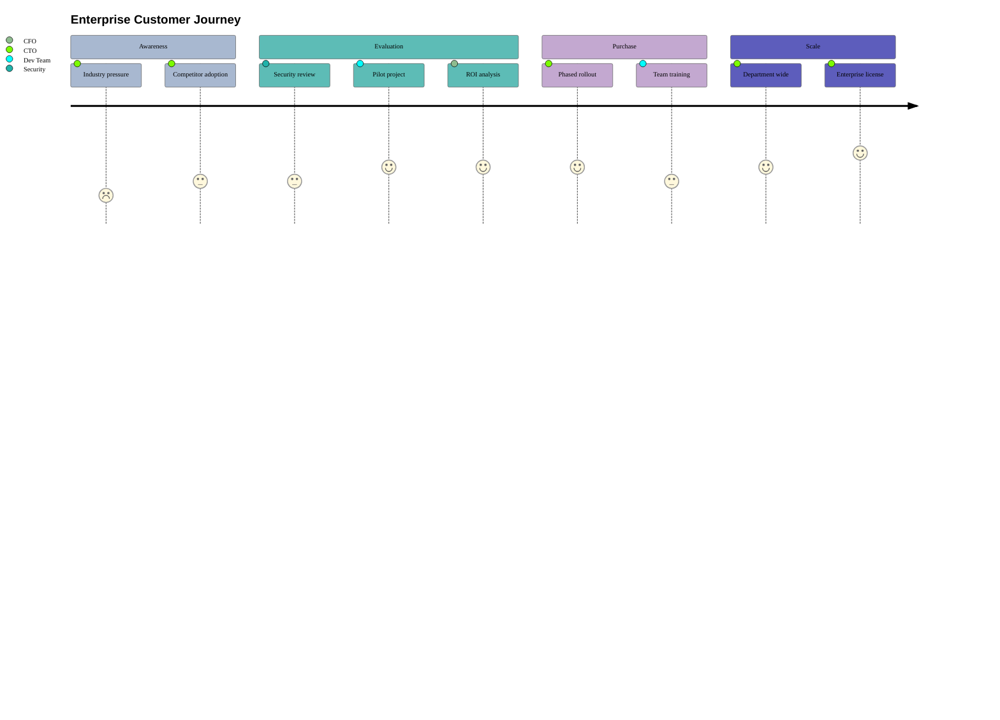

[🏠 Home](../../README.md) | [⬅️ Previous](03-market-size-growth.md) | [➡️ Next](05-competitive-landscape.md)

<link rel="stylesheet" href="../../assets/css/styles.css">
---

# Customer Segments Analysis

## Market Segmentation Overview

```mermaid
%%{init: {
  'theme': 'base',
  'themeVariables': {
    'primaryColor': '#A8B8D0',
    'primaryTextColor': '#000000',
    'primaryBorderColor': '#8A9AB2',
    'lineColor': '#8A9AB2',
    'secondaryColor': '#5DBCB6',
    'secondaryTextColor': '#000000',
    'secondaryBorderColor': '#3D9A94',
    'tertiaryColor': '#84D4F5',
    'tertiaryTextColor': '#000000',
    'tertiaryBorderColor': '#5ABCD8',
    'background': '#F5F5F5',
    'mainBkg': '#A8B8D0',
    'secondBkg': '#5DBCB6',
    'tertiaryBkg': '#84D4F5',
    'mainContrastColor': '#000000',
    'darkMode': false,
    'fontFamily': 'Arial, sans-serif',
    'fontSize': '14px',
    'labelBackground': '#E8E8E8',
    'textColor': '#000000',
    'nodeBkg': '#B3B2D8',
    'nodeTextColor': '#000000',
    'nodeBorder': '#8A89C0',
    'clusterBkg': '#E5C4CA',
    'clusterBorder': '#CDA2AB',
    'defaultLinkColor': '#8A9AB2',
    'titleColor': '#000000',
    'edgeLabelBackground': '#F5F5F5',
    'actorBorder': '#8A9AB2',
    'actorBkg': '#B3B2D8',
    'actorTextColor': '#000000',
    'actorLineColor': '#8A9AB2',
    'signalColor': '#000000',
    'signalTextColor': '#000000',
    'activationBorderColor': '#8A9AB2',
    'activationBkgColor': '#E5C4CA',
    'sequenceNumberColor': '#000000',
    'sectionBkgColor': '#FFD54F',
    'altSectionBkgColor': '#FFB74D',
    'sectionBkgColor2': '#E1B3C4',
    'taskBorderColor': '#8A9AB2',
    'taskBkgColor': '#B3B2D8',
    'taskTextColor': '#000000',
    'taskTextLightColor': '#000000',
    'taskTextOutsideColor': '#000000',
    'taskTextClickableColor': '#000000',
    'activeTaskBorderColor': '#A8B8D0',
    'activeTaskBkgColor': '#84D4F5',
    'gridColor': '#C0C0C0',
    'doneTaskBkgColor': '#5DBCB6',
    'doneTaskBorderColor': '#3D9A94',
    'critBorderColor': '#E27D00',
    'critBkgColor': '#FFB74D',
    'todayLineColor': '#E27D00',
    'labelColor': '#000000',
    'errorBkgColor': '#E1B3C4',
    'errorTextColor': '#000000'
  }
}}%%
graph TD
    A[Total Market] --> B[By Company Size]
    A --> C[By Industry]
    A --> D[By Geography]
    A --> E[By Tech Maturity]

    B --> B1[Startups<br/>26% of developers]
    B --> B2[SMBs<br/>35% of market]
    B --> B3[Enterprise<br/>39% of spending]

    C --> C1[Tech/Software<br/>28%]
    C --> C2[Financial<br/>17%]
    C --> C3[Healthcare<br/>12%]
    C --> C4[Other<br/>43%]
```

## Primary Customer Segments

### 1. 🚀 Startups (Highest Priority)

#### Profile
- **Size**: 1-50 employees
- **Budget**: $0-50K/year for development
- **Team**: 50% have 2-7 person dev teams
- **Market Size**: 90 million startups globally

#### Pain Points

| Pain Point | Impact | Current Solution | Cost |
|------------|--------|------------------|------|
| Funding constraints | 40.9% cite as #1 issue | Equity for development | 20-30% equity |
| AI integration complexity | 49.2% struggle | Hire AI experts | $150K+/year |
| Speed to market | 73% fail due to timing | Rush quality | Technical debt |
| Talent acquisition | 34% can't find devs | Overpay or outsource | 2-3x budget |

#### Opportunity
- **Current State**: Forced to seek VC funding for basic development
- **With AI Swarm**: Bootstrap with $3-15K/month instead of $100K+
- **Market Impact**: Enable 10x more startups to launch

#### Success Metrics
- Time to MVP: 2-3 weeks → 2-3 days
- Development cost: $50K → $1K
- Equity preserved: 100% vs 70-80%

### 2. 💼 Software Development Agencies

#### Profile
- **Size**: 10-500 employees
- **Revenue**: $1M-50M annually
- **Projects**: 5-50 concurrent
- **Market Size**: 500K+ agencies globally

#### Pain Points

| Challenge | % Affected | Annual Cost Impact |
|-----------|------------|-------------------|
| Project estimation | 36% | 15-20% margin loss |
| Client scope creep | 35% | $500K+ overruns |
| Resource allocation | 32% | 25% utilization loss |
| Quality consistency | 30% | Client churn 20% |

#### Current vs. AI Swarm Model

```mermaid
%%{init: {
  'theme': 'base',
  'themeVariables': {
    'primaryColor': '#A8B8D0',
    'primaryTextColor': '#000000',
    'primaryBorderColor': '#8A9AB2',
    'lineColor': '#8A9AB2',
    'secondaryColor': '#5DBCB6',
    'secondaryTextColor': '#000000',
    'secondaryBorderColor': '#3D9A94',
    'tertiaryColor': '#84D4F5',
    'tertiaryTextColor': '#000000',
    'tertiaryBorderColor': '#5ABCD8',
    'background': '#F5F5F5',
    'mainBkg': '#A8B8D0',
    'secondBkg': '#5DBCB6',
    'tertiaryBkg': '#84D4F5',
    'mainContrastColor': '#000000',
    'darkMode': false,
    'fontFamily': 'Arial, sans-serif',
    'fontSize': '14px',
    'labelBackground': '#E8E8E8',
    'textColor': '#000000',
    'nodeBkg': '#B3B2D8',
    'nodeTextColor': '#000000',
    'nodeBorder': '#8A89C0',
    'clusterBkg': '#E5C4CA',
    'clusterBorder': '#CDA2AB',
    'defaultLinkColor': '#8A9AB2',
    'titleColor': '#000000',
    'edgeLabelBackground': '#F5F5F5',
    'actorBorder': '#8A9AB2',
    'actorBkg': '#B3B2D8',
    'actorTextColor': '#000000',
    'actorLineColor': '#8A9AB2',
    'signalColor': '#000000',
    'signalTextColor': '#000000',
    'activationBorderColor': '#8A9AB2',
    'activationBkgColor': '#E5C4CA',
    'sequenceNumberColor': '#000000',
    'sectionBkgColor': '#FFD54F',
    'altSectionBkgColor': '#FFB74D',
    'sectionBkgColor2': '#E1B3C4',
    'taskBorderColor': '#8A9AB2',
    'taskBkgColor': '#B3B2D8',
    'taskTextColor': '#000000',
    'taskTextLightColor': '#000000',
    'taskTextOutsideColor': '#000000',
    'taskTextClickableColor': '#000000',
    'activeTaskBorderColor': '#A8B8D0',
    'activeTaskBkgColor': '#84D4F5',
    'gridColor': '#C0C0C0',
    'doneTaskBkgColor': '#5DBCB6',
    'doneTaskBorderColor': '#3D9A94',
    'critBorderColor': '#E27D00',
    'critBkgColor': '#FFB74D',
    'todayLineColor': '#E27D00',
    'labelColor': '#000000',
    'errorBkgColor': '#E1B3C4',
    'errorTextColor': '#000000'
  }
}}%%
graph TD
    A[Current Model] --> A1[Body Shop<br/>$150/hour]
    A --> A2[Low Margins<br/>15-25%]
    A --> A3[Scaling Issues<br/>Hiring bottleneck]

    B[AI Swarm Model] --> B1[Value Delivery<br/>Fixed price]
    B --> B2[High Margins<br/>70-85%]
    B --> B3[Instant Scale<br/>Unlimited capacity]
```

#### Opportunity
- Transform from body shops to product delivery
- 30x more projects with same overhead
- 70%+ profit margins vs 20%

### 3. 🏢 Enterprise Development Teams

#### Profile
- **Size**: 100-10,000+ developers
- **Budget**: $10M-1B+ annually
- **Challenges**: Legacy systems, compliance
- **Decision cycle**: 6-18 months

#### Adoption Barriers
1. **Technical** (41% haven't implemented AI)
   - Legacy system integration
   - Security requirements
   - Compliance needs

2. **Organizational** (35% cite as primary)
   - Change resistance
   - Skills gap
   - Budget approval process

3. **Trust** (43% trust AI accuracy)
   - Code quality concerns
   - IP protection
   - Vendor lock-in fears

#### Enterprise Requirements

| Requirement | Priority | Current Solution | Annual Cost |
|-------------|----------|------------------|-------------|
| Security compliance | Critical | Security teams | $2M+ |
| Audit trails | High | Manual documentation | $500K+ |
| SLAs | Critical | Dedicated teams | $5M+ |
| Integration | High | Custom development | $1M+ |

### 4. 👤 Freelancers & Solo Developers

#### Profile
- **Market Size**: 1.57 billion globally
- **Income**: 35% below living wage
- **Hours**: 57% work 40+ hours/week
- **Growth**: 15% annually

#### Unique Needs

#### AI Impact
- **Time Saved**: 8 hours/week average
- **Project Capacity**: 2x increase
- **Income Potential**: 50-150% increase

### 5. 💻 Technology Consultancies

#### Profile
- **Focus**: Digital transformation
- **Size**: 50-5000 consultants
- **Projects**: Enterprise scale
- **Margins**: 40-60%

#### Partnership Opportunity

| Service | Current Model | AI-Augmented Model | Margin Impact |
|---------|--------------|-------------------|---------------|
| Development | Subcontract 30% | White-label AI | +40% |
| Architecture | Senior consultants | AI + review | +60% |
| Maintenance | Dedicated teams | AI monitoring | +80% |

## Industry-Specific Segments

### 🏦 Financial Services

#### Requirements
- **Compliance**: SOC2, PCI-DSS, SOX
- **Security**: Zero-trust architecture
- **Uptime**: 99.99% SLA
- **Audit**: Complete trail

#### Market Data
- **Fines**: 86% paid $50K+ compliance fines
- **Breach Cost**: $4.88M average
- **IT Spend**: 7.16% of revenue

### 🏥 Healthcare

#### Requirements
- **HIPAA Compliance**: Mandatory
- **Integration**: EHR/EMR systems
- **Privacy**: Patient data protection
- **Validation**: FDA requirements

#### Growth Drivers
- Digital health market: $659B by 2025
- Telemedicine: 38.5% CAGR
- AI diagnostics: 45% CAGR

### 🏭 Manufacturing

#### Digital Transformation Needs
- IoT integration
- Supply chain optimization
- Predictive maintenance
- Quality control AI

## Geographic Segments

### Primary Markets (by opportunity)

```mermaid
%%{init: {
  'theme': 'base',
  'themeVariables': {
    'primaryColor': '#A8B8D0',
    'primaryTextColor': '#000000',
    'primaryBorderColor': '#8A9AB2',
    'lineColor': '#8A9AB2',
    'secondaryColor': '#5DBCB6',
    'secondaryTextColor': '#000000',
    'secondaryBorderColor': '#3D9A94',
    'tertiaryColor': '#84D4F5',
    'tertiaryTextColor': '#000000',
    'tertiaryBorderColor': '#5ABCD8',
    'background': '#F5F5F5',
    'mainBkg': '#A8B8D0',
    'secondBkg': '#5DBCB6',
    'tertiaryBkg': '#84D4F5',
    'mainContrastColor': '#000000',
    'darkMode': false,
    'fontFamily': 'Arial, sans-serif',
    'fontSize': '14px',
    'labelBackground': '#E8E8E8',
    'textColor': '#000000',
    'nodeBkg': '#B3B2D8',
    'nodeTextColor': '#000000',
    'nodeBorder': '#8A89C0',
    'clusterBkg': '#E5C4CA',
    'clusterBorder': '#CDA2AB',
    'defaultLinkColor': '#8A9AB2',
    'titleColor': '#000000',
    'edgeLabelBackground': '#F5F5F5',
    'actorBorder': '#8A9AB2',
    'actorBkg': '#B3B2D8',
    'actorTextColor': '#000000',
    'actorLineColor': '#8A9AB2',
    'signalColor': '#000000',
    'signalTextColor': '#000000',
    'activationBorderColor': '#8A9AB2',
    'activationBkgColor': '#E5C4CA',
    'sequenceNumberColor': '#000000',
    'sectionBkgColor': '#FFD54F',
    'altSectionBkgColor': '#FFB74D',
    'sectionBkgColor2': '#E1B3C4',
    'taskBorderColor': '#8A9AB2',
    'taskBkgColor': '#B3B2D8',
    'taskTextColor': '#000000',
    'taskTextLightColor': '#000000',
    'taskTextOutsideColor': '#000000',
    'taskTextClickableColor': '#000000',
    'activeTaskBorderColor': '#A8B8D0',
    'activeTaskBkgColor': '#84D4F5',
    'gridColor': '#C0C0C0',
    'doneTaskBkgColor': '#5DBCB6',
    'doneTaskBorderColor': '#3D9A94',
    'critBorderColor': '#E27D00',
    'critBkgColor': '#FFB74D',
    'todayLineColor': '#E27D00',
    'labelColor': '#000000',
    'errorBkgColor': '#E1B3C4',
    'errorTextColor': '#000000'
  }
}}%%
graph TD
    A[Geographic Strategy] --> B[Tier 1: English Speaking]
    A --> C[Tier 2: Europe]
    A --> D[Tier 3: Asia Pacific]

    B --> B1[USA - $213B market]
    B --> B2[UK - $45B market]
    B --> B3[Canada - $28B market]
    B --> B4[Australia - $19B market]

    C --> C1[Germany - $52B]
    C --> C2[France - $38B]
    C --> C3[Nordics - $31B]

    D --> D1[India - $54B]
    D --> D2[Singapore - $12B]
    D --> D3[Japan - $67B]
```

## Customer Journey Analysis

### Startup Journey

### Enterprise Journey

## Market Prioritization Matrix

```mermaid
%%{init: {
  'theme': 'base',
  'themeVariables': {
    'primaryColor': '#A8B8D0',
    'primaryTextColor': '#000000',
    'primaryBorderColor': '#8A9AB2',
    'lineColor': '#8A9AB2',
    'secondaryColor': '#5DBCB6',
    'secondaryTextColor': '#000000',
    'secondaryBorderColor': '#3D9A94',
    'tertiaryColor': '#84D4F5',
    'tertiaryTextColor': '#000000',
    'tertiaryBorderColor': '#5ABCD8',
    'background': '#F5F5F5',
    'mainBkg': '#A8B8D0',
    'secondBkg': '#5DBCB6',
    'tertiaryBkg': '#84D4F5',
    'mainContrastColor': '#000000',
    'darkMode': false,
    'fontFamily': 'Arial, sans-serif',
    'fontSize': '14px',
    'labelBackground': '#E8E8E8',
    'textColor': '#000000',
    'nodeBkg': '#B3B2D8',
    'nodeTextColor': '#000000',
    'nodeBorder': '#8A89C0',
    'clusterBkg': '#E5C4CA',
    'clusterBorder': '#CDA2AB',
    'defaultLinkColor': '#8A9AB2',
    'titleColor': '#000000',
    'edgeLabelBackground': '#F5F5F5',
    'actorBorder': '#8A9AB2',
    'actorBkg': '#B3B2D8',
    'actorTextColor': '#000000',
    'actorLineColor': '#8A9AB2',
    'signalColor': '#000000',
    'signalTextColor': '#000000',
    'activationBorderColor': '#8A9AB2',
    'activationBkgColor': '#E5C4CA',
    'sequenceNumberColor': '#000000',
    'sectionBkgColor': '#FFD54F',
    'altSectionBkgColor': '#FFB74D',
    'sectionBkgColor2': '#E1B3C4',
    'taskBorderColor': '#8A9AB2',
    'taskBkgColor': '#B3B2D8',
    'taskTextColor': '#000000',
    'taskTextLightColor': '#000000',
    'taskTextOutsideColor': '#000000',
    'taskTextClickableColor': '#000000',
    'activeTaskBorderColor': '#A8B8D0',
    'activeTaskBkgColor': '#84D4F5',
    'gridColor': '#C0C0C0',
    'doneTaskBkgColor': '#5DBCB6',
    'doneTaskBorderColor': '#3D9A94',
    'critBorderColor': '#E27D00',
    'critBkgColor': '#FFB74D',
    'todayLineColor': '#E27D00',
    'labelColor': '#000000',
    'errorBkgColor': '#E1B3C4',
    'errorTextColor': '#000000'
  }
}}%%
graph TD
    A[High Value/Easy Entry] --> A1[Startups]
    A --> A2[Tech Consultancies]

    B[High Value/Hard Entry] --> B1[Enterprises]
    B --> B2[Financial Services]

    C[Medium Value/Easy Entry] --> C1[Freelancers]
    C --> C2[Small Agencies]

    D[Lower Priority] --> D1[Government]
    D --> D2[Education]
```

## Key Insights

1. **Startups**: Highest ROI, lowest barrier, fastest adoption
2. **Agencies**: Transform business model, 30x productivity
3. **Enterprises**: Longer sales cycle but massive contracts
4. **Freelancers**: Volume play, viral growth potential
5. **Industries**: Fintech/Healthcare premium pricing opportunity

## Recommended Go-to-Market Sequence

1. **Phase 1** (Months 1-6): Startups + Freelancers
   - $100/day pilots
   - Bootstrap success stories
   - Viral growth

2. **Phase 2** (Months 6-12): Agencies + Consultancies
   - White-label partnerships
   - Revenue share models
   - Case studies

3. **Phase 3** (Year 2+): Enterprise + Regulated Industries
   - Compliance certifications
   - Enterprise features
   - Strategic accounts

---

[🏠 Home](../../README.md) | [⬅️ Previous](03-market-size-growth.md) | [➡️ Next](05-competitive-landscape.md)
