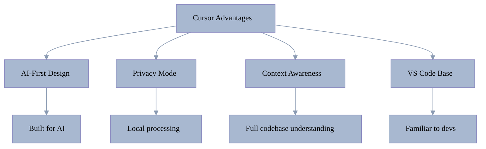
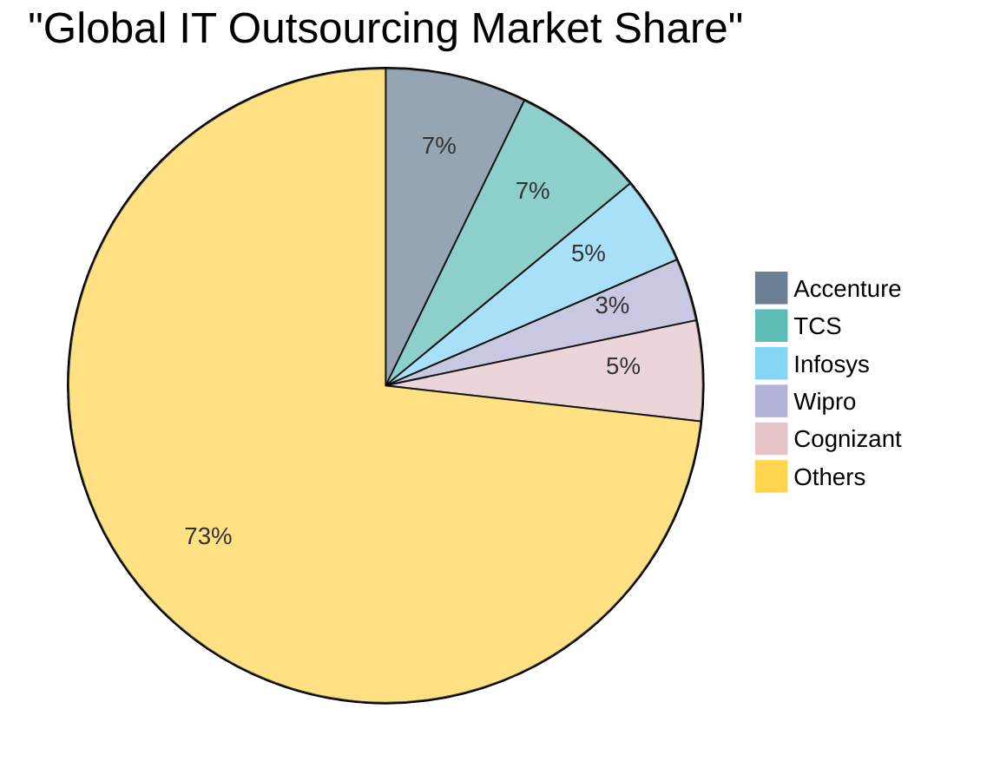
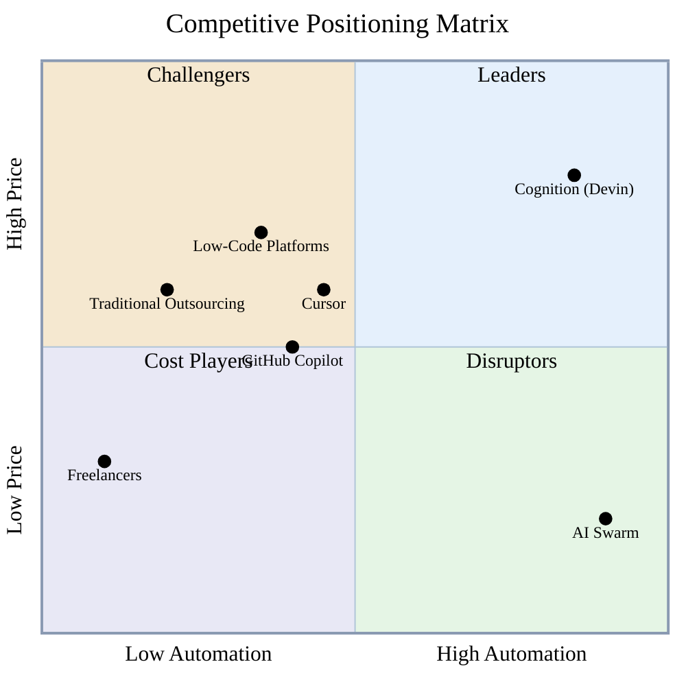
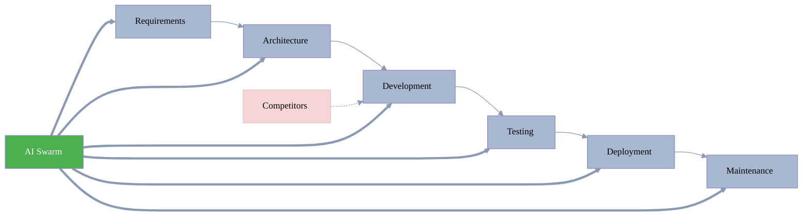
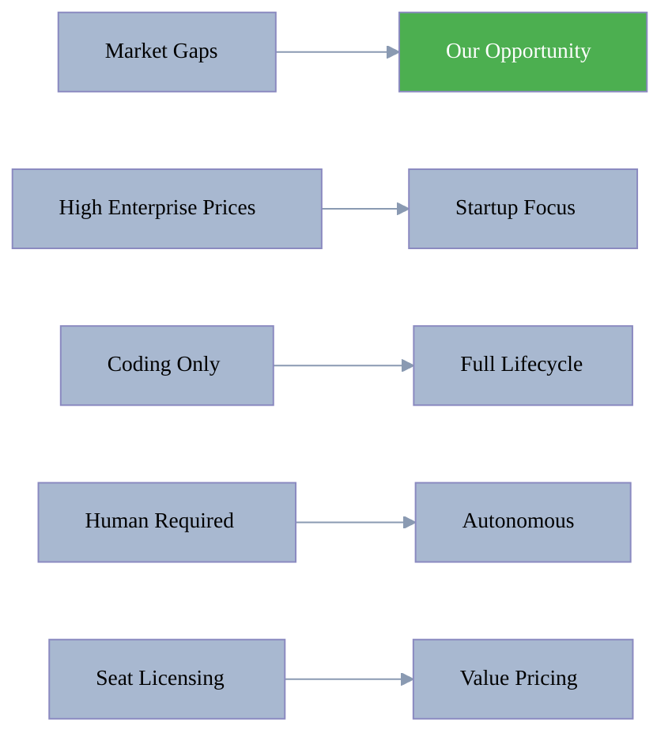

[🏠 Home](../../README.md) | [⬅️ Previous](04-customer-segments.md) | [➡️ Next](06-pricing-analysis.md)

<link rel="stylesheet" href="../../assets/css/styles.css">
---

# Competitive Landscape Analysis

## Market Structure

```mermaid
%%{init: {
  'theme': 'base',
  'themeVariables': {
    'primaryColor': '#A8B8D0',
    'primaryTextColor': '#000000',
    'primaryBorderColor': '#8A9AB2',
    'lineColor': '#8A9AB2',
    'secondaryColor': '#5DBCB6',
    'secondaryTextColor': '#000000',
    'secondaryBorderColor': '#3D9A94',
    'tertiaryColor': '#84D4F5',
    'tertiaryTextColor': '#000000',
    'tertiaryBorderColor': '#5ABCD8',
    'background': '#F5F5F5',
    'mainBkg': '#A8B8D0',
    'secondBkg': '#5DBCB6',
    'tertiaryBkg': '#84D4F5',
    'mainContrastColor': '#000000',
    'darkMode': false,
    'fontFamily': 'Arial, sans-serif',
    'fontSize': '14px',
    'labelBackground': '#E8E8E8',
    'textColor': '#000000',
    'nodeBkg': '#B3B2D8',
    'nodeTextColor': '#000000',
    'nodeBorder': '#8A89C0',
    'clusterBkg': '#E5C4CA',
    'clusterBorder': '#CDA2AB',
    'defaultLinkColor': '#8A9AB2',
    'titleColor': '#000000',
    'edgeLabelBackground': '#F5F5F5',
    'actorBorder': '#8A9AB2',
    'actorBkg': '#B3B2D8',
    'actorTextColor': '#000000',
    'actorLineColor': '#8A9AB2',
    'signalColor': '#000000',
    'signalTextColor': '#000000',
    'activationBorderColor': '#8A9AB2',
    'activationBkgColor': '#E5C4CA',
    'sequenceNumberColor': '#000000',
    'sectionBkgColor': '#FFD54F',
    'altSectionBkgColor': '#FFB74D',
    'sectionBkgColor2': '#E1B3C4',
    'taskBorderColor': '#8A9AB2',
    'taskBkgColor': '#B3B2D8',
    'taskTextColor': '#000000',
    'taskTextLightColor': '#000000',
    'taskTextOutsideColor': '#000000',
    'taskTextClickableColor': '#000000',
    'activeTaskBorderColor': '#A8B8D0',
    'activeTaskBkgColor': '#84D4F5',
    'gridColor': '#C0C0C0',
    'doneTaskBkgColor': '#5DBCB6',
    'doneTaskBorderColor': '#3D9A94',
    'critBorderColor': '#E27D00',
    'critBkgColor': '#FFB74D',
    'todayLineColor': '#E27D00',
    'labelColor': '#000000',
    'errorBkgColor': '#E1B3C4',
    'errorTextColor': '#000000'
  }
}}%%
graph TD
    A[AI Development Tools Market] --> B[Code Assistants<br/>$4.2B]
    A --> C[Development Platforms<br/>$3.8B]
    A --> D[Low-Code/No-Code<br/>$14.6B]
    A --> E[Traditional Outsourcing<br/>$92.5B]

    B --> B1[GitHub Copilot<br/>Market Leader]
    B --> B2[Tabnine/Codeium<br/>Challengers]

    C --> C1[Cursor<br/>Fastest Growing]
    C --> C2[Replit<br/>Browser-Based]

    D --> D1[OutSystems<br/>Enterprise Leader]
    D --> D2[Bubble<br/>SMB Leader]
```

## Direct Competitors

### 1. GitHub Copilot (Microsoft)

#### Market Position
- **Market Share**: 40%+ of AI coding assistant market
- **Users**: 1.3M paid subscribers
- **Organizations**: 77,000+ (including 1/3 of Fortune 500)
- **Revenue Impact**: 40% of GitHub's growth

#### Strengths

| Strength | Impact | Moat |
|----------|--------|------|
| Microsoft ecosystem | 230K+ organizations | Deep integration |
| First mover advantage | 82% developer awareness | Brand recognition |
| GitHub integration | 100M+ developers | Platform lock-in |
| Enterprise features | Fortune 500 adoption | Compliance ready |

#### Weaknesses
- Limited to code completion and chat
- Requires human developer oversight
- No project management capabilities
- Can't handle full development lifecycle

#### Pricing
- Individual: $10/month
- Business: $19/user/month
- Enterprise: $39/user/month

### 2. Cursor IDE

#### Market Position
- **Valuation**: $9.9B (2025)
- **ARR**: $500M (fastest to $100M in 12 months)
- **Growth**: 10x in 18 months

#### Competitive Advantages

#### Target Market
- Professional developers
- Privacy-conscious teams
- Complex codebases

### 3. Replit

#### Market Position
- **Valuation**: $1.16B
- **ARR**: $100M
- **Users**: 20M+ developers

#### Unique Value Proposition
- Browser-based development
- Instant deployment
- Educational focus
- Collaborative coding

#### Limitations vs AI Swarm
- Still requires coding knowledge
- Limited to web applications
- Performance constraints
- Not enterprise-ready

### 4. Cognition AI (Devin)

#### Revolutionary Approach
- **Valuation**: $4B (2025)
- **Concept**: Autonomous AI developer
- **Status**: Limited availability

#### Key Differentiator

```mermaid
%%{init: {
  'theme': 'base',
  'themeVariables': {
    'primaryColor': '#A8B8D0',
    'primaryTextColor': '#000000',
    'primaryBorderColor': '#8A9AB2',
    'lineColor': '#8A9AB2',
    'secondaryColor': '#5DBCB6',
    'secondaryTextColor': '#000000',
    'secondaryBorderColor': '#3D9A94',
    'tertiaryColor': '#84D4F5',
    'tertiaryTextColor': '#000000',
    'tertiaryBorderColor': '#5ABCD8',
    'background': '#F5F5F5',
    'mainBkg': '#A8B8D0',
    'secondBkg': '#5DBCB6',
    'tertiaryBkg': '#84D4F5',
    'mainContrastColor': '#000000',
    'darkMode': false,
    'fontFamily': 'Arial, sans-serif',
    'fontSize': '14px',
    'labelBackground': '#E8E8E8',
    'textColor': '#000000',
    'nodeBkg': '#B3B2D8',
    'nodeTextColor': '#000000',
    'nodeBorder': '#8A89C0',
    'clusterBkg': '#E5C4CA',
    'clusterBorder': '#CDA2AB',
    'defaultLinkColor': '#8A9AB2',
    'titleColor': '#000000',
    'edgeLabelBackground': '#F5F5F5',
    'actorBorder': '#8A9AB2',
    'actorBkg': '#B3B2D8',
    'actorTextColor': '#000000',
    'actorLineColor': '#8A9AB2',
    'signalColor': '#000000',
    'signalTextColor': '#000000',
    'activationBorderColor': '#8A9AB2',
    'activationBkgColor': '#E5C4CA',
    'sequenceNumberColor': '#000000',
    'sectionBkgColor': '#FFD54F',
    'altSectionBkgColor': '#FFB74D',
    'sectionBkgColor2': '#E1B3C4',
    'taskBorderColor': '#8A9AB2',
    'taskBkgColor': '#B3B2D8',
    'taskTextColor': '#000000',
    'taskTextLightColor': '#000000',
    'taskTextOutsideColor': '#000000',
    'taskTextClickableColor': '#000000',
    'activeTaskBorderColor': '#A8B8D0',
    'activeTaskBkgColor': '#84D4F5',
    'gridColor': '#C0C0C0',
    'doneTaskBkgColor': '#5DBCB6',
    'doneTaskBorderColor': '#3D9A94',
    'critBorderColor': '#E27D00',
    'critBkgColor': '#FFB74D',
    'todayLineColor': '#E27D00',
    'labelColor': '#000000',
    'errorBkgColor': '#E1B3C4',
    'errorTextColor': '#000000'
  }
}}%%
graph TD
    A[Traditional AI Tools<br/>Copilot Model] --> A1[Human writes code]
    A --> A2[AI assists/suggests]
    A --> A3[Human reviews/fixes]

    B[Devin/AI Swarm<br/>Contractor Model] --> B1[Human describes need]
    B --> B2[AI plans/builds/tests]
    B --> B3[Human approves result]

    style B fill:#4CAF50,color:#fff
```

## Indirect Competitors

### Low-Code/No-Code Platforms

#### Market Leaders Comparison

| Platform | Market Cap/Value | Target | Pricing | Limitation |
|----------|------------------|--------|---------|------------|
| OutSystems | $9.5B | Enterprise | $75-10K/mo | Vendor lock-in |
| Mendix | Part of Siemens | Enterprise | $998+/mo | Complexity |
| Bubble | $100M+ ARR | SMBs | $25-500/mo | Performance |
| Webflow | $4B | Designers | $14-212/mo | Learning curve |

#### Why They're Vulnerable
1. Still require significant learning
2. Limited to specific use cases
3. Platform constraints
4. Hidden complexity for advanced features

### Traditional Outsourcing

#### Major Players

#### Traditional Model Weaknesses

| Factor | Traditional | AI Swarm | Advantage |
|--------|------------|----------|-----------|
| Ramp-up time | 2-3 months | Instant | 60-90 days saved |
| Minimum team | 5-10 people | Unlimited | No minimums |
| Quality variance | High | Consistent | Predictable |
| Communication | Time zones | 24/7 | Always available |
| Cost | $50-150/hour | $4-20/hour | 10-30x cheaper |

## Competitive Positioning Matrix

### Quadrant Analysis

- **Leaders (High Automation, High Price)** 🔵: Cognition (Devin) - Premium autonomous solutions
- **Challengers (Low Automation, High Price)** 🟡: Traditional outsourcing, Low-Code platforms - Expensive but limited automation
- **Cost Players (Low Automation, Low Price)** 🟣: Freelancers - Cheap but manual labor
- **Disruptors (High Automation, Low Price)** 🟢: AI Swarm - Revolutionary value proposition with full automation at minimal cost

## Competitive Advantages Analysis

### O2.services AI Swarm Differentiators

#### 1. Full-Stack Automation

#### 2. Price Disruption

| Competitor | Monthly Cost (10 devs) | Per Project | Speed |
|------------|------------------------|-------------|-------|
| GitHub Copilot | $190 (tools only) | N/A | Assists only |
| Traditional Team | $100K+ | $300K+ | 3 months |
| Offshore Team | $30K+ | $90K+ | 3 months |
| Freelancers | $20K+ | $60K+ | 2-4 months |
| **AI Swarm** | **$3-15K** | **$200-1500** | **2-3 days** |

#### 3. Quality Guarantee
- 80%+ test coverage (vs 41% more bugs with AI tools)
- SOLID principles enforcement
- Best practices automation
- Living documentation

## Market Disruption Potential

### Disruption Vectors

1. **Price**: 47-1,612x cost reduction
2. **Speed**: Up to 50x faster delivery
3. **Scale**: Unlimited capacity instantly
4. **Quality**: Consistent best practices

### Vulnerable Segments

```mermaid
%%{init: {
  'theme': 'base',
  'themeVariables': {
    'primaryColor': '#A8B8D0',
    'primaryTextColor': '#000000',
    'primaryBorderColor': '#8A9AB2',
    'lineColor': '#8A9AB2',
    'secondaryColor': '#5DBCB6',
    'secondaryTextColor': '#000000',
    'secondaryBorderColor': '#3D9A94',
    'tertiaryColor': '#84D4F5',
    'tertiaryTextColor': '#000000',
    'tertiaryBorderColor': '#5ABCD8',
    'background': '#F5F5F5',
    'mainBkg': '#A8B8D0',
    'secondBkg': '#5DBCB6',
    'tertiaryBkg': '#84D4F5',
    'mainContrastColor': '#000000',
    'darkMode': false,
    'fontFamily': 'Arial, sans-serif',
    'fontSize': '14px',
    'labelBackground': '#E8E8E8',
    'textColor': '#000000',
    'nodeBkg': '#B3B2D8',
    'nodeTextColor': '#000000',
    'nodeBorder': '#8A89C0',
    'clusterBkg': '#E5C4CA',
    'clusterBorder': '#CDA2AB',
    'defaultLinkColor': '#8A9AB2',
    'titleColor': '#000000',
    'edgeLabelBackground': '#F5F5F5',
    'actorBorder': '#8A9AB2',
    'actorBkg': '#B3B2D8',
    'actorTextColor': '#000000',
    'actorLineColor': '#8A9AB2',
    'signalColor': '#000000',
    'signalTextColor': '#000000',
    'activationBorderColor': '#8A9AB2',
    'activationBkgColor': '#E5C4CA',
    'sequenceNumberColor': '#000000',
    'sectionBkgColor': '#FFD54F',
    'altSectionBkgColor': '#FFB74D',
    'sectionBkgColor2': '#E1B3C4',
    'taskBorderColor': '#8A9AB2',
    'taskBkgColor': '#B3B2D8',
    'taskTextColor': '#000000',
    'taskTextLightColor': '#000000',
    'taskTextOutsideColor': '#000000',
    'taskTextClickableColor': '#000000',
    'activeTaskBorderColor': '#A8B8D0',
    'activeTaskBkgColor': '#84D4F5',
    'gridColor': '#C0C0C0',
    'doneTaskBkgColor': '#5DBCB6',
    'doneTaskBorderColor': '#3D9A94',
    'critBorderColor': '#E27D00',
    'critBkgColor': '#FFB74D',
    'todayLineColor': '#E27D00',
    'labelColor': '#000000',
    'errorBkgColor': '#E1B3C4',
    'errorTextColor': '#000000'
  }
}}%%
graph TD
    A[Most Vulnerable] --> A1[Junior Developer Jobs]
    A --> A2[Basic Outsourcing]
    A --> A3[Simple Freelance Work]

    B[Moderately Vulnerable] --> B1[Mid-level Development]
    B --> B2[Offshore Teams]
    B --> B3[Dev Agencies]

    C[Less Vulnerable] --> C1[Senior Architects]
    C --> C2[Specialized Experts]
    C --> C3[Strategic Consultants]
```

## Competitive Response Analysis

### Expected Reactions

1. **GitHub/Microsoft**
   - Enhance Copilot capabilities
   - Acquisition attempts
   - Price reductions

2. **Outsourcing Giants**
   - Adopt AI internally
   - Shift to "AI-augmented" teams
   - Focus on enterprise relationships

3. **Startups**
   - Rapid feature copying
   - Niche specialization
   - Partnership seeking

### Defensive Strategies

1. **Network Effects**: Build ecosystem of users/partners
2. **Data Moat**: Proprietary training on successful projects
3. **Speed**: Move faster than large competitors
4. **Community**: Open source components
5. **Specialization**: Industry-specific solutions

## Competitive Intelligence Insights

### Market Gaps Our Competitors Miss

1. **Startup Enablement**: No one targets bootstrap market
2. **End-to-End**: All focus on parts, not whole
3. **Business Model**: Hourly/seat vs. value pricing
4. **Quality Focus**: Speed over correctness prevails

### Strategic Opportunities

## Key Takeaways

1. **Market Fragmentation**: No dominant full-solution player
2. **Price Umbrella**: Enterprise tools create huge pricing gap
3. **Quality Problem**: Current AI tools increase bugs by 41%
4. **Adoption Barriers**: Complexity prevents mass adoption
5. **Blue Ocean**: Bootstrap/startup segment underserved

Our positioning at the intersection of full automation, radical price reduction, and quality assurance creates a unique competitive advantage that's difficult to replicate quickly.

---

[🏠 Home](../../README.md) | [⬅️ Previous](04-customer-segments.md) | [➡️ Next](06-pricing-analysis.md)
