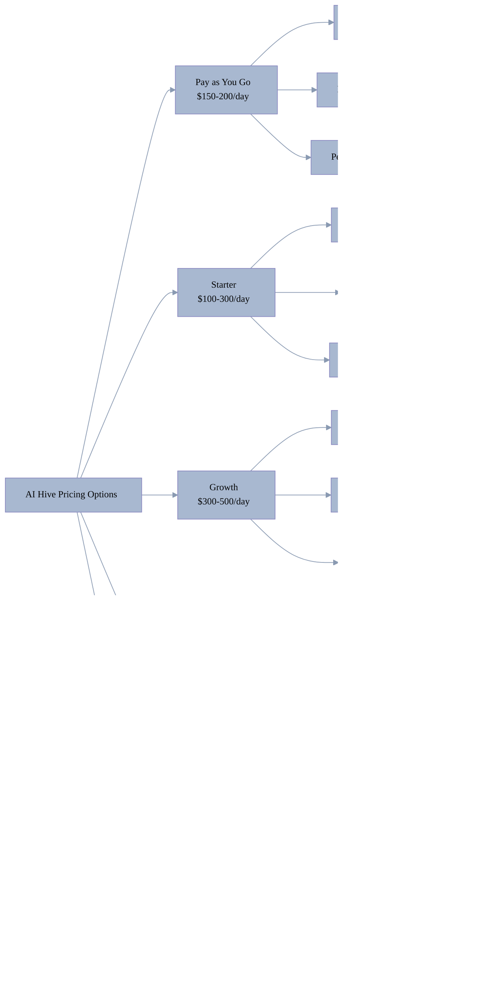
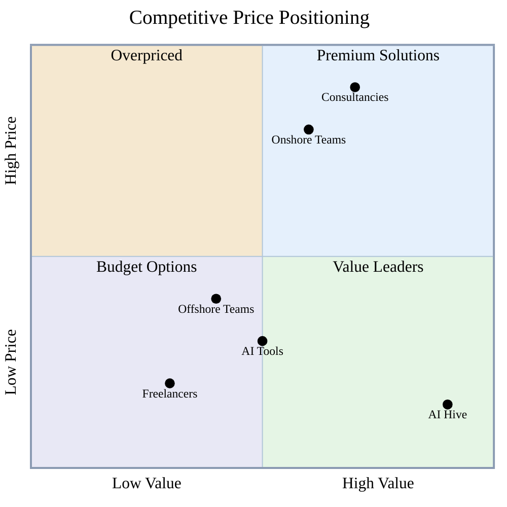
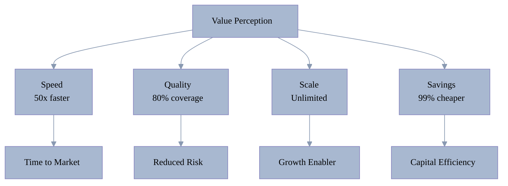

[🏠 Home](../../README.md) | [⬅️ Previous](05-competitive-landscape.md) | [➡️ Next](07-market-opportunities.md)

<link rel="stylesheet" href="../../assets/css/styles.css">
---

# Pricing Analysis

## Market Pricing Overview

```mermaid
%%{init: {
  'theme': 'base',
  'themeVariables': {
    'primaryColor': '#A8B8D0',
    'primaryTextColor': '#000000',
    'primaryBorderColor': '#8A9AB2',
    'lineColor': '#8A9AB2',
    'secondaryColor': '#5DBCB6',
    'secondaryTextColor': '#000000',
    'secondaryBorderColor': '#3D9A94',
    'tertiaryColor': '#84D4F5',
    'tertiaryTextColor': '#000000',
    'tertiaryBorderColor': '#5ABCD8',
    'background': '#F5F5F5',
    'mainBkg': '#A8B8D0',
    'secondBkg': '#5DBCB6',
    'tertiaryBkg': '#84D4F5',
    'mainContrastColor': '#000000',
    'darkMode': false,
    'fontFamily': 'Arial, sans-serif',
    'fontSize': '14px',
    'labelBackground': '#E8E8E8',
    'textColor': '#000000',
    'nodeBkg': '#B3B2D8',
    'nodeTextColor': '#000000',
    'nodeBorder': '#8A89C0',
    'clusterBkg': '#E5C4CA',
    'clusterBorder': '#CDA2AB',
    'defaultLinkColor': '#8A9AB2',
    'titleColor': '#000000',
    'edgeLabelBackground': '#F5F5F5',
    'actorBorder': '#8A9AB2',
    'actorBkg': '#B3B2D8',
    'actorTextColor': '#000000',
    'actorLineColor': '#8A9AB2',
    'signalColor': '#000000',
    'signalTextColor': '#000000',
    'activationBorderColor': '#8A9AB2',
    'activationBkgColor': '#E5C4CA',
    'sequenceNumberColor': '#000000',
    'sectionBkgColor': '#FFD54F',
    'altSectionBkgColor': '#FFB74D',
    'sectionBkgColor2': '#E1B3C4',
    'taskBorderColor': '#8A9AB2',
    'taskBkgColor': '#B3B2D8',
    'taskTextColor': '#000000',
    'taskTextLightColor': '#000000',
    'taskTextOutsideColor': '#000000',
    'taskTextClickableColor': '#000000',
    'activeTaskBorderColor': '#A8B8D0',
    'activeTaskBkgColor': '#84D4F5',
    'gridColor': '#C0C0C0',
    'doneTaskBkgColor': '#5DBCB6',
    'doneTaskBorderColor': '#3D9A94',
    'critBorderColor': '#E27D00',
    'critBkgColor': '#FFB74D',
    'todayLineColor': '#E27D00',
    'labelColor': '#000000',
    'errorBkgColor': '#E1B3C4',
    'errorTextColor': '#000000'
  }
}}%%
graph TD
    A[Software Development Pricing 2024] --> B[Human Teams]
    A --> C[AI Tools]
    A --> D[Hybrid Models]

    B --> B1[US: $150-300/hour]
    B --> B2[Europe: $80-150/hour]
    B --> B3[Asia: $15-50/hour]

    C --> C1[Copilot: $10-39/user]
    C --> C2[Cursor: $20/user]
    C --> C3[Enterprise: $200+/user]

    D --> D1[AI Hive: $100-500/day]
```

<div class="mermaid-diagram-wrapper">



</div>

## Traditional Development Pricing

### Geographic Rate Comparison

<div class="mermaid-diagram-wrapper">

| Region | Junior Dev | Senior Dev | Architect | Team (10 people) |
|--------|------------|------------|-----------|------------------|
| **United States** | $50-80/hr | $100-150/hr | $150-250/hr | $107,500/month |
| **Western Europe** | $40-60/hr | $80-120/hr | $120-180/hr | $70,000/month |
| **Eastern Europe** | $25-40/hr | $50-80/hr | $80-120/hr | $35,000/month |
| **India** | $15-25/hr | $30-50/hr | $50-80/hr | $23,650/month |
| **Vietnam** | $15-25/hr | $25-45/hr | $45-70/hr | $23,700/month |
| **Latin America** | $20-35/hr | $40-70/hr | $70-100/hr | $32,000/month |

</div>

### Pricing Models Distribution

<div class="mermaid-diagram-wrapper">


</div>

## AI Tool Pricing Landscape

### Direct Competitor Pricing

<div class="mermaid-diagram-wrapper">

| Tool | Individual | Team | Enterprise | Usage Limits |
|------|------------|------|------------|--------------|
| **GitHub Copilot** | $10/mo Pro | $19/user/mo Business | $39/user/mo Enterprise | Premium requests limited |
| **Cursor** | Free | $20/mo Pro | $200/mo Ultra | API usage based |
| **Tabnine** | Free | $12/user/mo Pro | $39/user/mo | Pro: 100 users max |
| **Codeium (Windsurf)** | Free | $15/user/mo Teams | $60/user/mo | Unlimited free tier |
| **Amazon Q Developer** | Free | $19/user/mo Pro | Custom | 50 chats/mo free |

</div>

#### Key 2025 Pricing Updates
- **GitHub Copilot**: Now enforces premium request limits on all paid plans
- **Cursor**: Controversial shift from unlimited to usage-based model (July 2025)
- **Tabnine**: Enterprise pricing increased to $39/user/mo
- **Codeium**: Rebranded to Windsurf, maintains generous free tier
- **Amazon Q**: CodeWhisperer now part of Q Developer ecosystem

### Enterprise AI Platform Pricing

<div class="mermaid-diagram-wrapper">

| Solution | Tool Cost | Developer Cost | **Total Annual Cost** | Cost Reduction |
|----------|-----------|----------------|----------------------|----------------|
| Traditional Team | $0 | $50,000,000 | **$50,000,000** | Baseline |
| GitHub Copilot | $234,000 | $50,000,000 | **$50,234,000** | -0.5% |
| Cursor Business | $120,000 | $50,000,000 | **$50,120,000** | -0.2% |
| **🟢 AI Hive** | **$36,500-182,500** | **$0** | **$36,500-182,500** | **99.6%** |

</div>

**Key Insight**: AI coding assistants (Copilot, Cursor) are just tools that still require full development teams. The tool cost is less than 0.5% of total expenses. Only AI Hive eliminates the need for human developers entirely.

### Visual Cost Comparison

```mermaid
---
config:
  themeVariables:
    xyChart:
      backgroundColor: transparent
      plotColorPalette: "#E5A3A3, #FFD93D, #6BCF7F"
      plotBorderColor: "#000000, #E6C230, #4CAF50"
      plotBorderWidth: 2
      titleColor: "#000000"
      xAxisLabelColor: "#000000"
      xAxisTitleColor: "#000000"
      xAxisTickColor: "#000000"
      xAxisLineColor: "#000000"
      yAxisLabelColor: "#000000"
      yAxisTitleColor: "#A00000"
      yAxisTickColor: "#000000"
      yAxisLineColor: "#000000"
---
xychart-beta horizontal
    title "Annual Cost Breakdown for 500 Developers (in millions)"
    x-axis ["Traditional", "GitHub Copilot", "Cursor Business", "🟢 AI Hive"]
    y-axis "Cost ($M)" 0 --> 55
    bar "Developer Costs" [50.00, 50.00, 50.00, 0]
    bar "Tool/Platform Costs" [0, 0.234, 0.12, 0.18]
```

<div class="mermaid-diagram-wrapper">



</div>

*Color Legend: 🔴 Red = Developer Costs, 🟡 Yellow = Tool/Platform Costs*

## Cost-per-Project Analysis

### Traditional vs AI Hive

<div class="mermaid-diagram-wrapper">

| Project Type | Traditional Cost | Time | AI Hive Cost | Time | Savings |
|--------------|------------------|------|---------------|------|---------|
| **Simple Website** | $10K-25K | 4 weeks | $200-500 | 1-2 days | 95-98% |
| **Mobile App** | $50K-150K | 3 months | $500-1500 | 2-3 days | 99% |
| **Enterprise System** | $250K-1M | 6-12 months | $1500-5000 | 1 week | 99.5% |
| **SaaS Platform** | $100K-500K | 4-6 months | $1000-3000 | 3-5 days | 99.4% |

</div>

### ROI Calculator

<div class="mermaid-diagram-wrapper">


</div>

## Pricing Strategy Analysis

### Value-Based Pricing Model

#### Traditional Cost-Plus Model
```
Developer Cost + Overhead + Margin = Price
$100/hr + $30/hr + $20/hr = $150/hr
```

#### AI Hive Value Model
```
Customer Value - Competitive Price = Value Gap
$300K project - $1.5K price = $298.5K value created
```

### Pricing Tiers Recommendation

<div class="mermaid-diagram-wrapper">



</div>

## Market Pricing Dynamics

### Pay as You Go Model Benefits

The Pay as You Go option addresses key market gaps:

<div class="mermaid-diagram-wrapper">

| Customer Type | Traditional Challenge | Pay as You Go Solution | Value Proposition |
|---------------|----------------------|------------------------|-------------------|
| **Occasional Users** | High monthly minimums | Only pay when needed | 60-80% cost savings |
| **Seasonal Businesses** | Year-round subscriptions | Scale up/down as needed | Flexible budgeting |
| **Test/Pilot Projects** | Long-term commitments | Try before committing | Risk-free evaluation |
| **Budget-Conscious Startups** | Cash flow constraints | Predictable per-project costs | Preserve runway |

</div>

### Price Sensitivity by Segment

<div class="mermaid-diagram-wrapper">

| Segment | Price Sensitivity | Decision Factor | Sweet Spot |
|---------|------------------|-----------------|------------|
| **Occasional Users** | Very High | Flexibility | $150-200/day (Pay as You Go) |
| **Startups** | Very High | Absolute cost | $100-300/day |
| **SMBs** | High | ROI/Value | $300-500/day |
| **Agencies** | Medium | Margin improvement | $500-1000/day |
| **Enterprise** | Low | Risk/Compliance | $1000-5000/day |

</div>

### Competitive Price Positioning

<div class="mermaid-diagram-wrapper">



</div>

### Price-Value Quadrant Analysis

- **Premium Solutions (High Value, High Price)** 🔵: Consultancies - High-value strategic services at premium pricing
- **Overpriced (Low Value, High Price)** 🟡: Onshore Teams - Traditional pricing without proportional value
- **Budget Options (Low Value, Low Price)** 🟣: Freelancers - Affordable but limited scope and quality
- **Value Leaders (High Value, Low Price)** 🟢: AI Hive - Maximum value delivery at disruptive pricing

This positioning analysis reveals AI Hive's unique opportunity in the value leaders quadrant, offering enterprise-grade capabilities at startup-friendly pricing.

## Pricing Psychology Insights

### Anchor Pricing Effect

1. **Traditional Project**: $300,000 (anchor)
2. **Offshore Option**: $90,000 (seems reasonable)
3. **AI Hive**: $1,500 (seems incredible)

### Value Perception Drivers

<div class="mermaid-diagram-wrapper">



</div>

## Pricing Model Recommendations

### 1. Usage-Based Pricing

```
Daily Rate = Base Cost + (Complexity Factor × Usage)
```

<div class="mermaid-diagram-wrapper">

| Complexity | Base Cost | Examples | Daily Rate |
|------------|-----------|----------|------------|
| Simple | $100 | Landing pages, CRUD apps | $100-200 |
| Medium | $200 | Mobile apps, APIs | $200-400 |
| Complex | $400 | Enterprise systems | $400-800 |
| Custom | $800 | AI/ML, Blockchain | $800-1500 |

</div>

### 2. Project-Based Pricing

<div class="mermaid-diagram-wrapper">

| Project Size | Fixed Price | Delivery | Guarantee |
|--------------|-------------|----------|-----------|
| Micro | $500 | 24 hours | 100% refund |
| Small | $1,500 | 2-3 days | 100% refund |
| Medium | $5,000 | 1 week | 50% refund |
| Large | $15,000 | 2 weeks | Negotiable |

</div>

### 3. Subscription Model

<div class="mermaid-diagram-wrapper">


</div>

## Price Optimization Strategy

### Dynamic Pricing Factors

1. **Market Demand**: Increase 10-20% during peak
2. **Complexity**: Adjust based on tech stack
3. **Urgency**: Premium for rush delivery
4. **Volume**: Discounts for multiple projects
5. **Partnership**: Special rates for agencies

### Promotional Pricing

<div class="mermaid-diagram-wrapper">

| Promotion | Discount | Target | Goal |
|-----------|----------|--------|------|
| First Project | 50% off | Startups | Acquisition |
| Bulk Package | 30% off | Agencies | Volume |
| Annual Prepay | 25% off | Enterprise | Lock-in |
| Referral | 20% off | All | Growth |

</div>

## Financial Projections

### Revenue Model at Different Price Points

```mermaid
%%{init: {
  'theme': 'base',
  'themeVariables': {
    'primaryColor': '#A8B8D0',
    'primaryTextColor': '#000000',
    'primaryBorderColor': '#8A9AB2',
    'lineColor': '#8A9AB2',
    'secondaryColor': '#5DBCB6',
    'secondaryTextColor': '#000000',
    'secondaryBorderColor': '#3D9A94',
    'tertiaryColor': '#84D4F5',
    'tertiaryTextColor': '#000000',
    'tertiaryBorderColor': '#5ABCD8',
    'background': '#F5F5F5',
    'mainBkg': '#A8B8D0',
    'secondBkg': '#5DBCB6',
    'tertiaryBkg': '#84D4F5',
    'mainContrastColor': '#000000',
    'darkMode': false,
    'fontFamily': 'Arial, sans-serif',
    'fontSize': '14px',
    'labelBackground': '#E8E8E8',
    'textColor': '#000000',
    'nodeBkg': '#B3B2D8',
    'nodeTextColor': '#000000',
    'nodeBorder': '#8A89C0',
    'clusterBkg': '#E5C4CA',
    'clusterBorder': '#CDA2AB',
    'defaultLinkColor': '#8A9AB2',
    'titleColor': '#000000',
    'edgeLabelBackground': '#F5F5F5',
    'actorBorder': '#8A9AB2',
    'actorBkg': '#B3B2D8',
    'actorTextColor': '#000000',
    'actorLineColor': '#8A9AB2',
    'signalColor': '#000000',
    'signalTextColor': '#000000',
    'activationBorderColor': '#8A9AB2',
    'activationBkgColor': '#E5C4CA',
    'sequenceNumberColor': '#000000',
    'sectionBkgColor': '#FFD54F',
    'altSectionBkgColor': '#FFB74D',
    'sectionBkgColor2': '#E1B3C4',
    'taskBorderColor': '#8A9AB2',
    'taskBkgColor': '#B3B2D8',
    'taskTextColor': '#000000',
    'taskTextLightColor': '#000000',
    'taskTextOutsideColor': '#000000',
    'taskTextClickableColor': '#000000',
    'activeTaskBorderColor': '#A8B8D0',
    'activeTaskBkgColor': '#84D4F5',
    'gridColor': '#C0C0C0',
    'doneTaskBkgColor': '#5DBCB6',
    'doneTaskBorderColor': '#3D9A94',
    'critBorderColor': '#E27D00',
    'critBkgColor': '#FFB74D',
    'todayLineColor': '#E27D00',
    'labelColor': '#000000',
    'errorBkgColor': '#E1B3C4',
    'errorTextColor': '#000000'
  }
}}%%
graph TD
    A[Price Point Analysis] --> B[Low: $100/day]
    A --> C[Mid: $300/day]
    A --> D[High: $500/day]

    B --> B1[Volume: 1000 projects/mo]
    B --> B2[Revenue: $3M/mo]

    C --> C1[Volume: 500 projects/mo]
    C --> C2[Revenue: $4.5M/mo]

    D --> D1[Volume: 300 projects/mo]
    D --> D2[Revenue: $4.5M/mo]
```

<div class="mermaid-diagram-wrapper">



</div>

### Break-Even Analysis

<div class="mermaid-diagram-wrapper">

| Metric | Value | Notes |
|--------|-------|-------|
| Fixed Costs | $500K/month | Infrastructure + Team |
| Variable Cost | $20/project | Compute + API costs |
| Break-even (Low) | 167 projects | At $100/day average |
| Break-even (Mid) | 56 projects | At $300/day average |
| Break-even (High) | 34 projects | At $500/day average |

</div>

## Key Pricing Insights

1. **Massive Arbitrage**: 47-1,612x price difference creates huge opportunity
2. **Value Pricing Works**: Customers pay for outcomes, not time
3. **Segment Variation**: 10x price difference acceptable across segments
4. **Anchor Effect**: Traditional pricing makes AI Hive seem miraculous
5. **Volume Play**: Lower prices drive 100x more volume

## Recommended Pricing Strategy

1. **Start Low**: $100/day to drive adoption
2. **Value Tiers**: Create clear progression
3. **Enterprise Custom**: Capture maximum value
4. **Usage Incentives**: Encourage multiple projects
5. **Partner Pricing**: Enable channel growth

The pricing strategy should emphasize value creation rather than cost competition, positioning AI Hive as a business enabler rather than just a cheaper alternative.

---

[🏠 Home](../../README.md) | [⬅️ Previous](05-competitive-landscape.md) | [➡️ Next](07-market-opportunities.md)
