[🏠 Home](../../README.md) | [⬅️ Previous](06-pricing-analysis.md) | [➡️ Next](08-appendix-data.md)

<link rel="stylesheet" href="styles.css">
---

# Market Opportunities Analysis

## Macro Opportunity Assessment

## High-Impact Opportunity Areas

### 1. 🚀 Bootstrap Revolution

#### The Opportunity
- **90 million startups** globally
- **73% fail** due to premature scaling
- **$3.7 trillion** startup economy
- Only **2.2%** receive VC funding

#### Market Gap

#### Revenue Potential
- **Target**: 1% of bootstrapped startups (880K)
- **Average Revenue**: $5K/year per startup
- **Market Size**: $4.4B annually

### 2. 🏢 SMB Digital Transformation

#### The Opportunity
- **400 million SMBs** worldwide
- **65% lack** basic digital presence
- **$10 trillion** SMB economy
- **79%** already experimenting with AI

#### Underserved Needs
| Need | Current Solution | Cost | AI Swarm Solution | Cost |
|------|------------------|------|-------------------|------|
| E-commerce site | Agency/Freelancer | $25K | 2-day build | $500 |
| Mobile app | Dev shop | $75K | 3-day build | $1000 |
| Custom software | Hire team | $200K/year | On-demand | $5K/project |
| Automation | Consultants | $100K | AI-powered | $2K |

### 3. 🌏 Emerging Market Explosion

#### Asia Pacific Opportunity

```mermaid
graph TD
    A[Asia Pacific Growth] --> B[Market Size<br/>$157B → $406B]
    A --> C[Developer Growth<br/>+35% annually]
    A --> D[Digital Economy<br/>$4T by 2025]

    B --> E[19.4% CAGR]
    C --> F[50M developers by 2027]
    D --> G[1B new users]
```

#### Regional Advantages
- **India**: 15.4M developers, English proficiency
- **Southeast Asia**: 655M population, mobile-first
- **China**: Despite restrictions, huge domestic market

### 4. 🏭 Industry-Specific Verticals

#### Fintech Transformation
- **Market Size**: $340B by 2026
- **Compliance Burden**: $270B annually
- **Our Opportunity**: Compliance-ready development
- **Premium Pricing**: 2-3x standard rates

#### Healthcare Digitization
- **Market Size**: $659B by 2025
- **EHR Integration**: $30B market
- **Telemedicine**: 38.5% CAGR
- **HIPAA Compliance**: Premium service

#### Supply Chain Tech
- **Market Size**: $30B by 2030
- **IoT Integration**: Growing 25% annually
- **Blockchain**: $20B opportunity
- **AI Optimization**: Untapped potential

### 5. 🤝 Channel Partner Ecosystem

#### White-Label Opportunity

#### Partner Economics
| Partner Type | Current Margin | With AI Swarm | Revenue Uplift |
|--------------|----------------|---------------|----------------|
| Consultancy | 40% | 80% | 2x |
| Digital Agency | 25% | 70% | 2.8x |
| Freelancer | 60% | 90% | 1.5x |

## Disruptive Market Plays

### 1. "Development as a Service" (DaaS)

### 2. "Instant MVP" Platform

- **Target**: Idea-stage entrepreneurs
- **Offering**: Working MVP in 48 hours
- **Price**: $999 flat
- **Volume**: 10K MVPs/month = $10M MRR

### 3. "AI Team Augmentation"

- **Target**: Existing dev teams
- **Offering**: AI team members
- **Integration**: Slack, GitHub, Jira
- **Price**: $500/month per AI developer

## Market Entry Strategies

### Phase 1: Land (Months 1-6)

### Geographic Expansion

1. **Wave 1**: English-speaking markets (US, UK, AU, CA)
2. **Wave 2**: Western Europe (DE, FR, NL, SE)
3. **Wave 3**: Asia Pacific (SG, IN, JP, KR)
4. **Wave 4**: Emerging (LATAM, MENA, Africa)

## Revenue Projections by Opportunity

### Conservative Scenario

| Year | Startups | SMBs | Enterprise | Partners | Total |
|------|----------|------|------------|----------|-------|
| 2025 | $2M | $1M | $0.5M | $1.5M | $5M |
| 2026 | $10M | $8M | $5M | $12M | $35M |
| 2027 | $25M | $30M | $20M | $50M | $125M |

### Aggressive Scenario

| Year | Startups | SMBs | Enterprise | Partners | Total |
|------|----------|------|------------|----------|-------|
| 2025 | $5M | $3M | $2M | $5M | $15M |
| 2026 | $25M | $20M | $15M | $40M | $100M |
| 2027 | $75M | $80M | $60M | $150M | $365M |

## Strategic Priorities

### Must-Win Battles

## Risk Mitigation

### Market Risks and Mitigation

| Risk | Probability | Impact | Mitigation |
|------|-------------|--------|------------|
| Big Tech competition | High | High | Speed & focus on underserved |
| Quality concerns | Medium | High | 80%+ test coverage guarantee |
| Adoption resistance | Medium | Medium | Success stories & trials |
| Economic downturn | Low | Medium | Target cost-saving use cases |

## Key Success Factors

1. **First-Mover Advantage**: Capture bootstrap market before competition
2. **Network Effects**: Each successful project creates referrals
3. **Quality Moat**: Become known for reliability
4. **Channel Leverage**: Partners provide distribution
5. **Geographic Arbitrage**: Global service, local pricing

## Recommended Actions

### Immediate (0-3 months)
1. Launch bootstrap startup program
2. Create ROI calculator tool
3. Build showcase portfolio
4. Establish partner program

### Short-term (3-6 months)
1. Geographic expansion to APAC
2. Industry vertical solutions
3. White-label platform
4. Community building

### Medium-term (6-12 months)
1. Enterprise features
2. Compliance certifications
3. Advanced integrations
4. M&A opportunities

The market opportunity is massive and growing rapidly. The key is to move fast, focus on underserved segments, and build a reputation for quality and reliability. The bootstrap revolution alone could build a billion-dollar business.

---

[🏠 Home](../../README.md) | [⬅️ Previous](06-pricing-analysis.md) | [➡️ Next](08-appendix-data.md)
