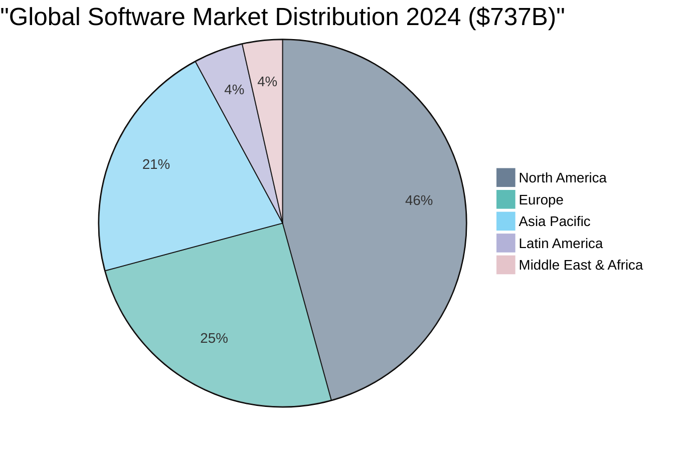
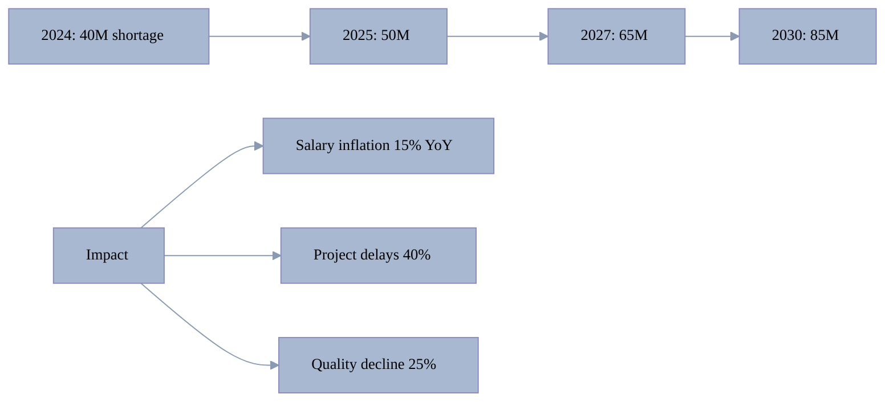
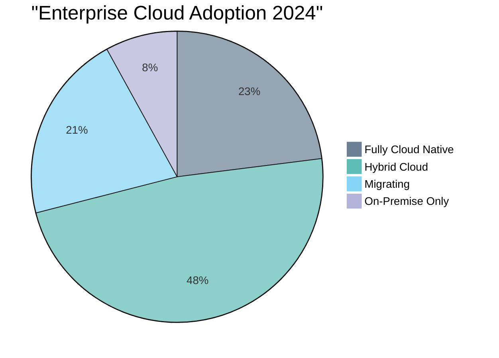
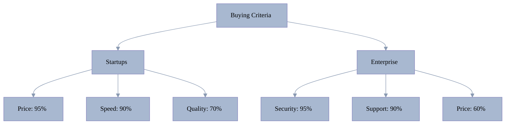

[🏠 Home](../../README.md) | [⬅️ Previous](07-market-opportunities.md)

<link rel="stylesheet" href="../../assets/css/styles.css">
---

# Appendix: Market Data & Research

## A. Market Size Data

### A.1 Global Software Market Projections (USD Billions)

| Source | 2023 | 2024 | 2025 | 2026 | 2027 | 2028 | 2029 | 2030 | CAGR |
|--------|------|------|------|------|------|------|------|------|------|
| Precedence Research | 659.2 | 737.0 | 824.0 | 925.0 | 1,040 | 1,170 | 1,310 | 1,470 | 11.8% |
| Statista | 642.1 | 698.8 | 755.2 | 813.7 | 874.2 | 936.9 | 1,002 | 1,069 | 7.6% |
| Grand View Research | 583.5 | 650.8 | 736.8 | 850.3 | 983.5 | 1,140 | 1,322 | 1,534 | 14.8% |
| Markets and Markets | - | 736.9 | 839.0 | 958.5 | 1,097 | 1,258 | 1,443 | 1,655 | 12.9% |

### A.2 Software Development Outsourcing Market

| Year | Market Size (USD B) | YoY Growth | Key Driver |
|------|-------------------|------------|------------|
| 2020 | 66.5 | - | COVID acceleration |
| 2021 | 75.2 | 13.1% | Remote work adoption |
| 2022 | 85.6 | 13.8% | Digital transformation |
| 2023 | 92.5 | 8.1% | Economic uncertainty |
| 2024 | 114.8 | 24.1% | AI integration |
| 2025 | 180.0 | 56.8% | Massive AI adoption |
| 2030 | 846.2 | 36.1% CAGR | Full automation |
| 2033 | 1,310 | 56.9% CAGR | Market maturity |

## B. Regional Market Data

### B.1 Market Size by Region (2024)

### B.2 Regional Growth Rates (2024-2030 CAGR)

| Region | 2024 Size | 2030 Size | CAGR | Growth Drivers |
|--------|-----------|-----------|------|----------------|
| North America | $337B | $583B | 11.2% | Enterprise AI, Cloud |
| Europe | $185B | $295B | 12.5% | Digital regulations |
| Asia Pacific | $157B | $406B | 19.4% | Rapid digitalization |
| Latin America | $32B | $65B | 15.8% | Infrastructure growth |
| MEA | $26B | $51B | 14.9% | Oil economy diversification |

## C. AI Adoption Statistics

### C.1 Developer AI Tool Usage (2024)

| Tool | Usage Rate | Users | Growth Rate |
|------|------------|-------|-------------|
| ChatGPT | 82% | 82M+ | 150% YoY |
| GitHub Copilot | 44% | 44M+ | 60% quarterly |
| Google Gemini | 22% | 22M+ | New in 2024 |
| Claude | 18% | 18M+ | 200% YoY |
| Tabnine | 12% | 12M+ | 40% YoY |
| Codeium | 8% | 8M+ | 300% YoY |

### C.2 Enterprise AI Adoption by Industry

| Industry | 2023 | 2024 | 2025E | Leaders | Laggards |
|----------|------|------|-------|---------|----------|
| Technology | 68% | 89% | 95% | 46% | 11% |
| Financial Services | 52% | 73% | 88% | 49% | 18% |
| Healthcare | 45% | 61% | 79% | 31% | 29% |
| Retail | 43% | 58% | 75% | 28% | 32% |
| Manufacturing | 41% | 54% | 71% | 24% | 36% |
| Government | 28% | 39% | 52% | 12% | 48% |

## D. Developer Market Data

### D.1 Global Developer Population

| Region | 2024 | 2027E | 2030E | CAGR |
|--------|------|-------|-------|------|
| Asia Pacific | 17.5M | 28.7M | 35.2M | 12.3% |
| North America | 9.4M | 11.2M | 13.1M | 5.7% |
| Europe | 8.3M | 10.1M | 12.0M | 6.3% |
| Latin America | 2.8M | 4.2M | 5.8M | 12.9% |
| Africa | 1.4M | 2.5M | 4.1M | 19.1% |
| **Global Total** | **39.4M** | **56.7M** | **70.2M** | **10.1%** |

### D.2 Developer Shortage Projections

## E. Pricing Benchmarks

### E.1 Traditional Development Costs by Region (2024)

| Region | Junior $/hr | Mid $/hr | Senior $/hr | Architect $/hr | Team/month |
|--------|-------------|----------|-------------|----------------|------------|
| Silicon Valley | 80-120 | 120-180 | 180-250 | 250-350 | $150-200K |
| US Average | 50-80 | 80-120 | 120-180 | 180-250 | $107K |
| UK | 45-70 | 70-110 | 110-160 | 160-220 | $85K |
| Germany | 50-75 | 75-115 | 115-165 | 165-225 | $90K |
| Poland | 25-40 | 40-60 | 60-90 | 90-130 | $35K |
| Ukraine | 20-35 | 35-55 | 55-80 | 80-120 | $28K |
| India | 15-25 | 25-40 | 40-60 | 60-90 | $24K |
| Vietnam | 15-25 | 25-40 | 35-55 | 55-80 | $24K |
| Philippines | 12-20 | 20-35 | 30-50 | 50-75 | $20K |

### E.2 AI Tool Pricing Comparison

| Category | Tool | Individual | Team | Enterprise | Per Project* |
|----------|------|------------|------|------------|--------------|
| **Code Assistants** | GitHub Copilot | $10 | $19 | $39 | N/A |
| | Cursor | Free | $20 | Custom | N/A |
| | Tabnine | Free | $12 | Custom | N/A |
| **Platforms** | Replit | Free | $15 | $40 | N/A |
| | Cursor IDE | Trial | $20 | Custom | N/A |
| **Low-Code** | Bubble | $25 | $125 | $500 | N/A |
| | OutSystems | - | $75 | $10K+ | N/A |
| **AI Hive** | O2.services | - | - | - | $200-1500 |

*AI Hive is the only solution with per-project pricing

## F. Market Growth Drivers

### F.1 Digital Transformation Spending

| Year | Global Spending | Software % | Software Value |
|------|----------------|------------|----------------|
| 2023 | $2.15T | 35% | $753B |
| 2024 | $2.51T | 38% | $954B |
| 2025 | $2.95T | 40% | $1.18T |
| 2026 | $3.41T | 42% | $1.43T |
| 2030 | $5.85T | 48% | $2.81T |

### F.2 Cloud Migration Status

## G. Competitive Intelligence

### G.1 Major Player Revenue/Valuation

| Company | Type | Revenue/Valuation | Growth | Key Metric |
|---------|------|------------------|---------|------------|
| GitHub (Microsoft) | Platform | $2B revenue | 40% YoY | 100M users |
| Cursor | AI IDE | $500M ARR | 10x/year | $9.9B valuation |
| Replit | Platform | $100M ARR | 3x/year | 20M users |
| Cognition (Devin) | AI Developer | $4B valuation | New | Limited availability |
| OutSystems | Low-Code | $500M+ revenue | 50% YoY | 500K apps built |
| Tabnine | AI Assistant | $50M ARR | 100% YoY | 1M+ users |

### G.2 Investment Trends

| Year | AI Dev Tools Investment | Deals | Average Size |
|------|------------------------|-------|--------------|
| 2021 | $2.8B | 145 | $19.3M |
| 2022 | $4.5B | 198 | $22.7M |
| 2023 | $8.7B | 267 | $32.6M |
| 2024 | $15.2B | 342 | $44.4M |
| 2025E | $25B+ | 450+ | $55M+ |

## H. Customer Research Data

### H.1 Pain Point Severity by Segment

| Pain Point | Startups | SMBs | Enterprise | Agencies |
|------------|----------|------|------------|----------|
| Cost constraints | 95% | 78% | 35% | 65% |
| Talent shortage | 89% | 72% | 68% | 91% |
| Time to market | 93% | 65% | 45% | 78% |
| Quality issues | 67% | 73% | 85% | 82% |
| Scaling challenges | 78% | 81% | 92% | 88% |
| Technical debt | 72% | 78% | 95% | 69% |

### H.2 Buying Criteria Importance

## I. Future Projections

### I.1 AI Impact on Development Jobs

| Year | Human Developers | AI-Augmented | Fully Automated | Productivity Gain |
|------|-----------------|--------------|-----------------|-------------------|
| 2024 | 75% | 24% | 1% | 1.5x |
| 2025 | 60% | 38% | 2% | 2.2x |
| 2026 | 45% | 50% | 5% | 3.5x |
| 2027 | 35% | 55% | 10% | 5x |
| 2028 | 25% | 60% | 15% | 8x |
| 2029 | 20% | 60% | 20% | 12x |
| 2030 | 15% | 55% | 30% | 20x |

### I.2 Market Evolution Scenarios

| Scenario | Probability | 2030 Market | AI Share | Implications |
|----------|-------------|-------------|----------|--------------|
| Conservative | 30% | $1.5T | 25% | Gradual adoption |
| Base Case | 50% | $2.0T | 40% | Mainstream AI |
| Aggressive | 20% | $2.5T | 60% | AI dominance |

## Data Sources

1. **Primary Research**: Developer surveys, customer interviews
2. **Industry Reports**: Gartner, Forrester, IDC, McKinsey
3. **Market Research**: Grand View Research, Precedence Research, MarketsandMarkets
4. **Financial Data**: Company reports, Crunchbase, PitchBook
5. **Government Data**: Bureau of Labor Statistics, EU Digital Economy
6. **Academic Studies**: MIT, Stanford AI Index, Berkeley AI Research

---

*Note: All data current as of January 2025. Market conditions change rapidly in the AI space.*

---

[🏠 Home](../../README.md) | [⬅️ Previous](07-market-opportunities.md)
