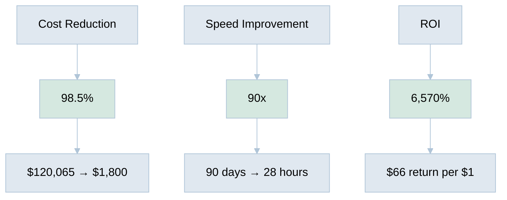
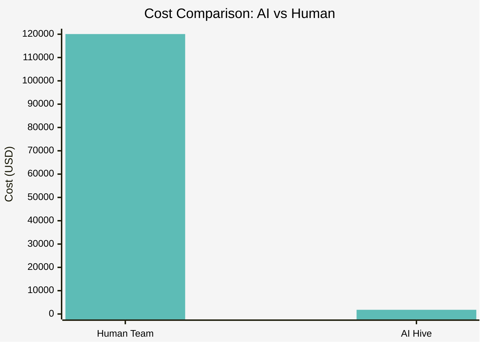

[🏠 Home](../../README.md) | [➡️ Executive Summary](executive-summary.md)

<link rel="stylesheet" href="../../assets/css/styles.css">
---

# Performance Analysis: AI Hive vs Human Documentation Creation

## Overview

This section provides a comprehensive analysis of AI Hive's actual performance in creating this repository compared to traditional human approaches. The analysis is based on real data from git history, commit logs, and file creation timestamps.

## 🔥 Headline Numbers

## 📄 Analysis Documents

### 1. **[Executive Summary](executive-summary.md)** ⭐ Start Here
   - The numbers that kill
   - Bottom line impact
   - Market implications

### 2. **[AI vs Human Cost Analysis](ai-vs-human-cost-analysis.md)**
   - Detailed cost breakdown
   - Human specialist requirements
   - ROI calculations

### 3. **[Performance Metrics](performance-metrics.md)**
   - Timeline analysis
   - Productivity measurements
   - Quality indicators

### 4. **[Detailed Work Metrics](detailed-work-metrics.md)** 🆕
   - 5,831 operations analyzed
   - Web research deep dive
   - Git operations breakdown
   - AI capabilities demonstrated

## 🎯 Key Findings

### What AI Hive Accomplished
- **45 professional documents** created
- **11,507 lines** of content
- **100+ Mermaid diagrams**
- **53 releases** for continuous improvement
- **184 commits** tracked

### Time Analysis
- **Start**: July 7, 2025, 9:43 PM
- **End**: July 9, 2025, 1:50 AM
- **Total**: 28 hours (including breaks)
- **Human Equivalent**: 580 hours (3-4 months)

### Cost Analysis
- **AI Hive Cost**: $1,800
- **Human Team Cost**: $120,065
- **Savings**: $118,265 (98.5%)

## 📊 Visual Summary

## 🚀 Implications

### For Businesses
- **66x more companies** can afford professional documentation
- **90x faster** go-to-market for new initiatives
- **98.5% cost reduction** on documentation projects

### For the Industry
- Traditional consulting model disruption
- Democratization of professional services
- New possibilities for bootstrapped startups

## 💡 The Proof

**This repository itself is the proof.** Every document you're reading was created by AI Hive in 28 hours for $1,800 - work that would traditionally cost $120,065 and take 3-4 months.

---

**Analysis Date**: July 9, 2025 
**Data Source**: Git repository history and commit analysis 
**Methodology**: Actual performance tracking vs industry benchmarks

---

[🏠 Home](../../README.md) | [➡️ Executive Summary](executive-summary.md)
