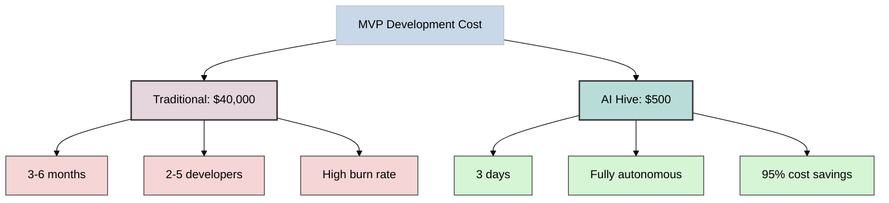
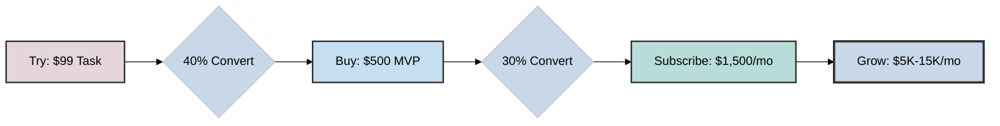

[🏠 Home](../../README.md) | [📁 Strategy](index.md)

<link rel="stylesheet" href="../../assets/css/styles.css">
---

# AI Hive 5-Year Business Plan (Q3 2025 - Q2 2030)

## Executive Summary

AI Hive will revolutionize the $737B software development market by delivering fully autonomous development at 95% lower cost and 30-50x faster speed than traditional teams. Our AI-run business model requires only 3-30 humans to build a $600M+ revenue operation by 2030.

## Market Opportunity

- **Total Market**: $737B (2024) → $1.47T (2030) at 12.2% CAGR
- **AI Development**: $122B (2024) → $467B (2030) at 25% CAGR
- **Developer Shortage**: 40M developers needed, growing to 85M by 2030
- **Cost Crisis**: Average developer costs $150K/year in US, creating massive inefficiency

## Revenue Model Evolution

### Year 1 (Q3 2025 - Q2 2026): Simple Start
**Single Product**: $500 MVP Package
- 3-day delivery guarantee
- One price, one promise
- Focus: Prove the model with bootstrapped startups
- Target: 2,500 customers

### Year 2 (Q3 2026 - Q2 2027): Expand Offerings
**Introduce Pay-As-You-Go**:
- **Micro Task**: $99 (landing page, bug fix, simple feature - 24hr delivery)
- **Small Task**: $249 (full webpage, integration, payment setup - 48hr delivery)

**Package Pricing**:
- **MVP**: $500 (unchanged - 3 day delivery)
- **Standard**: $2,500 (full product - 7 day delivery)

**First Subscription**:
- **Monthly**: $1,500 (1 project/month)

**Strategy**:
- Pay-as-you-go brings in hesitant buyers
- Natural upsell path: $99 → $500 → $1,500/month
- Target: 15,000 customers (10K pay-as-you-go, 5K packages)

### Year 3 (Q3 2027 - Q2 2028): Subscription Focus
**Shift to Recurring**:
- **Starter**: $1,500/month (1 project)
- **Growth**: $5,000/month (3 projects)
- **Scale**: $15,000/month (unlimited)
- Keep project pricing for one-offs
- Target: 50% subscription revenue

### Year 4-5 (2029-2030): Enterprise & Platform
**Add Premium Tiers**:
- **Enterprise**: Custom pricing
- **White Label**: Revenue share
- **API Access**: Usage-based
- Target: 70% recurring revenue

### Core Value Proposition (All Years)
- **95% cost reduction** vs traditional development
- **3-day guaranteed delivery** (vs 3-6 months)
- **Complete product package**: code, tests, docs, git repo
- **Human-maintainable**: can be handed off to any team
- **Addresses #1 startup killer**: cash flow problems

## Financial Projections

| Period | Revenue | Customers | Avg Revenue/Customer | Human Team |
|--------|---------|-----------|---------------------|------------|
| Q3-Q4 2025 | $750K | 300 | $2,500 | 3-5 |
| 2026 | $5M | 2,500 | $2,000 | 5-8 |
| 2027 | $25M | 12,500 | $2,000 | 8-12 |
| 2028 | $75M | 35,000 | $2,143 | 12-20 |
| 2029 | $200M | 80,000 | $2,500 | 20-25 |
| H1 2030 | $150M | 50,000 | $3,000 | 25-30 |

### Revenue Growth Trajectory

```mermaid
%%{init: {
  'theme': 'base',
  'themeVariables': {
    'primaryColor': '#C8D8E8',
    'primaryTextColor': '#000000',
    'primaryBorderColor': '#B0C5D8',
    'lineColor': '#B8DDD8',
    'secondaryColor': '#B8DDD8',
    'tertiaryColor': '#C5DEF0',
    'background': '#F5F5F5',
    'darkMode': false
  }
}}%%
graph LR
    A[2025: $750K] --> B[2026: $5M]
    B --> C[2027: $25M]
    C --> D[2028: $75M]
    D --> E[2029: $200M]
    E --> F[2030: $300M+]

    style A fill:#E5D5DC,stroke:#333,stroke-width:2px,color:#000
    style B fill:#D8D8D8,stroke:#333,stroke-width:2px,color:#000
    style C fill:#C5DEF0,stroke:#333,stroke-width:2px,color:#000
    style D fill:#B8DDD8,stroke:#333,stroke-width:2px,color:#000
    style E fill:#C8D8E8,stroke:#333,stroke-width:2px,color:#000
    style F fill:#F5E8D0,stroke:#333,stroke-width:3px,color:#000
```

## Go-to-Market Strategy

### Target Market Reality
- **150 million startups** worldwide
- **50 million new startups** created annually (137,000 daily)
- **80% are bootstrapped** (40 million new bootstrapped startups/year)
- **38% have solo founders** (19 million solo entrepreneur startups/year)

### Validated Sales Channels (Proven Demand)
1. **Web Summit Events**: 80% interest rate from 50 startups
2. **EntSpace Partnership**: 200 participants per bootcamp
3. **UAE IT Hub**: Pipeline of 50-100 qualified startups

### Phase 1: Launch & Validation (Q3 2025 - Q2 2026)
- **Immediate Start**: Leverage validated channels
- **Target**: Event attendees, bootcamp participants, hub members
- **Offering**: $500 MVP in 3 days
- **Sales**: 3 salespeople + 1 partnership manager
- **Goal**: 300 customers by year-end (conservative target)

### Phase 2: Scale Through Success (Q3 2026 - 2028)
- **Proven Model**: Leverage early customer success stories
- **Expand Team**: Scale to 8-12 people (mostly sales)
- **Channels**: Founder communities, startup accelerators
- **Goal**: 50,000 customers (0.1% of bootstrapped market)

### Phase 3: Market Leadership (2029 - Q2 2030)
- **Momentum**: Word-of-mouth drives growth
- **Automation**: AI handles most sales conversations
- **Premium Tiers**: Serve funded startups too
- **Goal**: 250,000 customers, clear market leader

## Why Startups Will Choose AI Hive

### The Startup Pain Points We Solve
1. **Cash Flow Crisis**: 82% of startups fail due to cash problems - we fix this
2. **Cost**: $99 entry point vs $40,000 average startup cost (95% savings)
3. **Speed**: 3-day guaranteed delivery vs 3-6 months traditional
4. **Complete Package**: Full product with docs, tests, git repo (not just code)
5. **Risk-Free**: Try with $99 before committing to more

### Cost Comparison: Traditional vs AI Hive

### Pay-As-You-Go Conversion Strategy (Year 2+)

- **Entry**: $99 micro task gets them hooked on speed/quality
- **Upsell**: After first success, 40% buy $500 MVP
- **Retain**: Happy MVP customers convert to $1,500/month
- **Expand**: Monthly customers upgrade to higher tiers

### Competitive Advantages
1. **Perfect for bootstrappers**: 80x cheaper than hiring
2. **Solo founder friendly**: No need to find technical co-founder
3. **Failure-proof**: 82% of bootstrapped startups fail - we reduce that risk
4. **Time to revenue**: Launch in days, not months
5. **Focus on business**: Founders can sell while we build

## Key Milestones

- **Q3 2025**: Launch with EntSpace bootcamp, Web Summit presence
- **Q4 2025**: 300 paying customers (prove the model)
- **Q2 2026**: 1,500 customers, Series A funding
- **Q4 2027**: 12,500 customers, $50M ARR
- **Q2 2030**: 100,000 customers, growth funding

## Operating Model

### AI-First Operations
- **Sales**: AI agents handle lead qualification, demos, onboarding
- **Support**: AI provides 24/7 customer support and issue resolution
- **Development**: AI Hive improves itself autonomously
- **Marketing**: AI generates content, manages campaigns
- **Cost Structure**: $16-44/day operational costs (verified from actual usage)

### Human Team Composition
- **Sales Team** (60-70% of staff): Direct outreach to startups and solo entrepreneurs
- **Founders** (1-2): Vision, strategy, partnerships
- **Customer Success** (2-3): Help early adopters succeed
- **Operations** (1-2): Finance, legal, compliance

## Investment Requirements

- **Seed**: $2M (Q3 2025) - Event participation, partnership setup
- **Series A**: $10M (Q2 2026) - Scale validated channels
- **Series B**: $50M (Q2 2027) - Geographic expansion
- **Growth**: Self-funded from operations (95%+ margins)
- **Note**: Validated demand reduces investment risk significantly

## Risk Mitigation

- **Technology**: Continuous AI improvement, multiple model providers
- **Competition**: Strong IP, customer lock-in, network effects
- **Regulation**: Proactive compliance, industry partnerships
- **Market**: Diversified segments, recession-proof value prop

## Revolutionary Business Model

### Traditional SaaS vs AI Hive
- **Traditional**: 1,000+ employees for $1B revenue
- **AI Hive**: 20-30 humans for $1B+ revenue potential
- **Operating Margin**: 95%+ (vs industry 20-30%)
- **Revenue per Human**: $30-50M+ (vs industry $500K)
- **AI Operations Cost**: <$15K/year (proven in production)

## Success Metrics

- **End 2025**: 300 customers, $1.5M ARR, channels validated
- **End 2027**: 12,500 customers, $50M ARR, proven growth
- **Q2 2030**: 100,000 customers, $600M run rate, market leader

---

*AI Hive: The first AI company that runs itself.*

---

© 2023-2025 [O2.services](https://O2.services) - All Rights Reserved

---

[🏠 Home](../../README.md) | [📁 Strategy](index.md)
