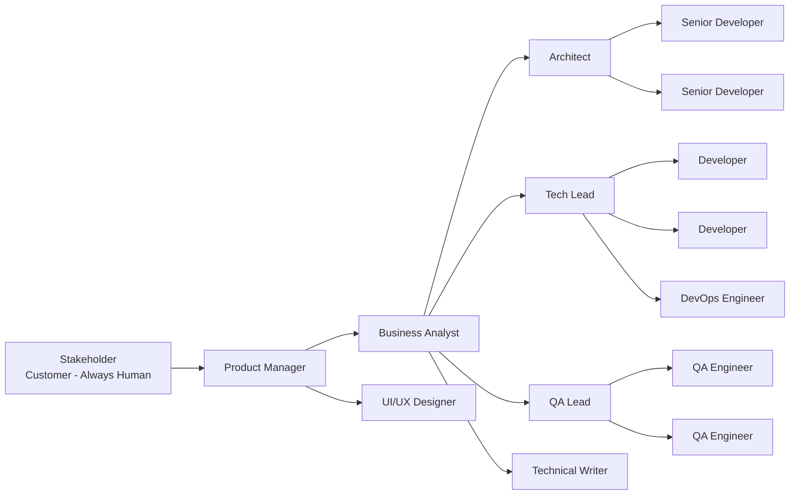

[🏠 Home](../slide-deck.md) | [⬆️ Up](../slide-deck.md) | [⬅️ Prev](slide-01-cover.md) | [➡️ Next](slide-03-agent-augmented.md)

---

# Slide 2: Classical Team Structure

## Traditional Software Development Team

### Team Hierarchy

### Example Supporting Roles

- **QA Engineers**: Testing and quality assurance
- **DevOps**: Infrastructure and deployment
- **UI/UX Designer**: User interface and experience
- **Technical Writer**: Documentation

### Typical Productivity

- **Developer**: 1-2 features/week
- **QA**: 3-5 features tested/week
- **Team Total**: 5-8 features/sprint (2 weeks)

---

[🏠 Home](../slide-deck.md) | [⬆️ Up](../slide-deck.md) | [⬅️ Prev](slide-01-cover.md) | [➡️ Next](slide-03-agent-augmented.md)
