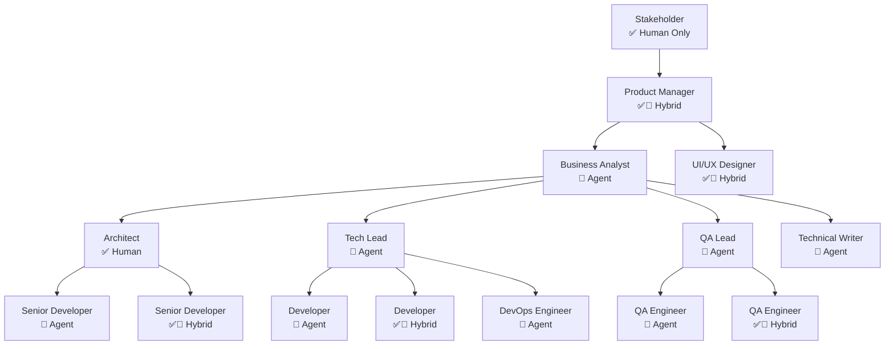

[🏠 Home](../slide-deck.md) | [⬆️ Up](../slide-deck.md) | [⬅️ Prev](slide-02-classical-team.md) | [➡️ Next](slide-04-cost-comparison.md)

---

# Slide 3: Agent-Augmented Team Structure

## The Future of Software Development Teams

### Flexible Role Assignment

### Agent Integration Channels

- **Current**: GitHub Issues, Pull Requests, Code Reviews
- **Coming Soon**: Slack, Teams, Email, Voice interfaces
- **Future**: Visual avatars for video meetings

### Agent Capabilities

- Create and discuss issues
- Write and review code
- Participate in planning
- Generate documentation
- Run tests and deployments
- Collaborate with humans seamlessly

### Legend

- ✅ **Human**: Traditional team member
- 🤖 **Agent**: AI-powered team member
- ✅🤖 **Both**: Hybrid human-agent collaboration

---

[🏠 Home](../slide-deck.md) | [⬆️ Up](../slide-deck.md) | [⬅️ Prev](slide-02-classical-team.md) | [➡️ Next](slide-04-cost-comparison.md)
