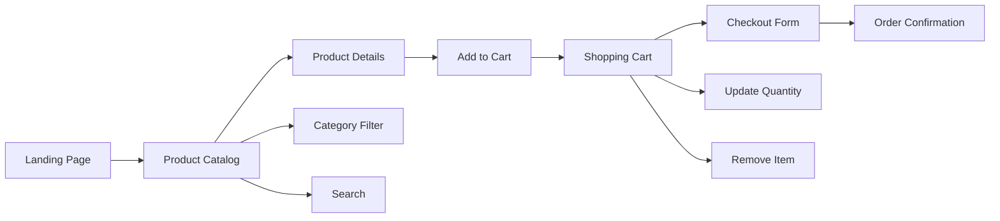
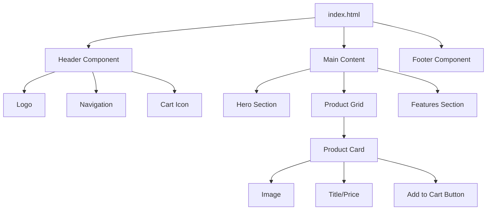

[🏠 Home](../slide-deck.md) | [⬆️ Up](../slide-deck.md) | [⬅️ Prev](slide-07-example-projects.md) | [➡️ Next](slide-09-complex-example.md)

---

# Slide 8: Small, Complete Example (Simple)

## E-Commerce Landing Page

### Project Overview

**Agent-built responsive e-commerce site in 48 hours**

### Features Implemented

#### Frontend

- Modern, responsive design
- Product catalog with filters
- Shopping cart functionality
- Checkout flow with validation
- Mobile-first approach

#### Technical Stack

- HTML5/CSS3/JavaScript
- Bootstrap for responsive grid
- LocalStorage for cart persistence
- Form validation
- SEO optimized

#### UI Flow Diagram

#### Component Architecture

### Development Time

- **Human team**: 1-2 weeks
- **Agent team**: 2 days
- **Cost savings**: 85%

---

[🏠 Home](../slide-deck.md) | [⬆️ Up](../slide-deck.md) | [⬅️ Prev](slide-07-example-projects.md) | [➡️ Next](slide-09-complex-example.md)
