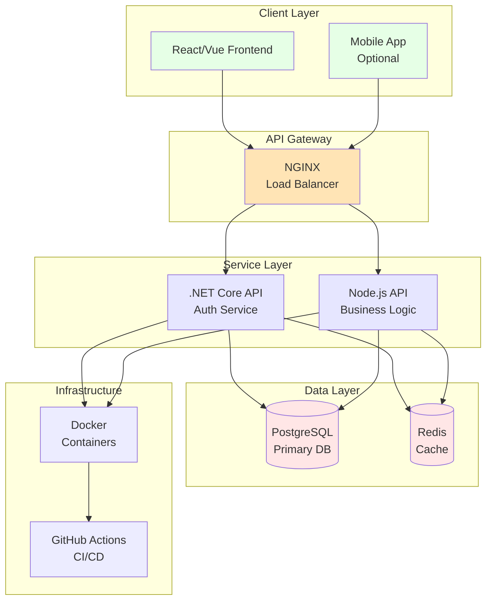

[🏠 Home](../slide-deck.md) | [⬆️ Up](../slide-deck.md) | [⬅️ Prev](slide-08-simple-example.md) | [➡️ Next](slide-10-conclusion.md)

---

# Slide 9: Small, Complete Example (Complex)

## Full-Stack Web Application

### Project Scope
**Enterprise-grade application with modern architecture**

### Architecture Overview

### Features Delivered
- **Authentication**: JWT tokens, OAuth2
- **User Management**: Registration, profiles, roles
- **API**: RESTful, OpenAPI documented
- **Database**: Migrations, seed data
- **Testing**: 80% code coverage
- **CI/CD**: GitHub Actions pipeline
- **Monitoring**: Logging, health checks

### Development Metrics
- **Timeline**: 2 weeks (vs 2-3 months traditional)
- **Code Quality**: A-rated on all metrics
- **Cost**: $3,000 (vs $50,000+ traditional)

---

[🏠 Home](../slide-deck.md) | [⬆️ Up](../slide-deck.md) | [⬅️ Prev](slide-08-simple-example.md) | [➡️ Next](slide-10-conclusion.md)